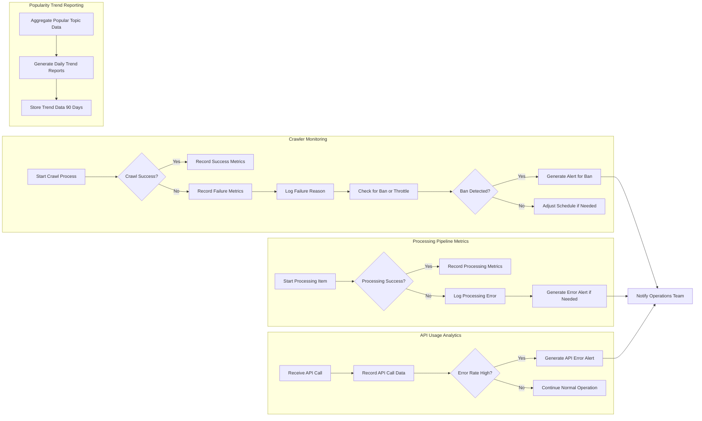

# Political News Crawler - Analytics and Reporting Requirements

## 1. Introduction

This document specifies the business requirements for the analytics and reporting components of the Political News Crawler backend system. The purpose is to ensure comprehensive monitoring of system health, detailed metrics on data processing pipelines, insightful API usage analytics, popularity trend reports, and timely alerts. These capabilities are critical to maintain operational excellence, understand user engagement, and guide ongoing improvements.

This document focuses exclusively on business-level analytics requirements, describing what data must be collected, tracked, and reported. It does not specify how these analytics should be implemented technically.

---

## 2. Crawler Monitoring Requirements

The system shall provide real-time and historical monitoring of the crawling subsystems, including diverse source management and scheduling efficiency.

### 2.1 Metrics to Track
- Number of successful crawls per source within configurable intervals
- Number of failed crawl attempts per source and failure reasons
- Crawling latency and duration statistics per source
- Current crawl queue length and processing backlog
- Number of ban detections or throttling events
- Source-specific crawl frequency and any deviations

### 2.2 Monitoring Features
- WHEN the crawler is operational, THE system SHALL aggregate crawl success and failure data in real-time.
- WHEN crawl errors or bans occur, THE system SHALL log these events with detailed metadata.
- WHEN a source changes crawl behavior (e.g., slowing down), THE system SHALL flag this for review.
- THE system SHALL maintain crawl history data for at least 30 days for trend analysis.

### 2.3 Alerts
- IF crawling failure rate per source exceeds 10% over a rolling 1 hour, THEN THE system SHALL generate an alert.
- IF a source is detected as banning the crawler excessively, THEN THE system SHALL generate an alert and suggest schedule adjustment.

---

## 3. Processing Pipeline Metrics

This section covers the large language model post-processing analytics.

### 3.1 Metrics to Track
- Number of raw data items queued for processing
- Processing throughput (items per minute/hour)
- Success rate of processing tasks
- Error rate and types in LLM processing
- Average processing time per item

### 3.2 Monitoring Features
- THE system SHALL provide dashboards showing pipeline status, queue depths, and historical throughput.
- WHEN an error in processing occurs, THE system SHALL log details for troubleshooting.
- THE system SHALL store processing statistics with granularity sufficient to analyze hourly trends.

### 3.3 Alerts
- IF processing queue length exceeds configurable threshold for more than 15 minutes, THEN THE system SHALL generate a performance alert.
- IF processing error rate exceeds 5%, THEN THE system SHALL generate an alert.

---

## 4. API Usage Analytics

### 4.1 Metrics to Track
- Number of API calls per endpoint, aggregated by minute/hour/day
- Number of unique API consumers (e.g., unique IPs or API keys if any)
- Most requested hot topic categories or query parameters
- Average response times per endpoint
- Number of API errors and error codes returned

### 4.2 Monitoring Features
- THE system SHALL track and store API usage metrics continuously.
- THE system SHALL provide time-series reports for usage trends.
- THE system SHALL segment data by endpoint and significant query parameters.

### 4.3 Alerts
- IF API error rate exceeds 3% over a 1-hour period, THEN THE system SHALL generate an operational alert.
- IF API traffic spikes beyond historical averages by 2x, THEN THE system SHALL generate a traffic anomaly alert.

---

## 5. Popularity Trend Reports

### 5.1 Reports
- THE system SHALL generate daily summaries of the top popular political topics.
- THE system SHALL provide trend analysis reports showing the rise or fall of topics over configurable time windows (e.g., 1 day, 3 days, 7 days).
- THE system SHALL track source distribution contributing to popular topics.

### 5.2 Data Retention and Access
- THE system SHALL retain trend data for at least 90 days.
- THE system SHALL allow export of popularity trends in common formats for offline analysis.

---

## 6. Alerts and Reporting

### 6.1 Alerting Framework
- THE system SHALL allow configuring alert thresholds for all key metrics.
- THE system SHALL support real-time notifications via system logs or external notification services.

### 6.2 Reporting Features
- THE system SHALL provide scheduled reports (daily, weekly) of crawler and processing health.
- THE system SHALL provide custom report generation on demand.
- THE system SHALL allow export of reports in standard document formats.

---

## 7. Business Rules and Constraints
- THE system SHALL ensure analytics data is collected in compliance with crawling rate limits to avoid source bans.
- THE system SHALL guarantee data accuracy and freshness suitable for near real-time monitoring.
- THE system SHALL maintain separation of raw data metrics and processed content metrics.
- THE system SHALL provide API usage anonymization where applicable to protect consumer privacy.

---

## 8. Performance Requirements
- Analytics dashboards and reports SHALL update within 1 minute of underlying data availability.
- Alerts SHALL trigger within 5 minutes of threshold breaches.

---

## 9. Glossary
- Crawl Source: Any external website, API, or service from which political news data is collected.
- LLM Processing: Large Language Model based content post-processing like summarization or analysis.
- API Endpoint: Exposed interface serving processed news data and trending topics.
- Popularity Trend: Metrics defining which political topics are hot or rising in user interest.

---

This document provides business requirements only. All technical implementation decisions belong to developers, who have full autonomy on backend architecture, data storage, analytics tooling, and reporting mechanisms. The document solely specifies WHAT the analytics and reporting system must achieve, not HOW it must be built.

