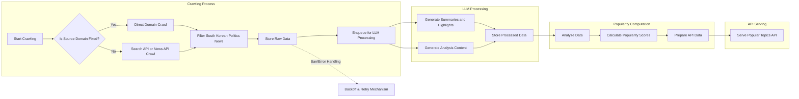

# Functional Requirements Specification for Political News Crawler Backend

## 1. Introduction

This document specifies the detailed functional business requirements for the "politicalNewsCrawler" backend system. Its purpose is to enable backend developers to build a robust, scalable service that crawls political news from diverse sources, processes this data using cost-effective large language models (LLMs), stores raw and processed data appropriately, computes real-time popularity of news topics, and exposes flexible API endpoints for frontend use. This document focuses exclusively on business requirements, not on technical implementation details.

The service primarily targets news on South Korean politics by aggregating information from multiple distinct channels including direct website crawling, search engine APIs, third-party news APIs, and public data aggregators.

## 2. Crawling Requirements

### 2.1 Overview
The system shall collect political news related to South Korean politics from as many diverse sources as possible to provide a wide, multiperspective view. This includes:
- Direct crawling of news websites (e.g., New York Times, Korean magazines)
- Using search engine APIs (e.g., SERP APIs)
- Utilizing third-party news APIs (e.g., Tavily)

### 2.2 Crawling Scheduling
- WHEN the system initializes crawling for a given source, THE system SHALL determine and adapt crawling frequency based on the source's update patterns.
- THE system SHALL attempt crawling intervals typically between 15 and 30 minutes per source unless adjusted for source limitations or bans.
- The system SHALL comply with each source's crawling policies to avoid bans, including respecting rate limits and crawl delays.

### 2.3 Crawling Modes
- THE system SHALL support multiple crawling methods:
  - Focused crawling within fixed website domains.
  - Search queries through search engine APIs to discover news articles.
  - Consuming news through official news APIs from various providers.
- THE system SHALL allow configuration of specific website domains to crawl directly.

### 2.4 Data Filtering
- THE system SHALL only collect data relevant to South Korean politics based on source meta-information and text content filtering.

### 2.5 Error and Ban Handling
- IF crawling of a source is denied or results in errors due to bans or forbiddance,
  THEN THE system SHALL back off and retry with exponential delay and notify system monitoring components.

### 2.6 Real-Time Considerations
- WHEN possible, THE system SHALL crawl frequently and process data for near real-time updates.
- THE system SHALL limit crawling speed to avoid triggering source bans while maintaining freshness.

## 3. Data Storage Requirements

### 3.1 Raw Data Storage
- THE system SHALL store all raw crawled data permanently in cloud object storage services such as Google Cloud Storage (GCP) or Amazon S3.
- THE system SHALL maintain a duplicate copy of raw data in local file storage.

### 3.2 Local Storage TTL
- THE system SHALL enforce a Time To Live (TTL) policy on local file storage copies such that files older than one month are deleted.

### 3.3 Data Integrity and Duplication
- THE system SHALL manage and track duplication of data to prevent redundant storage.
- THE system SHALL provide mechanisms to verify consistency between cloud and local storage.

## 4. LLM Post-Processing Requirements

### 4.1 Overview
- THE system SHALL process raw news data using large language models (LLMs) to generate value-added content.
- THE system SHALL use inexpensive LLM variants and optimize prompt engineering techniques to achieve cost efficiency.

### 4.2 Content Generation Features
- THE system SHALL generate at least two distinct content types:
  - Summaries and Highlights: concise rendition of articles.
  - Analysis: deeper, contextual insights on political news.
- THE system SHALL be designed to support additional future content generation features as they are identified and prioritized.

### 4.3 Data Retention
- THE system SHALL store both raw data and generated processed content.
- THE system SHALL maintain metadata tracking for each piece of content including generation time and source.

### 4.4 Processing Pipeline
- WHEN new raw news data is available,
  THEN THE system SHALL enqueue it for LLM processing.
- THE system SHALL prioritize timely processing to support near real-time availability of processed content.

## 5. Popularity Algorithm Requirements

### 5.1 Popularity Computation Goals
- THE system SHALL compute popularity scores for political news topics based on custom, proprietary algorithms.

### 5.2 Metrics Considered
- THE system SHALL consider multiple signals such as article frequency, source authority, recency, user engagement metrics (if available), and content affinity.

### 5.3 Real-Time Processing
- The popularity algorithms SHALL operate in real-time or near real-time to enable up-to-date hot topic identification.
- The system SHALL balance real-time responsiveness with crawling and processing constraints.

### 5.4 Adaptive Scaling
- THE system SHALL adjust algorithm parameters dynamically based on traffic loads and data volumes to maintain performance.

## 6. API Endpoint Requirements

### 6.1 Endpoint Flexibility
- THE system SHALL provide a set of flexible API endpoints for frontend consumption.
- THE endpoints SHALL include:
  - Retrieval of top N popular political topics, refreshed daily or in near real-time.
  - Query endpoints supporting filters such as category, time range, or keyword search.

### 6.2 Access and Permissions
- THE system SHALL expose all endpoints without user authentication or role-based access control.

### 6.3 Response Requirements
- THE API responses SHALL include metadata sufficient to justify popularity rankings.
- THE responses SHALL provide both summary/highlight and analytical content where available.

### 6.4 Performance Expectations
- API responses SHALL be delivered within 2 seconds under typical loads to provide a responsive user experience.

## 7. Glossary and Definitions

- **Crawler**: Component responsible for fetching data from external sources.
- **LLM (Large Language Model)**: AI models used for natural language processing tasks.
- **TTL (Time To Live)**: Duration data is retained before being deleted.
- **Popularity Algorithm**: Custom business logic calculating relevance and interest scores for news topics.

---

This document provides business requirements only. All decisions regarding technical implementation, system architecture, database design, and API specification are fully within the developers' autonomy. This document describes WHAT the system should do, not HOW it should be built.

---

This diagram represents major data flow and business process interactions.

---

Detailed requirements ensure backend developers understand the scope, business logic, and expected system behavior fully and can proceed to design and implementation with clarity and confidence.