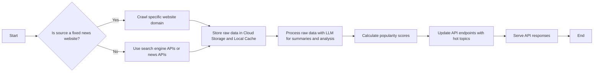
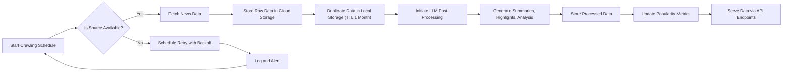
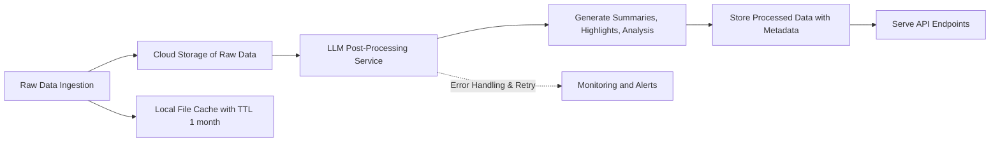
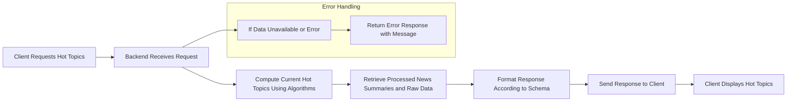
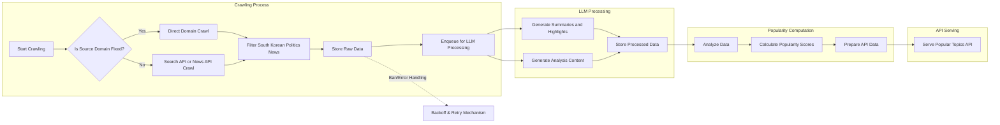

# Political News Crawler Backend - Functional and Business Requirements

## 1. Introduction
This document defines the complete functional and business requirements for the "politicalNewsCrawler" backend system. The system collects political news relevant to South Korean politics from multiple sources using diverse crawling methods and processes this data with cost-effective large language models (LLMs) to generate summaries, highlights, and analysis. It maintains raw and processed data storage, computes popularity scores algorithmically, and exposes flexible API endpoints serving popular hot topics.

This document focuses on business requirements only, providing backend developers with clear, testable, and implementation-ready specifications. It describes WHAT the system shall do, not HOW it should be built.

## 2. Crawling Requirements

### 2.1 Source Diversity
THE system SHALL collect political news by combining multiple crawling approaches, including:
- Direct crawling of specific known news websites (e.g., New York Times, Korean political magazines).
- Querying search engine APIs such as SERP APIs.
- Integrating third-party news APIs and services like Tavily.

### 2.2 Crawling Frequency and Scheduling
- WHEN the system starts crawling a source, THE system SHALL adapt its crawling frequency based on the update pattern of that source.
- THE system SHALL typically perform crawling of sources every 15 to 30 minutes, adjusting dynamically to avoid overloading or bans.
- THE system SHALL comply with each source's crawling policies, respecting rate limits and robots.txt directives.

### 2.3 Crawling Policies
- THE system SHALL support crawling within fixed website domains where specified.
- THE system SHALL support generic crawling via search engine or news APIs to maximize coverage.
- THE system SHALL filter collected data to extract South Korean political news.

### 2.4 Error and Ban Handling
- WHEN crawling results in errors due to bans, network failures, or denied access, THEN THE system SHALL back off exponentially and notify monitoring systems.

### 2.5 Real-Time Constraints
- THE system SHALL balance crawling frequency to provide near-real-time updates without violating source restrictions.

## 3. Data Storage Requirements

### 3.1 Raw Data Storage
- THE system SHALL store raw crawl data permanently in cloud object storage such as Google Cloud Storage or Amazon S3.
- THE system SHALL maintain a duplicate cache copy in local file storage.

### 3.2 Local Storage TTL
- THE system SHALL delete local cached raw data older than one month automatically.

### 3.3 Data Consistency
- THE system SHALL detect and manage duplicate data.
- THE system SHALL verify synchronization between cloud and local storages regularly.

## 4. LLM Post-Processing Requirements

### 4.1 Cost-Efficient Model Use
- THE system SHALL use cost-effective LLMs optimized via prompt engineering.
- THE system SHALL support integration of new LLM models without disruption.

### 4.2 Content Generation
- THE system SHALL generate multiple content types:
  - Summaries and highlights of news articles.
  - Analytical content for deeper political insights.
- THE system SHALL store processed data along with raw data.

### 4.3 Processing Pipeline
- WHEN new raw data arrives, THE system SHALL enqueue it for prompt-engineered LLM processing prioritized for timely availability.

### 4.4 Error Handling
- IF LLM processing fails, THEN THE system SHALL retry with exponential backoff or flag for manual review.

## 5. Popularity Algorithm Requirements

### 5.1 Popularity Metrics
- THE system SHALL compute popularity scores based on article frequency, recency, source diversity, and post-processed content measures.

### 5.2 Processing
- THE system SHALL provide near real-time popularity data updates at intervals no longer than 15 minutes.
- THE system SHALL support incremental popularity updates for efficiency.

### 5.3 Scaling and Resilience
- THE system SHALL monitor processing load and adjust computations dynamically.

## 6. API Endpoint Requirements

### 6.1 Endpoint Variety
- THE system SHALL provide flexible public API endpoints returning popular topics, news summaries, and analyses.
- THE system SHALL support query parameters for filtering by topic, category, and time window.

### 6.2 Access Control
- THE system SHALL expose APIs with no authentication or user role restrictions.

### 6.3 Response Performance
- API responses SHALL be delivered within 2 seconds under normal loads.

### 6.4 Error Management
- On invalid requests, THE system SHALL return appropriate error statuses and messages.

## 7. User Scenarios and Workflows

### 7.1 Crawling Workflow
- The system shall initiate and manage crawling schedules per source.
- It shall store raw data in local and cloud storages.
- It shall handle retries, errors, and bans gracefully.

### 7.2 LLM Post-Processing Workflow
- Raw data shall be processed into summaries and analysis.
- Processed data shall be stored and made available for APIs.

### 7.3 Popular Topics Computation and Serving
- Popularity scores are computed as new data arrives.
- The system serves hot topics via APIs in near-real-time.

### 7.4 Error Handling
- For failures in crawling or processing, the system shall retry or log and alert appropriately.
- For API errors, meaningful messages and statuses shall be returned.

## 8. Crawling System Specifications

### 8.1 Multi-Method Crawling
- Support fixed-domain crawling, search API crawling, and news API crawling.
- Allow dynamic addition of new sources without downtime.

### 8.2 Scheduling and Throttling
- Implement adaptive crawling intervals per source, honoring rate limits and politeness.
- Coordinate crawls to avoid flooding sources.

### 8.3 Error Handling and Ban Recovery
- Detect bans and throttling responses, back off, and alert operations.
- Ensure redundancy in sources to mitigate failures.

## 9. Storage Strategy

- Use cloud object storage as primary repository for all raw data.
- Duplicate data locally with a 1-month TTL.
- Ensure consistency and automated deletion of expired local data.

## 10. Non-Functional Requirements

- Data freshness: Popular topics updated within 5 minutes of source data availability.
- API latency: Responses within 2 seconds under typical load.
- Crawlers operate concurrently up to 10 parallel jobs.
- Handle errors and bans with backoff and alerting.
- Ensure 99.9% system availability.
- Compliance with source crawling policies and legal requirements.

## 11. Analytics and Reporting

- Monitor crawl success/failure rates.
- Track LLM processing throughput and errors.
- Record API usage metrics and error rates.
- Generate daily trending reports.
- Alert on error thresholds and anomalies.

---

## Mermaid Diagrams

### System Overview

### Crawling and Processing Workflow

### LLM Post-Processing Workflow

### API Endpoint Workflow

### Popularity Algorithm Processing

---

This document contains business requirements only. All technical implementations including architecture, databases, APIs, and system infrastructure are the sole responsibility of the development team. This document defines WHAT the system MUST do, not HOW to implement it.