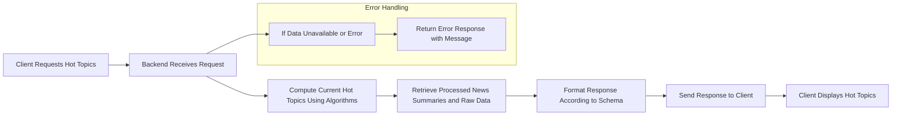
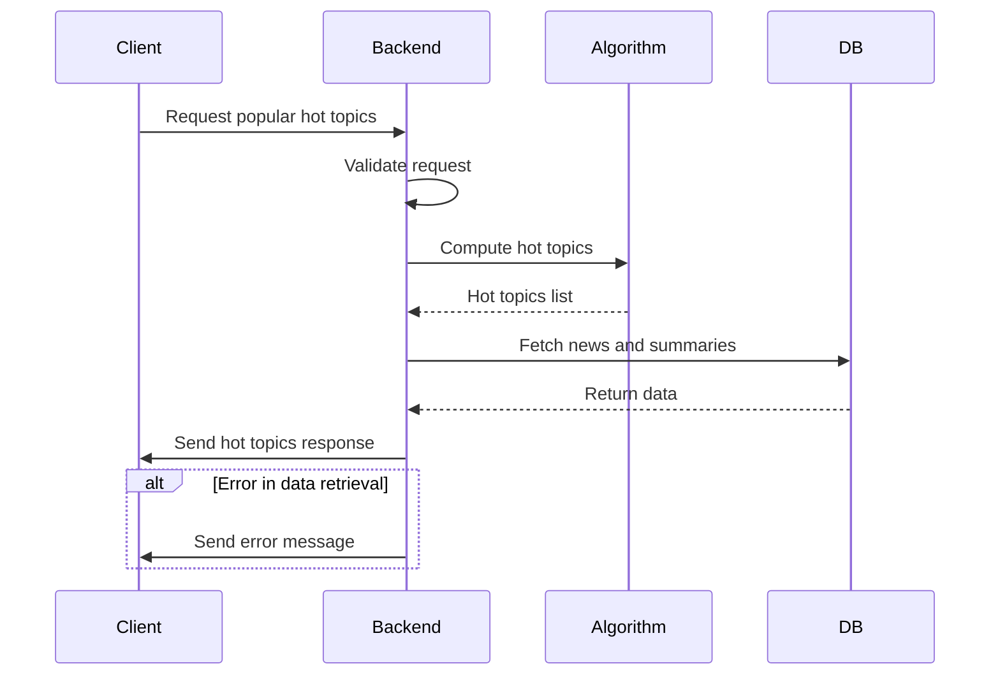

# Backend API Endpoints Design and Business Logic

## 1. Introduction

The backend API endpoints serve as the primary interface through which processed political news and popular hot topics are delivered to client applications. This document specifies the comprehensive business requirements for these endpoints, ensuring a flexible, performant, and accessible API layer that meets the service's goals.

## 2. Business Model Summary

The politicalNewsCrawler service aims to aggregate diverse political news sources focused on South Korean politics and provide enriched, analyzed content through public endpoints. This API supports a wide audience, offering real-time or near real-time updates of popular topics without requiring user authentication.

## 3. User Roles and Access Rights

### 3.1 Guest Role
- THE system SHALL allow unauthenticated guest users to access all public API endpoints for political news and popular hot topics.
- THE system SHALL NOT require any authentication or authorization mechanisms for these access points.
- Guests SHALL NOT be able to perform any modification, write, or administrative operations.

## 4. API Endpoint Types and Their Functions

### 4.1 News Retrieval Endpoints
- THE system SHALL provide endpoints to retrieve raw and processed political news data.
- THE endpoints SHALL accept filters such as date ranges, source identifiers, categories, and keyword searches.

### 4.2 Hot Topic Endpoints
- THE system SHALL provide endpoints delivering ranked lists of popular political topics.
- THE endpoints SHALL support querying by date ranges and sub-categories when applicable.

### 4.3 Summary and Analysis Endpoints
- THE system SHALL serve content generated from LLM post-processing, including summaries, highlights, and in-depth analyses.

### 4.4 Real-Time Update Endpoints
- THE system SHALL support endpoints enabling clients to receive or poll for near real-time updates about hot topics and breaking news.

### 4.5 Metadata and Health Check Endpoints
- THE system SHALL provide endpoints for basic system status, metadata exposure, and health checks for monitoring.

## 5. Response Data Structures

### 5.1 News Item Schema
- Each news item SHALL include:
  - Unique identifier
  - Source metadata (name, URL, etc.)
  - Crawling timestamp
  - Reference or link to raw content storage
  - Processed summary and highlights
  - Language and regional tags relevant to South Korean politics

### 5.2 Hot Topic Schema
- Each hot topic entry SHALL include:
  - Topic name and identifier
  - Popularity score or ranking position
  - Related news item references
  - Time window for the popularity measurement

### 5.3 Summary and Analysis Schema
- Generated content entries SHALL include:
  - Source news references
  - Content type (summary, highlight, analysis)
  - Textual content
  - Generation timestamp

## 6. Real-Time Updates and Performance Expectations

- THE system SHALL provide fresh data with a latency not exceeding 30 seconds under normal conditions.
- API response times SHALL be under 500 milliseconds for 95% of requests under typical load.
- The system SHALL implement mechanisms to throttle updates per source to respect crawling and site restrictions.

## 7. Hot Topic Computation and Popularity Algorithm Integration

- Popular hot topics SHALL be computed based on internal algorithms that factor source diversity, recency, frequency, and engagement proxies.
- THE system SHALL update hot topic information continuously and expose it via endpoints reflecting near real-time freshness within operational constraints.

## 8. Error Handling and Recovery Processes

- WHEN invalid or unsupported query parameters are received, THE system SHALL return meaningful error messages with appropriate status codes.
- WHEN requested data is temporarily unavailable, THE system SHALL return clear status indications and fallback responses where possible.
- THE system SHALL implement retry and backoff strategies in internal data fetching and crawling processes to minimize client-facing errors.

## 9. Security and Access Control Requirements

- All endpoints SHALL be publicly accessible without authentication.
- THE system SHALL implement rate limiting to prevent abuse and ensure service stability.
- Error responses due to rate limiting SHALL provide appropriate HTTP status codes and explanatory messages.

## 10. Success Criteria and Performance Metrics

- API endpoint availability SHALL exceed 99.9% uptime.
- Real-time update latency SHALL be under 30 seconds.
- API response times SHALL be under 500 milliseconds for 95% of calls.
- Popular hot topics served SHALL reflect backend algorithm computations accurately.

---

## Mermaid Diagram: API Endpoint Flow

---

This document defines business requirements exclusively. All details about implementation, APIs, data storage, and system architecture are the sole responsibility of backend developers. The document's purpose is to specify WHAT the system should deliver, not HOW it must be built.