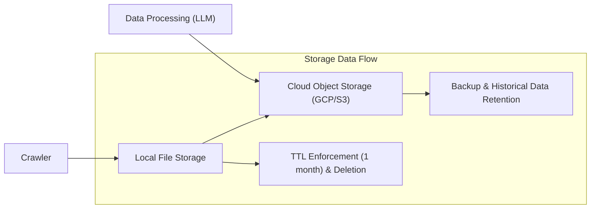

# Storage Strategy for politicalNewsCrawler Backend Service

## 1. Introduction

The storage strategy defines how raw political news data collected by the politicalNewsCrawler backend is securely stored, redundantly maintained, and efficiently managed. The strategy ensures durability and availability through cloud object storage complemented by local file storage caching with strict time-to-live (TTL) policies.

## 2. Cloud Storage of Raw Data

### 2.1 Purpose and Requirements
THE system SHALL store all raw data collected from crawling operations primarily in cloud object storage services such as Google Cloud Platform (GCP) or Amazon S3. This cloud storage serves as the authoritative, durable repository for all raw news data and must support high availability, fault tolerance, and scalability to accommodate growth.

### 2.2 Storage Locations
THE system SHALL support configurable selection or switching between supported cloud object storage providers.

### 2.3 Data Format and Metadata
THE system SHALL store raw data in structured or semi-structured formats compatible with downstream processing, such as JSON or XML. Each stored item SHALL include metadata comprising:
- Source identifier or channel
- Crawl timestamp with ISO 8601 date format
- Content type
- Unique identifier or hash for duplicate detection

## 3. Local File Storage and TTL

### 3.1 Purpose and Scope
THE system SHALL maintain a duplicate cache of raw data in local file storage to enable faster retrieval and provide resiliency against temporary cloud storage access issues.

### 3.2 Duplication Policies
THE system SHALL automatically replicate all raw data stored in cloud storage to local file storage, ensuring consistency between both layers.

### 3.3 TTL and Automated Deletion
WHEN data items in local storage reach a time-to-live (TTL) of one month,
THEN THE system SHALL automatically delete those items to free up local storage resources.

THE system SHALL log deletions and verify successful completion.

## 4. Data Duplication Strategies

### 4.1 Cloud and Local Duplication
THE system SHALL ensure data redundancy by duplicating raw data in both cloud object storage and local file storage.

### 4.2 Consistency and Synchronization
THE system SHALL periodically verify synchronization between cloud and local storage. If inconsistencies or failures occur during duplication, THE system SHALL automatically retry synchronization according to configured policies.

## 5. Data Retention and Deletion

### 5.1 Retention Periods
THE system SHALL retain raw data indefinitely in cloud storage to enable future analyses and archival.

THE system SHALL enforce a strict one-month TTL policy for local file storage data.

### 5.2 Automated Deletion
THE system SHALL automatically delete expired local cache data following the TTL policy.

THE system MAY provide administrative tools for manual purging of cloud storage data if required for compliance or cost management.

### 5.3 Audit and Compliance
THE system SHALL maintain logs of all retention and deletion activities for audit and regulatory compliance purposes.

## 6. Error Handling and Data Integrity

IF data storage operations fail (write or delete),
THEN THE system SHALL log detailed error information and automatically retry these operations.

In case of repeated failures, alerts SHALL be generated to notify system operators.

## 7. Performance and Scalability Considerations

THE system SHALL perform storage operations asynchronously to avoid blocking core crawling and processing workflows.

THE system SHALL scale cloud storage capacity seamlessly to handle increasing data volumes without performance degradation.

## 8. Security and Access Control

THE system SHALL enforce strict authentication and authorization controls on all storage systems.

THE system SHALL encrypt data in transit and at rest to protect against unauthorized access.

## 9. Data Flow Diagram

## 10. Summary

The storage strategy ensures all raw political news data is durably stored and redundantly cached locally with a one-month TTL to balance availability, performance, and operational cost.

This approach ensures data integrity, scalability, and compliance while supporting the backend's crawling, processing, and API serving functions.

---

This document provides business requirements only. All technical implementations including architecture, storage technologies, encryption methods, and operational procedures are the responsibility of the development team. The developers have full discretion over how to implement these requirements to achieve the described outcomes successfully.