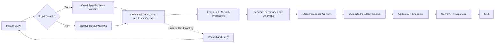

# Functional Requirements Specification for Political News Crawler Backend

## 1. Introduction

The politicalNewsCrawler backend is a system designed to aggregate political news related to South Korean politics from a wide variety of sources. It performs multi-channel crawling, processes the data using cost-effective large language models (LLMs), stores both raw and processed data, calculates real-time popularity scores for political topics, and provides flexible API endpoints without requiring user authentication.

This specification provides detailed business requirements to guide developers in building the backend system. All requirements are stated clearly using EARS to ensure unambiguous understanding. This document covers crawling logic, storage policies, content post-processing, popularity computation, APIs, and includes detailed error handling and performance expectations.

## 2. Crawling Requirements

### 2.1 Data Source Diversity and Crawling Methods
- THE system SHALL crawl political news about South Korean politics from diverse sources including:
  - Fixed specific news websites (e.g., known Korean political magazines, internationally recognized sources such as New York Times).
  - Search engine APIs (e.g., SERP APIs) for dynamic news discovery.
  - Third-party news APIs and services (e.g., Tavily) for additional data.
- THE system SHALL support adding new crawling sources dynamically without downtime.

### 2.2 Crawling Scheduling
- WHEN starting to crawl a new source, THE system SHALL determine a crawling schedule adapted to the source's update frequency.
- THE system SHALL typically schedule crawl intervals between 15 and 30 minutes.
- IF a source enforces crawl limits, THEN THE system SHALL respect those by adapting crawl intervals and reducing frequency.

### 2.3 Filtering Relevance
- THE system SHALL filter collected data to ensure only political news relevant to South Korean politics is retained.

### 2.4 Crawling Error Handling and Ban Mitigation
- IF a crawling attempt fails due to network errors, HTTP errors, or bans (such as HTTP 403 or 429), THEN THE system SHALL implement exponential backoff and retry strategies.
- IF repeated crawl failures occur for a source beyond a configured threshold, THEN THE system SHALL temporarily disable crawling for that source and notify system monitoring.

### 2.5 Real-Time Crawling Considerations
- THE system SHALL attempt to crawl frequently and update its data near real-time but SHALL maintain crawl intervals sufficient to avoid bans or blocks.

## 3. Data Storage Requirements

### 3.1 Raw Data Storage
- THE system SHALL store all raw crawled data persistently in cloud object storage such as Google Cloud Storage or Amazon S3.

### 3.2 Local File Storage Caching
- THE system SHALL maintain a duplicate cache of raw data on local file storage.
- THE system SHALL enforce a time-to-live (TTL) policy with a maximum retention of 1 month for local cached data.
- WHEN data age exceeds 1 month in local storage, THE system SHALL delete the expired data automatically and log the deletion.

### 3.3 Data Consistency and Duplication Handling
- THE system SHALL ensure data consistency between cloud storage and local cache, and maintain mechanisms to detect and remediate duplication issues.

## 4. LLM Post-Processing Requirements

### 4.1 Cost-Effective LLM Usage
- THE system SHALL use inexpensive large language models (LLMs) combined with prompt engineering to generate value-added content.

### 4.2 Content Generation Features
- THE system SHALL produce the following content types for each news item:
  - Summaries and highlights of news articles.
  - Analytical insights contextualizing political news.
  - Additional content types may be added in the future.

### 4.3 Data Storage for Processed Content
- THE system SHALL store both raw data and processed content along with metadata such as generation timestamps and source references.

### 4.4 Processing Workflow
- WHEN new raw data is added, THE system SHALL enqueue it promptly for LLM post-processing.
- THE system SHALL process data timely to support near real-time availability of enriched content.

### 4.5 Error Handling
- IF LLM processing fails, THEN THE system SHALL retry processing with exponential backoff up to a configurable maximum retry count.
- IF processing consistently fails, THEN THE system SHALL flag the data item for manual inspection.

## 5. Popularity Algorithm Requirements

### 5.1 Popularity Metrics
- THE system SHALL compute popularity scores based on metrics including:
  - Recency of news publication.
  - Frequency of topic mentions across multiple articles.
  - Diversity of sources reporting the topic.
  - Content generation volume and relevance.

### 5.2 Algorithm Behavior
- THE algorithm SHALL aggregate data within configurable time windows (e.g., 24 hours).
- THE algorithm SHALL apply recency decay functions to prioritize recent topics.
- THE algorithm SHALL normalize and rank topics according to computed popularity scores.

### 5.3 Real-Time Processing
- THE system SHALL update popularity scores in near real-time or at least every 15 minutes.
- THE system SHALL support incremental computation for efficiency.

### 5.4 Adaptive Scaling
- THE system SHALL dynamically adjust algorithm parameters (such as thresholds) according to system load and data volume.

### 5.5 Error Handling
- IF input data is incomplete or corrupted, THEN THE algorithm SHALL exclude such data and log the incident.
- IF computation fails, THEN THE system SHALL revert to last known stable popularity state.

## 6. API Endpoint Requirements

### 6.1 Endpoint Types
- The backend SHALL provide unauthenticated public API endpoints that include:
  - Retrieval of popular hot political topics, supporting filter parameters for time ranges and categories.
  - Retrieval of summarized and analyzed news content.
  - Metadata and health check endpoints.

### 6.2 Response Structures
- API responses SHALL include:
  - Unique identifiers for news items and topics.
  - Metadata including source information, crawl timestamps.
  - Content summaries, highlights, and analytic insights.
  - Popularity scores and ranking information.

### 6.3 Real-Time Updates
- API endpoints SHALL support near real-time update delivery with response latency under 2 seconds.

### 6.4 Error Handling
- THE API SHALL return clear error messages and codes for invalid requests or unavailable data.

### 6.5 Rate Limiting
- THE system SHALL implement rate limiting to protect endpoints from excessive requests, returning standard error responses for rate violations.

## 7. Glossary

- Crawler: Component responsible for collecting news data from external sources.
- LLM: Large Language Model used for natural language processing tasks.
- TTL: Time To Live, duration before cached data is deleted.
- Popularity Algorithm: Custom method for ranking trending news topics.

---

All requirements specified are expressed in natural language business terms following EARS conventions to remove ambiguity and ensure testability. Technical implementation details, API schema designs, database schemas, and system architecture decisions are excluded as they remain at the discretion of the development team. This document defines WHAT the politicalNewsCrawler backend system SHALL do, not HOW.

## Mermaid Diagram: System Functional Overview

