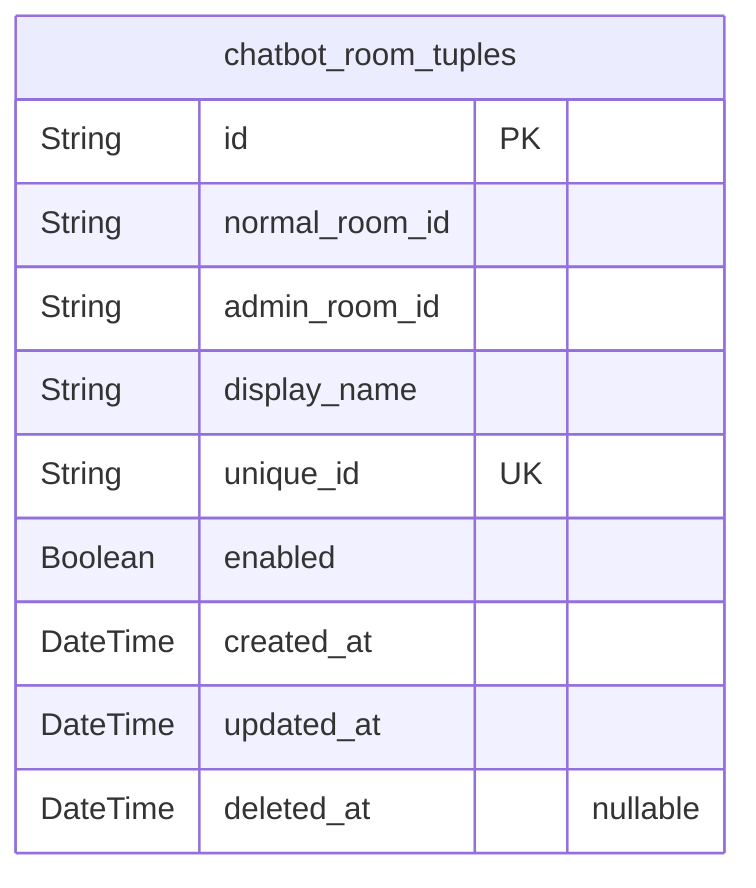
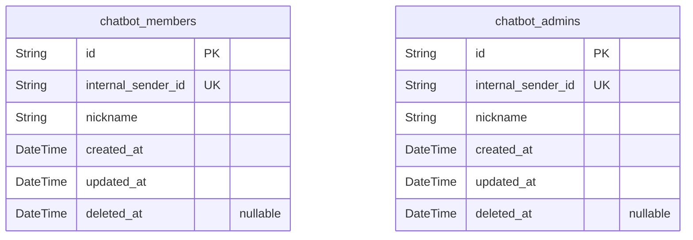
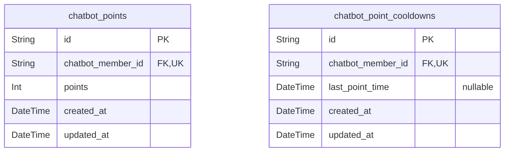
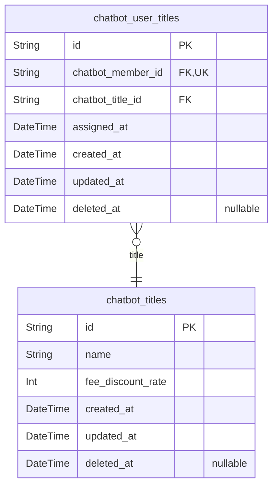
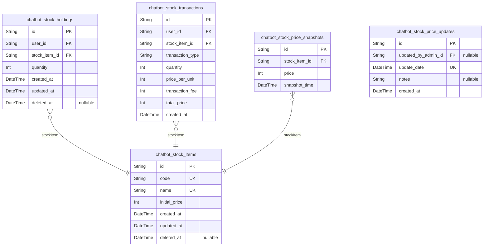
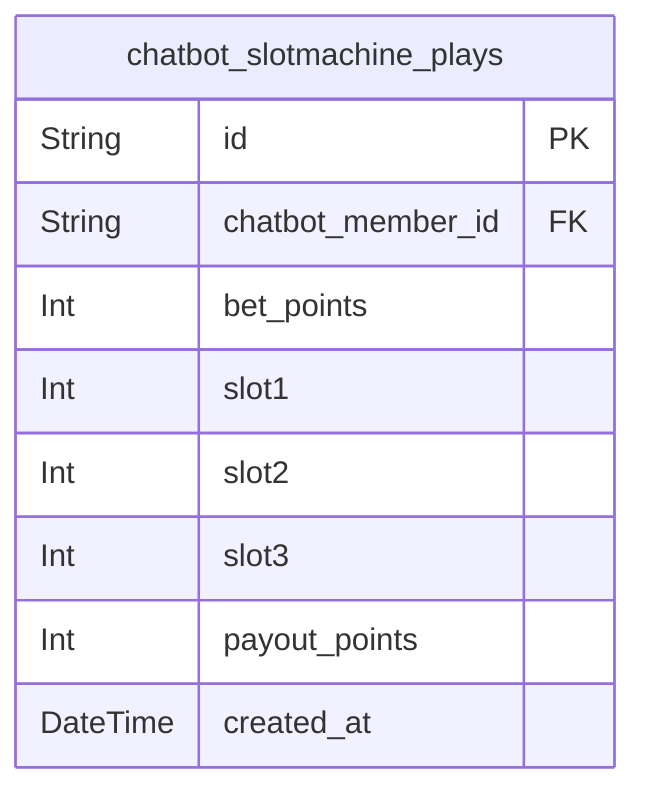
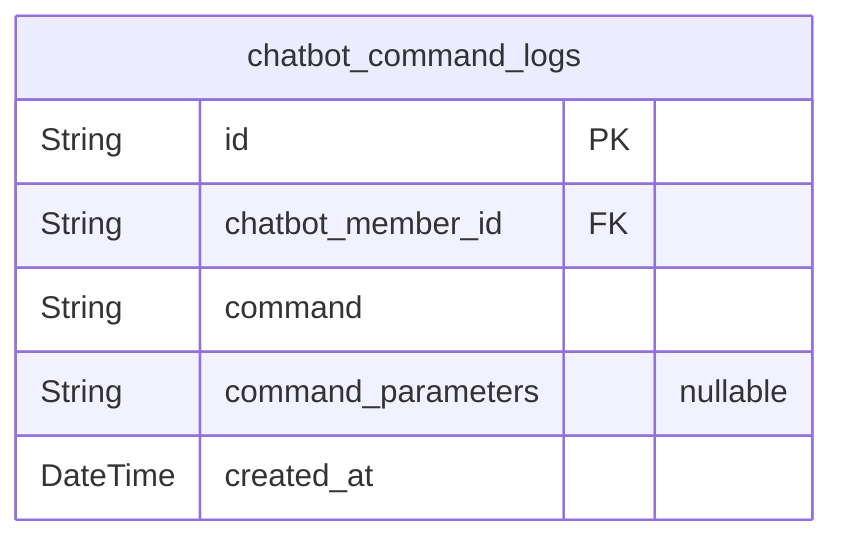
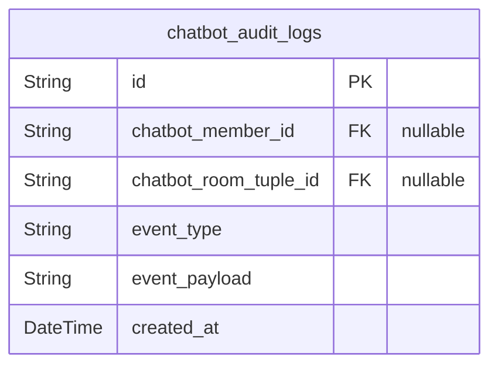

# Prisma Markdown

> Generated by [`prisma-markdown`](https://github.com/samchon/prisma-markdown)

- [Systematic](#systematic)
- [Actors](#actors)
- [Points](#points)
- [Titles](#titles)
- [Stocks](#stocks)
- [SlotMachine](#slotmachine)
- [Commands](#commands)
- [Audit](#audit)

## Systematic

### `chatbot_room_tuples`

Room tuples define mappings between normal chat rooms and their linked
admin rooms. This table stores session isolation mappings and controls
admin authorization by maintaining unique identifiers, room IDs, display
names, and enablement statuses. It ensures proper role determination and
supports operational enablement and soft deletion. Key fields include
normal_room_id and admin_room_id for chat routing, display name for
identification, and unique_id as a business identity key. Auditing fields
track creation, update, and deletion times.

Properties as follows:

- `id`: Primary Key.
- `normal_room_id`: Identifier for the normal chat room used for member participation.
- `admin_room_id`
  > Identifier for the corresponding admin room controlling administrative
  > commands.
- `display_name`: User-friendly display name for this room tuple, used for identification.
- `unique_id`
  > Unique business identifier for this room tuple, ensuring uniqueness
  > across system.
- `enabled`
  > Flag indicating if the room tuple is currently active and operational in
  > the system.
- `created_at`: Timestamp when this room tuple record was created.
- `updated_at`: Timestamp when this room tuple record was last updated.
- `deleted_at`
  > Timestamp indicating when this room tuple record was soft deleted, if
  > applicable.

## Actors

### `chatbot_members`

Member user of the chatbot system who interacts in normal rooms. Holds
internal sender id, nickname, and timestamps. Independent entity for user
identity management in the system. Connected to points, titles, and
sessions managed elsewhere.

Properties as follows:

- `id`: Primary Key.
- `internal_sender_id`
  > Internal unique identifier for the member, mapped from external sender
  > ID, used for internal system logic and privacy.
- `nickname`
  > Nickname displayed for the member in chat rooms, mutable by user or
  > system.
- `created_at`: Timestamp when the member record was created.
- `updated_at`: Timestamp when the member record was last updated.
- `deleted_at`: Timestamp when the member record was soft-deleted (nullable).

### `chatbot_admins`

Admin user of the chatbot system operating via admin rooms. Holds
internal sender id and nickname. Responsible for elevated permissions and
management tasks within the system.

Properties as follows:

- `id`: Primary Key.
- `internal_sender_id`
  > Internal unique identifier for the admin, mapped from external sender ID,
  > used for internal system logic and privacy.
- `nickname`: Nickname displayed for the admin in admin rooms, mutable by system.
- `created_at`: Timestamp when the admin record was created.
- `updated_at`: Timestamp when the admin record was last updated.
- `deleted_at`: Timestamp when the admin record was soft-deleted (nullable).

## Points

### `chatbot_points`

Stores the current point balance for each member. This main business
entity tracks points accumulated by users based on message activity.
Points are updated in real-time and are essential for minigames and user
rankings. References the member owning the points.

Properties as follows:

- `id`: Primary Key.
- `chatbot_member_id`: Referenced member's [chatbot_members.id](#chatbot_members) owning these points.
- `points`: Current total points accumulated by the user.
- `created_at`: Record creation timestamp.
- `updated_at`: Record last update timestamp.

### `chatbot_point_cooldowns`

Records the last point award time per member to enforce the 1-second
cooldown rule. Tracks when a user last earned points to prevent rapid
point farming. This supporting entity complements the points system for
fair point distribution.

Properties as follows:

- `id`: Primary Key.
- `chatbot_member_id`: Referenced member's [chatbot_members.id](#chatbot_members) for cooldown tracking.
- `last_point_time`: Timestamp of the last point awarded to the member.
- `created_at`: Record creation timestamp.
- `updated_at`: Record last update timestamp.

## Titles

### `chatbot_titles`

User title definitions providing fee discount rates and descriptive
names. This table stores the distinct titles that can be assigned by
administrators to users to grant special benefits such as reduced
transaction fees in minigames. The entity is a primary business object
with full CRUD capabilities. It is normalized and indexed to allow
efficient querying by title name and fee discount.

Properties as follows:

- `id`: Primary Key.
- `name`: The name of the title visible to users and used for display purposes.
- `fee_discount_rate`
  > The fee discount rate percentage this title grants on minigame
  > transactions, e.g., 0 to 100%.
- `created_at`: Timestamp when the title record was created.
- `updated_at`: Timestamp when the title record was last updated.
- `deleted_at`: Timestamp when the title record was soft-deleted, if applicable.

### `chatbot_user_titles`

Associations of users to assigned titles with related fee discount
applicability. Each record links one user with one title along with
assignment timestamps and soft deletion support. This table supports
enforceable business rules such as one active title per user and
historical tracking for assignment auditing. References chatbot_members
and chatbot_titles table primary keys.

Properties as follows:

- `id`: Primary Key.
- `chatbot_member_id`
  > Belonged user's [chatbot_members.id](#chatbot_members). Ensures one-to-one relation
  > representing the user's assigned title.
- `chatbot_title_id`
  > Referenced title's [chatbot_titles.id](#chatbot_titles). The title assigned to the
  > user.
- `assigned_at`: Timestamp when the title was assigned to the user.
- `created_at`: Timestamp when the user-title association record was created.
- `updated_at`: Timestamp when the user-title association record was last updated.
- `deleted_at`
  > Timestamp when the user-title association record was soft-deleted, if
  > applicable.

## Stocks

### `chatbot_stock_items`

Table storing virtual stock items available for trading. Includes unique
stock codes, names, initial prices, and soft delete handling. This
primary table serves as the master list of stock definitions for the
virtual stock trading domain.

Properties as follows:

- `id`: Primary Key.
- `code`: Unique business code for the stock item.
- `name`: Display name of the stock item.
- `initial_price`: Initial price of the stock item in points.
- `created_at`: Timestamp when the stock item was created.
- `updated_at`: Timestamp of the last update to the stock item record.
- `deleted_at`: Soft deletion timestamp; null if active.

### `chatbot_stock_holdings`

Tracks each user's holdings of stock items. Links users to stock items
with the quantity held. Ensures uniqueness for the user-item pair and
supports soft deletes. Essential for portfolio management in the stock
trading system.

Properties as follows:

- `id`: Primary Key.
- `user_id`: Owner user of the stock holdings. [chatbot_members.id](#chatbot_members)
- `stock_item_id`: Stock item referenced. [chatbot_stock_items.id](#chatbot_stock_items)
- `quantity`: Number of stock units held by user.
- `created_at`: Timestamp of when this holding record was created.
- `updated_at`: Timestamp of last update to the holding record.
- `deleted_at`: Soft delete timestamp, null if holding is active.

### `chatbot_stock_transactions`

Records all stock transactions made by users. Captures transaction type,
quantity, unit price, fees, total price, and timestamp. Links to user and
stock item ensuring referential integrity. This primary table supports
full audit trails of trading activity.

Properties as follows:

- `id`: Primary Key.
- `user_id`: User conducting the transaction. [chatbot_members.id](#chatbot_members)
- `stock_item_id`: Stock item involved in the transaction. [chatbot_stock_items.id](#chatbot_stock_items)
- `transaction_type`: Transaction type: 'buy' or 'sell'.
- `quantity`: Quantity of stock units in the transaction.
- `price_per_unit`: Price per unit at transaction time in points.
- `transaction_fee`: Fee charged for this transaction in points.
- `total_price`: Total price after fees in points.
- `created_at`: Timestamp of the transaction.

### `chatbot_stock_price_snapshots`

Stores historical price snapshots of stock items for audit and analytics.
Each record uniquely identifies a snapshot by stock item and timestamp.
Snapshot stance indicates append-only, immutable history.

Properties as follows:

- `id`: Primary Key.
- `stock_item_id`: Stock item linked to this price snapshot. [chatbot_stock_items.id](#chatbot_stock_items)
- `price`: Stock price at snapshot time in points.
- `snapshot_time`: Timestamp when this snapshot was recorded.

### `chatbot_stock_price_updates`

Records each stock price update event with date, optional admin who
triggered the event, and notes. Tracks daily updates for the virtual
stock system. Supports auditing and operational tracking.

Properties as follows:

- `id`: Primary Key.
- `updated_by_admin_id`
  > Admin who triggered the update, nullable if system triggered. {@link
  > chatbot_admins.id}
- `update_date`: Date and time this price update occurred.
- `notes`: Optional notes about this update.
- `created_at`: Record creation timestamp.

## SlotMachine

### `chatbot_slotmachine_plays`

Slot machine gameplay records capturing individual spin details including
user reference, bet amount, slot results, payout, and timestamps. Enables
audit and analysis of minigame activity separated from user and point
domains to improve modularity and maintainability.

Properties as follows:

- `id`: Primary Key.
- `chatbot_member_id`: Referenced member who played the slot machine. [chatbot_members.id](#chatbot_members).
- `bet_points`: Number of points the user bet on this spin.
- `slot1`: Result of first slot digit (0-9).
- `slot2`: Result of second slot digit (0-9).
- `slot3`: Result of third slot digit (0-9).
- `payout_points`: Points won from this spin, zero if none.
- `created_at`: Timestamp when the play was recorded.

## Commands

### `chatbot_command_logs`

Chatbot command logs record all executed commands by users and admins
with timestamps, user references, command content, and parameters. This
table serves as an append-only historical record for auditing command
usage and admin actions. It references the chatbot_members table's id to
associate each log entry with the executing user. The model supports
comprehensive auditing and tracking of all commands processed in chatbot
rooms.

Properties as follows:

- `id`: Primary Key.
- `chatbot_member_id`
  > Referencing the chatbot member who executed the command. {@link
  > chatbot_members.id}.
- `command`
  > The exact command string issued by the user or admin, including
  > parameters.
- `command_parameters`
  > Parameters passed with the command, stored as a JSON string or plain text
  > representation.
- `created_at`: Timestamp when the command was executed, stored in UTC.

## Audit

### `chatbot_audit_logs`

Audit log entries recording detailed operational events across the
chatbot system, including minigame results, command executions, stock
transactions, and stock price changes. It preserves immutable historical
data for compliance, analysis, and debugging purposes. References users
([chatbot_members.id](#chatbot_members)), rooms ([chatbot_room_tuples.id](#chatbot_room_tuples)) and
event types to support filtering and auditing.

Properties as follows:

- `id`: Primary Key.
- `chatbot_member_id`
  > Referenced chatbot member [chatbot_members.id](#chatbot_members) associated with the
  > audit event. Nullable if event is system generated.
- `chatbot_room_tuple_id`
  > Referenced chatbot room tuple [chatbot_room_tuples.id](#chatbot_room_tuples) related to
  > the event. Nullable when not applicable.
- `event_type`
  > Type of audit event such as 'command_execution', 'minigame_play',
  > 'stock_transaction', or 'stock_price_change'.
- `event_payload`
  > Detailed JSON-encoded string containing the event specifics, parameters,
  > and results for audit purposes.
- `created_at`: Timestamp when the audit event was recorded in the system.
