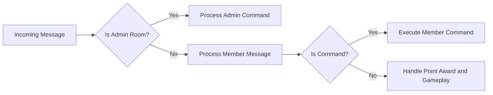

# User Roles and Permissions Specification for Chatbot Server

## 1. Introduction

This document defines the user roles within the chatbot backend system and details their permissions and authentication requirements. It ensures secure and isolated operation of chat sessions with role-appropriate abilities.

## 2. User Roles Definition

### 2.1 Roles Overview

- **Member**: An authenticated participant in a normal chat room. Members can send messages, earn points, play minigames, and view rankings.
- **Admin**: An administrator operates from a dedicated admin room and has elevated permissions to manage rooms, users, points, titles, and system configuration.

### 2.2 Role Determination

- The system does not store explicit user roles; instead, the role is inferred from the room ID of the incoming message.
- Messages from normal rooms are treated as from members.
- Messages from admin rooms are treated as from admins.
- No points or game actions occur in admin rooms except for execution of admin commands.

### 2.3 User Identification and Internal Mapping

- Each user is assigned an internal unique identifier.
- The external sender ID from webhook payloads is stored internally but never exposed externally.
- User records contain nickname, internal sender ID, point total, point cooldown timestamp, and title string.

## 3. Authentication Flow and Session Management

- Users are considered authenticated simply by presence in a chat room.
- No guest roles exist; everyone is a member or admin based on room context.
- No password or persistent session storage is maintained for users.
- Role checking is performed in real-time per incoming message.

## 4. Permission Matrix

| Role  | Allowed Actions |
|-------|-----------------| 
| Member| Send messages in normal rooms (earn points)
|       | Use member commands like `/랭킹`, `/슬롯머신`, `/도움말`, `/주식`, `/주식목록`, `/주식매수`, `/주식매도`
|       | Play minigames  
| Admin | Use admin-only commands like `/목록`, `/포인트`, `/포인트초기화`, `/칭호`, `/칭호제거`, `/주식추가`, `/주식제거`, `/주식목록` 
|       | Manage room tuples and user point data

## 5. Role-based Access Control

- Admin rooms exclusively accept admin commands.
- Normal rooms allow member interactions only.
- Commands are rejected or ignored according to role and room context.

## 6. Business Rules

- Users earn 1 point per message of 3+ characters with 1-second cooldown.
- Titles are simple strings stored in user data, assigned and modified by admins.
- Virtual stocks and minigames are member-only features.
- Sender and room IDs are hidden from end users and never included in outputs.

## 7. Error Handling

- Unauthorized commands return error messages denying access.
- Incorrect usage yields help or error messages.
- Commands issued in admin rooms but not admin commands are ignored silently.

## 8. Performance Requirements

- Real-time message processing with response times under 1 second.
- Point and cooldown increments enforced strictly to prevent abuse.

---

---

This document provides business requirements only. All technical implementation decisions belong to developers. Developers have full autonomy over architecture, APIs, and database design. The document describes WHAT the system should do, NOT HOW to build it.