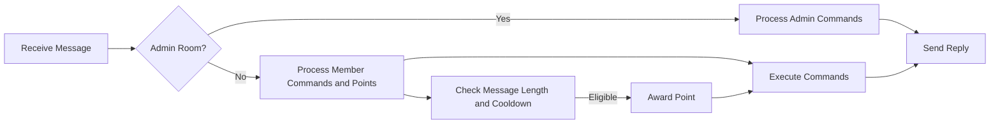

# Chatbot Server Functional Requirements

## 1. Introduction

The Chatbot Server is designed to process incoming chat messages in real-time via a webhook endpoint, award points based on user activity, facilitate mini-games, and enable administrative functions through dedicated admin rooms.

## 2. Business Model

### 2.1 Purpose
THE chatbot system SHALL enhance user engagement and retention by providing gamification features such as point accrual, social competition through rankings, and entertaining mini-games.

### 2.2 Revenue Strategy
THE system SHALL support future monetization opportunities via premium features and sponsored content leveraging increased user engagement.

### 2.3 Growth Plan
THE system SHALL grow by increasing active user count, encouraging competitive play via rankings, and enabling scalable administration.

## 3. User Roles and Authentication

### 3.1 Role Definitions
- Member: Users participating in normal rooms, earning points, playing mini-games.
- Admin: Users in admin rooms with elevated permissions to manage users, points, titles, rooms, and game configurations.

### 3.2 Dynamic Role Assignment
THE system SHALL determine user roles based on message origin room ID.

### 3.3 Permissions
| Action                     | Member | Admin |
|----------------------------|--------|-------|
| Send messages             | Yes    | No    |
| Earn points               | Yes    | No    |
| Use member commands       | Yes    | No    |
| Use admin commands        | No     | Yes   |
| Manage rooms and settings | No     | Yes   |

### 3.4 Authentication
THE system SHALL identify users internally by anonymized sender ID mapped from the webhook payload.

## 4. Core Functional Requirements

### 4.1 Message Reception and Processing
THE system SHALL expose a webhook endpoint `/webhook` to receive messages.
WHEN a message is received, THE system SHALL determine the user role based on room ID.
THE system SHALL parse commands and handle point awarding, and minigames accordingly.
ADMIN commands SHALL be processed only if the message is from an admin room.

### 4.2 Point System
WHEN a user sends a message with at least 3 characters in a normal room, AND a 1-second cooldown has elapsed since their last point award, THEN the system SHALL increment user points by 1.
THE system SHALL support unlimited point accumulation.
ADMINs can adjust points manually with commands.

### 4.3 Commands
THE system SHALL recognize commands prefixed with `/`.
MEMBER commands include:
- `/랭킹`: Shows points ranking with zero-width spaces to truncate previews.
- `/슬롯머신 <bet>`: Plays slot machine minigame.
- `/도움말`: Shows help message.
- `/주식`: Lists the user's stock holdings.
- `/주식목록`: Lists available stock items.
- `/주식매수 <item-id> <count>`: Buys stock.
- `/주식매도 <item-id> <count>`: Sells stock.
ADMIN commands include:
- `/목록`: Displays user list.
- `/포인트 <user-id> <increment>`: Adjusts user points.
- `/포인트초기화 <user-id> <points>`: Sets user points.
- `/칭호 <user-id> <fee-discount> <title>`: Sets title.
- `/칭호제거 <user-id>`: Removes title.
- `/주식목록`, `/주식추가`, `/주식제거`: Manage stock items.
- Room tuple management commands.

### 4.4 Minigames
- Virtual Stock Trading: Multiple configurable stocks with prices updating daily and on trades; 5% fee on sells, reducible by title discounts.
- Slot Machine: Three random digits, min bet 100 points, payouts at 777 (777x), three identical digits (10x), else loss.

### 4.5 Title System
Titles are simple strings stored in the member record with an associated fee discount percentage. One title maximum per user, managed by admins.

### 4.6 Room Management
Room tuples pair normal rooms with admin rooms and have display names and IDs. Admin rooms only process admin commands; normal rooms process member commands and point systems.

### 4.7 Audit Logging
Logs of commands, minigame plays, stock price changes, and stock transactions are kept. Chat message content is not logged.

### 4.8 Error Handling
Clear error messages on invalid commands, insufficient points, or unauthorized actions. Commands outside role scope are rejected.

### 4.9 Performance
Processing and reply within 1 second. Scheduled price updates daily at midnight KST.

### 4.10 Security and Privacy
Sender and room IDs are confidential internal data; no exposure allowed. Admin identification enforced by room IDs.

## 5. Diagrams

## 6. Developer Autonomy Statement
>This document provides only business requirements. All technical implementation details, including architecture, APIs, and database designs, are at the discretion of the development team.
