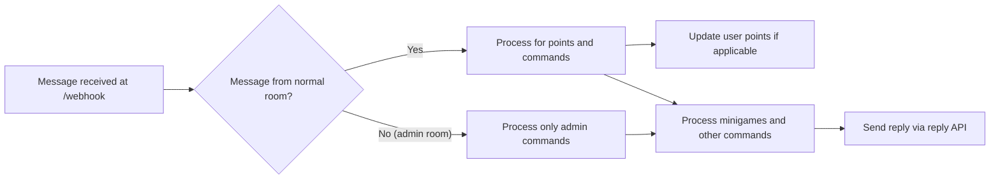
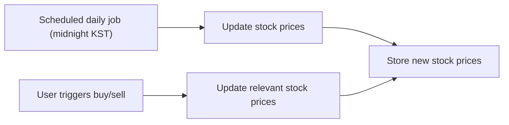

# Chatbot Server Functional Requirements Specification

## 1. Introduction

This document provides a detailed and comprehensive specification of the chatbot server’s functional and business requirements. It defines how the server should process messages, award points, manage mini-games, administer user titles and points, and interact with the reply API. The document serves as a complete resource for backend developers to implement the system without ambiguity.

## 2. Business Model

### 2.1 Purpose

The chatbot server enhances user engagement in multi-room chat environments by rewarding message activity with points and enabling interactive mini-games such as virtual stock trading and a slot machine. It supports administrative controls via dedicated admin rooms to configure and manage the system dynamically.

### 2.2 Revenue and Growth

Although direct monetization is not yet implemented, the system’s engagement features lay a foundation for potential premium services or advertising. Growth is planned via increased user activity and retention driven by gamification strategies.

### 2.3 Core Value Proposition

- Real-time message processing and points awarding
- Multi-room isolated session management
- Gamification with minigames enhancing user interaction
- Secure and distinct admin control interface

## 3. User Roles and Permissions

### 3.1 Role Definition
- User roles are determined entirely by the context of the chat room where the message originates:
  - Messages from normal rooms are treated as from members.
  - Messages from admin rooms are treated as from admins.
- No user role data is stored explicitly in the user records.

### 3.2 Permissions Summary

| Action/Feature            | Member (Normal Room)                  | Admin (Admin Room)                |
|--------------------------|------------------------------------|---------------------------------|
| Send Messages            | Yes                                | No                              |
| Earn Points              | Yes (with cooldown and message length restriction) | No                              |
| Use Member Commands      | Yes                                | No                              |
| Use Admin Commands       | No                                 | Yes                             |
| Manage User Points/Titles| No                                 | Yes                             |
| Manage Stock Items       | No                                 | Yes                             |

## 4. Core Functional Requirements

### 4.1 Message Reception and Processing
- The server SHALL expose a webhook endpoint at `/webhook` accepting POST messages.
- Incoming message payloads SHALL include an internal sender ID (not exposed externally), nickname, and room ID (not exposed externally).
- The system SHALL process messages immediately upon receipt.
- WHEN a message originates from a normal room:
  - THE system SHALL award points according to message length and cooldown rules.
  - THE system SHALL parse commands and handle mini-games accordingly.
- WHEN a message originates from an admin room:
  - THE system SHALL process only admin commands.
  - No points or mini-games SHALL be triggered.

### 4.2 Points System
- THE system SHALL award 1 point per message of at least 3 characters length.
- THE system SHALL enforce a 1-second cooldown per user to prevent rapid point farming.
- THE system SHALL allow unlimited point accumulation.
- THE system SHALL allow admins to set or adjust points manually via commands.

### 4.3 Command Handling
- THE system SHALL parse and execute commands prefixed with `/`.
- Normal member commands include: `/랭킹`, `/슬롯머신 <bet>`, `/도움말`, `/주식`, `/주식목록`, `/주식매수 <item-id> <count>`, `/주식매도 <item-id> <count>`.
- Admin commands include: `/목록`, `/포인트 <user-id> <increment>`, `/포인트초기화 <user-id> <points>`, `/칭호 <user-id> <fee-discount> <title>`, `/칭호제거 <user-id>`, `/주식목록`, `/주식추가 <item-id> <price> <name>`, `/주식제거 <item-id>`, room management commands.

## 5. Minigames

### 5.1 Virtual Stock Trading
- The system SHALL support multiple virtual stock items; initially six placeholders (item0–item5).
- Admins can dynamically add or remove stock items.
- Stocks SHALL have configurable names, quantities, and prices (100 to 1,000,000 points).
- Stock prices update daily (scheduled job at KST) and dynamically after user transactions.
- Buying and selling incur a 5% transaction fee, reduced by user titles.
- Removal of a stock item refunds all user holdings automatically.

### 5.2 Slot Machine
- Three slots display random digits 0–9.
- Minimum bet is 100 points; no maximum.
- Spins are free apart from risk of the bet amount.
- Payouts:
  - Triple sevens (777) pays 777x the bet.
  - Any other triple digits pay 10x the bet.
  - All other outcomes lose the bet amount.

## 6. Title System
- Titles are simple strings stored in user records.
- Each user may have one title assigned by admins.
- Titles include fee discount percentages applied to stock transaction fees.
- Only admins may assign or remove titles.

## 7. Room and Session Management
- The system SHALL maintain tuples linking normal room IDs and corresponding admin room IDs.
- Each tuple includes a display name and unique identifier.
- Admin rooms are exclusive contexts for admin commands.
- No points or mini-game activities occur in admin rooms.

## 8. Administrative Features
- Admins can manage rooms, users, points, titles, and stock items.
- Admin commands are valid only within admin rooms.
- APIs SHALL allow listing, adding, updating, enabling, disabling room tuples.

## 9. Audit Logging
- The system SHALL log commands, minigame results, stock price changes, and stock transactions.
- Chat message content SHALL NOT be logged.

## 10. Error Handling and Recovery
- Invalid commands or parameters SHALL generate user-friendly error messages.
- Insufficient points or invalid actions SHALL result in error replies.
- Unauthorized command attempts SHALL notify the user about permission issues.

## 11. Performance Requirements
- The system SHALL respond to webhook messages and commands within 200 milliseconds under normal load.
- Scheduled jobs SHALL run daily at midnight KST to update stock prices.
- The system SHALL support concurrent processing of multiple rooms with isolated data.

## 12. Security and Privacy
- Sender IDs and room IDs SHALL remain confidential and never exposed.
- Administrative commands SHALL be restricted by room context.
- No authentication is required given trusted local environment assumptions.

## 13. Appendices

### 13.1 Mermaid Diagram: Message Flow

### 13.2 Mermaid Diagram: Stock Price Update Flow

---

This document provides business requirements only. All technical implementations including architecture, APIs, and database schema design are left to developers' discretion. It describes WHAT must be built, not HOW to build it.