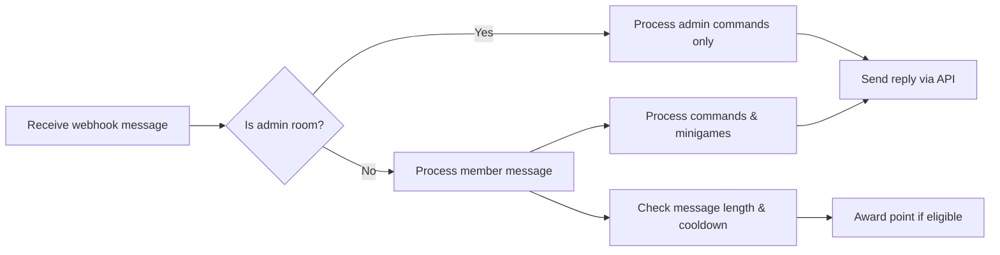

# Chatbot Server Core Functional Requirements

## 1. Introduction
This document details the comprehensive functional requirements for the chatbot server supporting multiple chat rooms. The server receives and processes messages in real-time, manages user points and rankings, executes minigames (Virtual Stock Trading and Slot Machine), and oversees the Title system for user benefits. Administrative functionalities, audit logging, error handling, and performance expectations are also specified.

## 2. Business Model

### Why This Service Exists
The chatbot service fills a need for interactive engagement and gamification in chat platforms, encouraging user retention through point accumulation, minigames, and status titles, differentiating from traditional chatbots.

### Revenue Strategy
Though currently no direct monetization is specified, the point system and minigames provide a foundation for potential future monetization through premium features or advertising.

### Growth Plan
Growth will be driven by increasing user engagement via gamification features and competitive ranking displays, supported by administrative tools for dynamic control.

### Success Metrics
Key performance indicators include active user count per room, message volume, points accrued, minigame participation rates, and accurate execution of commands.

## 3. User Roles and Permissions

### Roles
- **Member**: Authenticated users in normal chat rooms. Can send messages, earn points, participate in minigames, view rankings, and execute member commands.
- **Admin**: Users in dedicated admin rooms linked to normal rooms. Can manage users, points, titles, virtual stocks, and rooms via admin commands.

### Role Determination
User roles are determined solely by the room from which messages originate. Messages from admin rooms are treated as coming from admins; messages from normal rooms are members. No other role attributes are stored.

### Permissions Matrix
| Action                            | Member | Admin  |
|---------------------------------|--------|--------|
| Send chat messages              | ✅     | ❌     |
| Earn points                    | ✅     | ❌     |
| Use member commands            | ✅     | ❌     |
| Use admin commands             | ❌     | ✅     |
| Manage rooms and stocks        | ❌     | ✅     |
| Adjust user points             | ❌     | ✅     |
| Assign/remove titles           | ❌     | ✅     |

## 4. Message Reception and Processing

### Webhook Endpoint
- Endpoint path: `/webhook`
- Method: POST
- Payload includes `sender_id` (internal identifier), `nickname`, `room_id`.
- Sender ID and room ID are sensitive and must never be exposed or returned to clients.

### Session Isolation
- Sessions are isolated by `room_id`.
- Message processing, points management, and minigame state are scoped per room.

### Real-time Processing
- Messages are processed immediately upon reception.
- Point awarding rules and command execution occur in real-time.

## 5. Command Handling

### Command Categories
- **Normal Commands**: Executable by members in normal rooms.
- **Admin Commands**: Executable only by admins in admin rooms linked to the respective normal room.

### Command List

| Command              | Scope | Description                                           |
|----------------------|-------|-------------------------------------------------------|
| `/랭킹`               | Member| Show points ranking with truncated preview using zero-width spaces.
| `/슬롯머신 <points>`  | Member| Spin slot machine minigame betting specified points.
| `/도움말`             | Member| Display help text listing available commands.
| `/주식`               | Member| List user-owned stocks with current info and fluctuations.
| `/주식목록`           | Member/Admin| List available virtual stock items.
| `/주식매수 <item-id> <count>` | Member| Buy specified stock items.
| `/주식매도 <item-id> <count>` | Member| Sell specified stock items.
| `/목록`               | Admin | Show user list in normal room with details.
| `/포인트 <user-id> <increment>` | Admin | Adjust user points.
| `/포인트초기화 <user-id> <points>` | Admin | Set user points.
| `/칭호 <user-id> <discount-fee-percentage> <title>` | Admin | Set user title with fee discount.
| `/칭호제거 <user-id>` | Admin | Remove user title.
| `/주식추록 <item-id> <initial-price> <name>` | Admin | Add a new stock item.
| `/주식제거 <item-id>` | Admin | Remove a stock item and refunds holdings.

### Command Processing Rules
- Commands from admin rooms execute only admin commands.
- Commands from normal rooms execute only member commands.
- If a command is not recognized in the room context, return an appropriate error message.

## 6. Points Management Rules

### Point Awarding
- Members earn 1 point per qualifying message.
- Messages must be at least 3 characters.
- 1-second cooldown applies for each user for awarding points.
- Points accumulate without limit.

### Manual Adjustment
- Admins can increase or set user points via commands.

### Ranking
- `/랭킹` command displays points ranking.
- Ranking lists top users by points, showing title (if any) and nickname.
- The ranking message includes 2000 zero-width spaces to truncate previews.

## 7. Minigames

### 7.1 Virtual Stock Trading

#### Stocks
- Unlimited virtual stock items supported.
- Initially 6 placeholder stocks: item0 through item5.
- Each stock has configurable name, quantity, initial price (100–1,000,000 points).

#### Market
- Prices update daily at KST (UTC+9) and on every buy/sell transaction.
- Buying and selling stock incurs a 5% transaction fee; selling fees may be reduced by user titles.

#### User Holdings
- Users can buy/sell stock if they have enough points or holdings.
- Selling returns points minus the fee.

#### Admin Control
- Admins add or remove stock items dynamically.
- Removing a stock refunds holdings to users.

### 7.2 Slot Machine
- The slot machine displays three digits from 0–9 randomly.
- Minimum bet 100 points; no max limit.
- Spin costs no points beyond bet amount.
- Payouts: 777 pays 777x, three identical digits pay 10x, else lose bet.

## 8. Title System
- Titles stored as a string in user records.
- At most one title per user.
- Admins assign and remove titles.
- Titles provide fee discount on stock transactions.

## 9. Room and Session Management
- Rooms managed as tuples of normal room ID + admin room ID + display name + unique id.
- Admin room messages process admin commands only.
- No point gain/gameplay in admin rooms.

## 10. Audit Logging
- Logs commands, minigame results, stock price changes, stock transactions.
- No chat message logging.

## 11. Error Handling
- Invalid commands produce error messages.
- Insufficient points or holdings cause command rejections.
- Commands executed only in allowed room contexts.

## 12. Performance Requirements
- Processing and replies within 1 second.
- Scheduled daily jobs for price updates at KST.
- Support multiple concurrent rooms.

## 13. Security and Privacy
- Sender and room IDs confidential, never exposed.
- Admin commands restricted by room.
- No authentication as environment trusted locally.

## 14. Appendix: Mermaid diagrams

---

This document provides only business requirements. All technical implementation decisions, including architecture, API, and data schema design, are the responsibility of the developers.