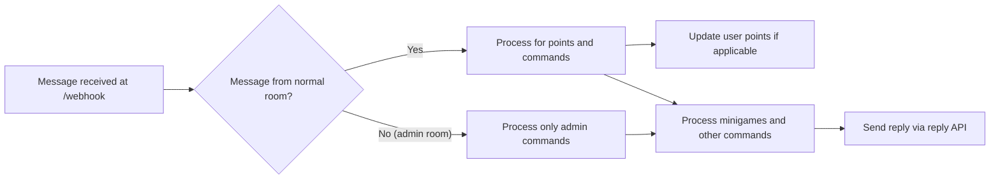
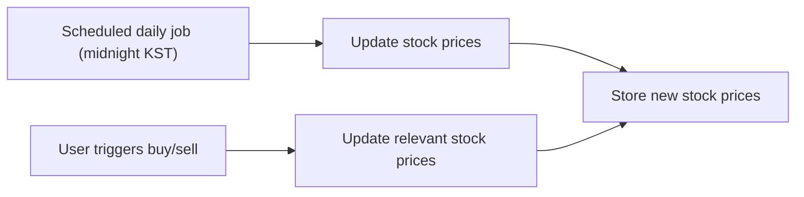

# Chatbot Server Functional Requirements Analysis

## 1. Introduction
This document defines the complete business and functional requirements for the chatbot server. It serves as the definitive guide for backend developers to implement the server that handles message reception, point awarding, game mechanics, administrative controls, and reply processing through a specified reply API endpoint.

## 2. Business Model
### 2.1 Purpose and Justification
The chatbot server enables interactive engagement within chat rooms by awarding points based on user activity and providing mini-games to encourage continued participation. This fosters user retention and community engagement within the platform.

### 2.2 Revenue and Growth
While the system does not currently monetize directly, the point and gaming systems can later support value-added services or premium features. The business strategy includes expanding user engagement and enabling administrative ease of management.

### 2.3 Core Value Proposition
- Seamless interaction via webhook message reception
- Real-time user engagement rewarded through points
- Multiple mini-games enhancing the chat experience
- Administrative controls for dynamic configuration

## 3. User Roles and Permissions
### 3.1 Roles
- **Member**: Authenticated users participating in chat rooms. They can gain points, play mini-games, and use normal commands.
- **Admin**: Elevated permissions for managing rooms, users, points, titles, mini-games, and system configuration.

### 3.2 Role Determination
User roles are not explicitly stored in the user/member data but are inferred based on the room from which the messages originate.

### 3.3 Permissions Summary
| Action/Feature             | Member          | Admin           |
|---------------------------|-----------------|-----------------|
| Gain Points               | Yes (in normal rooms only) | No (no actions in admin rooms) |
| Play Mini-games           | Yes             | Yes             |
| Use Normal Commands       | Yes             | No (only admin commands in admin rooms) |
| Manage Rooms/Users        | No              | Yes             |
| Adjust Points and Titles  | No              | Yes             |
| Point Ranking Display     | Yes             | Yes             |

## 4. Core Functional Requirements
### 4.1 Message Reception and Processing
- The server SHALL expose a webhook endpoint at `/webhook` accepting POST requests with message payload containing:
  - Internal sender ID (not exposed outside server)
  - Nickname
  - Room ID (not exposed outside server)
  - Message text
- WHEN the webhook receives a message from a normal room, THE system SHALL:
  - Process message for points awarding
  - Parse commands if present
  - Process mini-game actions if commands correspond
  - Send replies using the external reply API at `http://host.docker.internal:3000/reply`
- No processing of user messages nor point gains SHALL occur in admin rooms.

### 4.2 Points System
- WHEN a user sends a message with a length of at least 3 characters in a normal room, and a minimum 1 second has elapsed since their last point award, THE system SHALL increment user's points by 1.
- THE system SHALL enforce an unlimited accumulation of points; no upper limits apply.
- THE system SHALL support administrative commands to adjust and reset user points.

### 4.3 Command Handling
- THE system SHALL support user commands prefixed with `/`.
- THE system SHALL parse and execute commands accordingly.
- Normal user commands include:
  - `/랭킹`: Show points ranking in a message truncated via 2000 zero-width spaces to prevent preview spoilers.
  - `/슬롯머신 <points-to-bet>`: Play slot machine minigame, betting specified points.
  - `/도움말`: Show help information about available commands.
  - `/주식`: Show the user's current stock holdings with price fluctuations and details.
  - `/주식목록`: Show the list of available stock items.
  - `/주식매수 <item-id> <count>`: Buy specified quantity of stock item.
  - `/주식매도 <item-id> <count>`: Sell specified quantity of stock item.
- Admin commands (only valid in admin rooms) include:
  - `/목록`: Show user list with nickname, identifier, and points.
  - `/포인트 <user-identifier> <increment>`: Increase a user's points.
  - `/포인트초기화 <user-identifier> <points>`: Set a user's points.
  - `/칭호 <user-identifier> <fee-discount-rate> <title>`: Assign a title with fee discount rate.
  - `/칭호제거 <user-identifier>`: Remove a user's title.
  - `/주식목록`: Show list of stocks.
  - `/주식추가 <item-id> <initial-price> <name>`: Add a new stock item.
  - `/주식제거 <item-id>`: Remove a stock item and refund holdings.
  - Commands for enabling/disabling room tuples.

## 5. Minigames
### 5.1 Virtual Stock Trading
- THE system SHALL support multiple virtual stock items; initially six placeholders (item0 to item5).
- Admins can add or remove stock items dynamically.
- Each stock SHALL have configurable name, quantity, and price range (100 to 1,000,000 points).
- Stock prices update daily (scheduled job in KST UTC+9) and dynamically on user transactions (buy/sell).
- WHEN a user buys/sells stock, THE system SHALL apply a 5% transaction fee, reducible by title-based fee discounts.
- Selling deducts stocks and awards points accordingly after fee deduction.
- When a stock is removed by admin, all user holdings SHALL be refunded.

### 5.2 Slot Machine
- THE system SHALL present a slot machine with three numeric slots (0-9).
- Users can place a bet with a minimum of 100 points; maximum bet is unlimited.
- Spin cost is free; risk applies only to bet amount.
- Payouts:
  - Triple sevens (777) yields 777x multiplier.
  - Any other triple identical digits yields 10x multiplier.
  - All other combinations yield loss of bet amount.

## 6. Title System
- Titles SHALL be stored as simple strings in user records.
- Only admins can assign or revoke titles.
- Titles include a fee discount rate applied on stock transaction fees.
- Each user may have at most one title.

## 7. Room and Session Management
- THE system SHALL manage multiple isolated chat sessions partitioned by room id.
- Admin and normal rooms SHALL be managed in tuples with display name and unique id.
- Admin messages are only processed in admin rooms; normal messages active in normal rooms.
- Rooms can be enabled, disabled, added, or updated via admin commands/APIs.

## 8. Administrative Features
- THE system SHALL provide commands and APIs for managing rooms, users, points, titles, and stock items.
- Admin commands SHALL be valid ONLY in admin rooms.
- Admins SHALL be able to view user lists with points and titles.
- Admins SHALL be able to adjust points and titles for users.

## 9. Audit Logging
- THE system SHALL log all commands executed, minigame play results, stock price changes, and stock transactions.
- Chat messages SHALL NOT be logged to protect privacy.

## 10. Error Handling and Recovery
- IF invalid command syntax or parameters are received, THE system SHALL reply with an appropriate error message.
- IF a user attempts unauthorized action (e.g., admin command in normal room), THE system SHALL inform them of permission denial.
- IF a stock transaction fails (insufficient points or stock), THE system SHALL send descriptive failure messages.
- THE system SHALL handle unexpected errors gracefully and notify users without leaking sensitive details.

## 11. Performance Requirements
- THE system SHALL respond to webhook messages and commands within 200 milliseconds under normal load.
- Scheduled jobs (stock price updates) SHALL run daily at midnight KST.
- THE system SHALL support concurrent sessions for multiple rooms without cross-data contamination.

## 12. Security and Privacy Considerations
- Sender IDs and room IDs SHALL be kept confidential internally and not exposed in replies or logs.
- Data SHALL be stored securely with appropriate access controls.
- Admin commands SHALL be restricted by room context only; no additional authentication is currently required.

## 13. Appendix
### 13.1 Mermaid Diagram: Message Flow

### 13.2 Mermaid Diagram: Stock Price Update Flow

---

**This document provides business requirements only. All technical implementations, including system architecture, APIs, and database design, are at developers' discretion.**