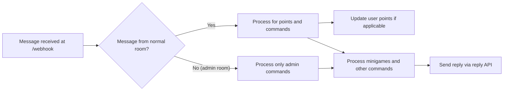
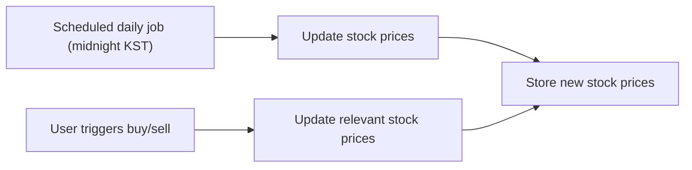

# Chatbot Server Functional Requirements Analysis

## 1. Introduction
This document defines comprehensive business and functional requirements for a multi-room chatbot server that incorporates real-time message processing, an advanced points and minigames system, and robust administrative controls via dedicated admin rooms.

## 2. Business Model
### 2.1 Service Purpose
The chatbot enriches user engagement in chat rooms by rewarding active participation through points and entertainment via mini-games like virtual stock trading and slot machine spins. This promotes community activity and retention.

### 2.2 Revenue and Growth
Current operations do not monetize directly but the extensive gamification framework positions the service for possible future monetization through premium features or promotions.

### 2.3 Value Proposition
- Real-time message processing for timely user feedback
- Points system with fair cooldown and unlimited accrual
- Mini-games integrated with stock market simulation and slot machines
- Administrative controls via segregated admin rooms

## 3. User Roles and Permissions
### 3.1 Roles Overview
- **Member**: Users in normal chat rooms who can send messages, gain points, play mini-games, and execute normal commands.
- **Admin**: Privileged users operating in dedicated admin rooms with permissions to manage users, points, titles, stocks, and rooms.

### 3.2 Role Determination
- Roles are inferred solely by the origin room ID, with no explicit user role property stored.
- Messages from normal rooms are processed as member actions; admin room messages are for admin commands only.

### 3.3 Permissions Summary
| Feature                     | Member       | Admin        |
|-----------------------------|--------------|--------------|
| Gain points on messages      | Yes          | No           |
| Execute member commands      | Yes          | No           |
| Execute admin commands       | No           | Yes          |
| Manage rooms and stocks      | No           | Yes          |
| Adjust user points and titles| No           | Yes          |

## 4. Core Features
### 4.1 Message Handling
- The webhook endpoint `/webhook` receives POST messages containing sender ID (confidential), nickname, room ID (confidential), and message content.
- Incoming messages from normal rooms trigger points processing, commands parsing, and minigame participation.
- Incoming messages from admin rooms process only admin commands.

### 4.2 Points System
- WHEN a user sends a message of at least 3 characters in a normal room AND 1 second has passed since their last point, THE system SHALL award 1 point.
- Points accumulate without any upper bounds.
- Admins can adjust user points via designated commands.

### 4.3 Command Handling
- Commands are initiated by messages starting with '/'.
- Normal users have a predefined set of commands; admins have additional management commands.
- User commands include `/랭킹`, `/슬롯머신 <bet>`, `/도움말`, `/주식`, `/주식목록`, `/주식매수 <item-id> <count>`, `/주식매도 <item-id> <count>`.
- Admin commands include `/목록`, `/포인트 <user-id> <delta>`, `/포인트초기화 <user-id> <points>`, `/칭호 <user-id> <fee-discount> <title>`, `/칭호제거 <user-id>`, and stock management commands.

### 4.4 Minigames
#### Virtual Stock Trading
- Supports multiple stock items; initially six placeholders.
- Stocks have configurable names, quantities and prices (100-1,000,000 points).
- Prices update daily (KST) and dynamically on buy/sell actions.
- 5% transaction fee applies on sales; discounts apply if user has titles.
- Removing a stock refunds user holdings.

#### Slot Machine
- 3 slots showing digits 0-9.
- Min bet 100 points, no max limit.
- Spin free apart from bet risk.
- Payouts: 777 pays 777x, other triples pay 10x, else lose bet.

### 4.5 Title System
- Titles are stored as strings directly in user records.
- Admins assign or remove titles.
- Titles provide fee discount percentages for stock transactions.

### 4.6 Room and Session Management
- Rooms managed as tuples (normal room ID + admin room ID + display name + unique ID).
- Admin rooms permit only admin commands; no points or minigame actions.

### 4.7 Admin Features
- Manage users, points, titles, stocks, and rooms.
- Admin command execution only in admin rooms.

### 4.8 Audit Logging
- Logs commands, minigame results, stock price changes, and stock transactions.
- Does NOT log chat message contents.

### 4.9 Error Handling
- Invalid commands result in clear error messages.
- Unauthorized commands are rejected with explanations.
- Stock transaction failures notify users.
- Graceful error recovery prevents system crashes.

### 4.10 Performance
- Messages processed and responded to within 200 milliseconds.
- Daily stock update scheduled at midnight KST.
- Concurrent multi-room support.

### 4.11 Security
- Confidential sender and room IDs.
- Role-based permissions via room ID.
- No authentication required due to trusted network.

## 5. Diagrams
### Message Flow

### Stock Price Update Flow

---

This document provides business requirements only. All technical implementations, including architecture, APIs, and database design, are at developers' discretion.