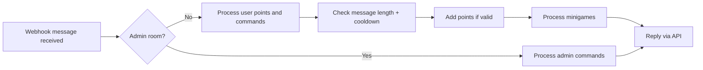

# Chatbot Server Functional Requirements

## 1. Introduction
This document defines the complete business requirements and functional specifications for a chatbot server designed to operate across multiple chat rooms with a point and minigame system. It clarifies user roles, command structures, game mechanics, point awarding rules, and administrative controls to provide backend developers with a clear, actionable blueprint.

## 2. Business Model
### 2.1 Purpose
The chatbot server aims to enhance user engagement in chat environments by awarding points for message activity, providing entertaining minigames, and offering administrative tools for management and monitoring. It fosters active participation and community building.

### 2.2 Growth and Monetization
The current implementation focuses on gamification and user retention. While monetization is not yet in scope, the point and mini-game systems lay groundwork for future premium features or transactional revenue.

### 2.3 Core Value
- Real-time interaction and feedback via webhook integration.
- Engagement through points, rankings, and minigames.
- Administrative management through separate admin rooms.

## 3. User Roles and Authentication
### 3.1 User Role Definition
- Users are categorized based on the room the message comes from: normal rooms for members, admin rooms for administrators.
- The system does not store explicit roles; role inference is automatic.
- Members participate normally and gain points; admins manage configurations.

### 3.2 Authentication Flow
- Role-based access is determined on the fly by message origin room ID.
- Members have access to user commands and minigames.
- Admins operate exclusively in admin rooms.

### 3.3 Permissions Matrix
| Functionality               | Member in Normal Room | Admin in Admin Room |
|----------------------------|----------------------|--------------------|
| Gain points on messages     | Yes                  | No                 |
| Use member commands         | Yes                  | No                 |
| Use admin commands          | No                   | Yes                |
| Manage rooms and users      | No                   | Yes                |
| Adjust points and titles    | No                   | Yes                |

## 4. Message Reception and Processing
### 4.1 Webhook Endpoint
- Messages enter the system through `/webhook` POST endpoint.
- Payload includes sender ID, nickname, message content, and room ID.
- Sender and room IDs are kept confidential internally.

### 4.2 Message Handling
- Messages from normal rooms trigger point assessment and command parsing.
- Messages from admin rooms execute only admin commands.

### 4.3 Message Anonymity
- User identifiers and room identifiers are mapped internally and are not exposed externally.

## 5. Points System
### 5.1 Award Rules
- WHEN a message with 3 or more characters is received from a normal room, THE system SHALL award 1 point to the sender if 1 second has elapsed since their last point.
- Points have no accumulation limit.

### 5.2 Manual Point Adjustments
- Admins can modify user points using admin commands.

### 5.3 Cooldown
- A per-user 1-second cooldown is enforced for awarding points.

## 6. Commands
### 6.1 User Commands
- `/랭킹`: Displays the points ranking, formatted with 2000 zero-width spaces to avoid preview.
- `/슬롯머신 <bet>`: Plays the slot machine minigame.
- `/도움말`: Shows available commands.
- `/주식`: Shows the user's holdings and stock fluctuations.
- `/주식목록`: Lists current stock items.
- `/주식매수 <item-id> <count>`: Purchases stock.
- `/주식매도 <item-id> <count>`: Sells stock.

### 6.2 Admin Commands
- `/목록`: Lists users with nicknames, internal IDs, and points.
- `/포인트 <user-id> <increment>`: Adjust points.
- `/포인트초기화 <user-id> <points>`: Set points.
- `/칭호 <user-id> <fee-discount> <title>`: Assign title with fee discount.
- `/칭호제거 <user-id>`: Remove title.
- `/주식목록`: List stocks.
- `/주식추가 <item-id> <price> <name>`: Add stock.
- `/주식제거 <item-id>`: Remove stock and refund holdings.
- Commands to add/update/enable/disable room administrtive room tuples.

## 7. Minigames
### 7.1 Virtual Stock Market
- Initial 6 virtual stock items.
- Admins can add or remove stocks.
- Prices rage from 100 to 1,000,000 points.
- Prices update daily at KST and on transactions.
- 5% fee on trades reduced by title discounts.
- Holdings refunded on stock removal.

### 7.2 Slot Machine
- Three digits (0-9) are randomly generated.
- Minimum bet of 100 points; no max bet.
- Spin is free beyond bet.
- Payouts: 777 pay 777x, three identical digits pay 10x, else lose bet.

## 8. Title System
- Titles are a string field in user records.
- One title max per user.
- Titles assigned/removed by admins.
- Titles provide fee discounts for stocks.

## 9. Room Management
- Room tuples pair normal and admin rooms with unique IDs and display names.
- Admin commands only accepted in admin rooms.

## 10. Audit Logs
- Log commands, minigame outcomes, stock prices and transactions.
- No chat message logs.

## 11. Error Handling
- Invalid commands get clear error messages.
- Insufficient point/balance errors are reported.
- Commands out of context are rejected.

## 12. Performance
- Processing done real-time.
- Responses within 1 second.
- Scheduled jobs at midnight KST.
- Support concurrency.

## 13. Security
- Sender and room IDs internal and never exposed.
- Admin commands restricted by room context.
- No authentication needed on local network.

## 14. Mermaid Diagrams

---

This document provides detailed, actionable business requirements for the chatbot server backend. It focuses exclusively on what the system shall do, excluding technical implementation details such as database schema or API specifications.

Developers have full freedom to design the backend architecture as long as these requirements are met.