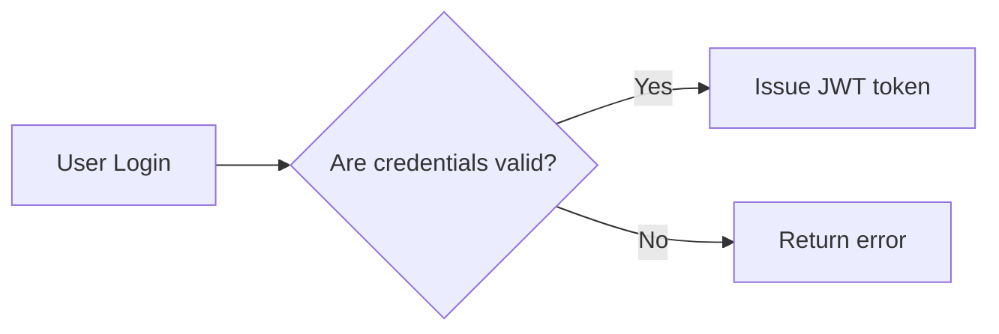
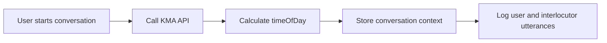
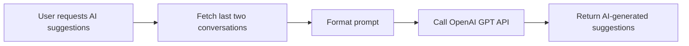
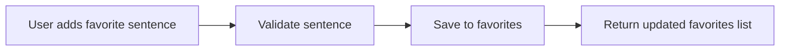

# Echo Backend Business and Functional Requirements

## 1. Introduction

### 1.1 Service Overview
Echo is an AI-powered assistive communication backend designed to facilitate communication for non-verbal individuals suffering from brain lesions. By converting text to speech and offering AI-generated sentence suggestions, Echo enables users to interact effectively within their environment.

### 1.2 Business Model

#### Why This Service Exists
Echo fulfills a vital need for augmentative and alternative communication, targeting individuals who lose their ability to speak due to neurological injury. Existing solutions lack the adaptive, context-aware responsiveness Echo offers, thereby addressing a significant communication gap.

#### Revenue Strategy
Primarily focusing on accessibility, Echo plans potential monetization through subscription tiers offering premium AI features, complemented by partnerships with healthcare entities.

#### Growth Plan
User acquisition will proceed via healthcare partnerships, caregiver engagement, and ongoing enhancements improving AI contextual accuracy.

#### Success Metrics
- Monthly active users (MAU) growth targets of 20%
- AI suggestion response times under 3 seconds
- 90% accuracy in timeOfDay context determination
- 85% positive user satisfaction ratings
- System availability of 99.9%

### 1.3 User Roles
- **Guest:** Public user with access limited to signup and login.
- **User:** Authenticated individual capable of managing profile, conversations, favorites, and AI suggestions.
- **Admin:** System administrator with full access to user and system management functionalities.

## 2. Authentication Requirements

### 2.1 User Registration
WHEN a new user signs up, THE system SHALL validate that the chosen userId is unique.
WHEN the survey data is submitted, THE system SHALL perform strict validation against the predefined schema.
WHEN validation passes, THE system SHALL create the user with hashed password storage.
WHEN signup is successful, THE system SHALL issue a JWT token containing userId and role information.

### 2.2 User Login
WHEN a user attempts to log in, THE system SHALL verify the credentials against stored hashes.
IF credentials are invalid, THEN THE system SHALL return HTTP 401 Unauthorized with an appropriate error.
WHEN successful, THE system SHALL issue a JWT token.

### 2.3 Session Management
THE system SHALL maintain stateless sessions using JWT tokens.
Tokens SHALL include userId, role, and permissions claims.
Access tokens SHALL expire within 15 minutes.

### 2.4 Authorization
THE system SHALL require JWT authentication for all protected endpoints.
IF an invalid or expired token is presented, THEN THE system SHALL respond with HTTP 401 Unauthorized.

## 3. User Management Requirements

WHEN a user updates their profile, THE system SHALL validate and persist updated survey data.
THE system SHALL reject duplicate userIds during signup.

## 4. Conversation Management Requirements

WHEN a new conversation starts, THE system SHALL call the KMA API to fetch sunrise and sunset times for the user’s location.
THE system SHALL calculate the timeOfDay and store it alongside timestamp and season within the conversation context.
THE system SHALL log conversational utterances with speaker attribution and precise timestamp in a "ping-pong" format.
WHEN requested, THE system SHALL provide a list of past conversations with summary data.

## 5. AI Suggestions Requirements

WHEN a user requests AI sentence suggestions, THE system SHALL collect context and utterances from the last two conversations.
THE system SHALL forward a formatted prompt to OpenAI GPT API.
THE system SHALL return at least three suggestions.

## 6. Favorites Management Requirements

THE system SHALL allow users to add, retrieve, and delete favorite sentences independently from conversations.
WHEN adding favorites, THE system SHALL validate sentence length (max 500 characters) and uniqueness.

## 7. External Integrations

THE system SHALL interact with the KMA Weather API for environmental context.
THE system SHALL use the OpenAI GPT API for AI sentence suggestions with secure key management.
On failure of external API requests, THE system SHALL implement retry logic and fallback behaviors.

## 8. Business Rules and Constraints

Survey data must be complete and strictly validated.
Favorites SHALL be stored separately and limited to 100 entries per user.
Conversation context SHALL always include timestamp, season and timeOfDay computed by precise comparison with KMA data.
AI suggestions use only the last two conversations.

## 9. Error Handling and Recovery

WHEN authentication errors occur, THE system SHALL respond with specific HTTP error codes and messages.
WHEN external services fail, THE system SHALL log the failures and notify users appropriately.
THE system SHALL allow retries for failed external dependencies.

## 10. Performance Requirements

Authentication endpoints SHALL respond within 2 seconds.
Conversation initiation SHALL complete within 1 second.
AI suggestion responses SHALL be returned within 3 seconds.

## 11. Data Lifecycle and Audit Requirements

User data SHALL be securely managed and retained for compliance.
Audit logs SHALL be recorded for critical actions and preserved securely.

## 12. Appendices

### 12.1 Glossary
- UserId: Unique string identifier for each user.
- Survey Data: Fixed JSON structure of user background data.
- Conversation: A user session capturing dialogues.
- Utterance: Individual statement by user or interlocutor.
- Favorites: User-managed list of reusable sentences.
- Context: Environmental data linked to conversations.

### 12.2 References
- [Service Overview](./01-service-overview.md)
- [User Roles and Authentication](./02-user-roles.md)
- [External Integrations](./06-external-integrations.md)

---

This document provides business requirements only. Technical implementation details, including API specifications and database architectures, are to be determined by the development team.