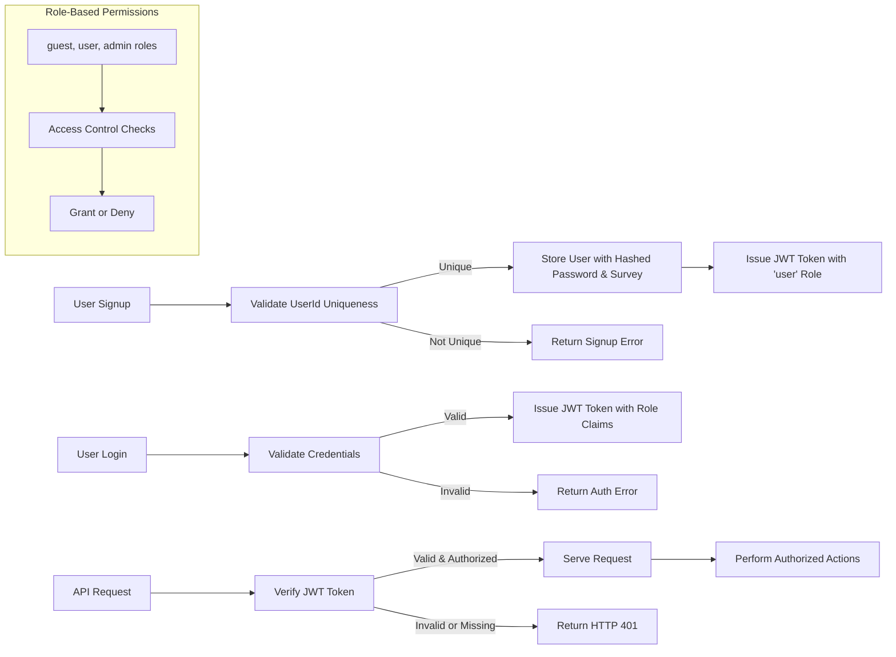

# User Authentication and Authorization Requirements for Echo Backend

This document specifies the detailed business requirements for user authentication and authorization within the Echo backend service. It is intended to be a definitive guide for backend developers to implement secure, robust, and fully functional access control mechanisms.

## 1. Authentication Flow

### 1.1 User Registration

WHEN a new user attempts to sign up, THE system SHALL require a unique userId chosen by the user and a password.

WHEN the user submits the signup request with the password and fixed-schema survey data, THE system SHALL validate the uniqueness of the userId BEFORE creating the user.

IF the userId is already taken, THEN THE system SHALL respond with an error indicating "UserId already exists".

WHEN the signup data passes validation, THE system SHALL create a new user record storing the hashed password and survey data.

WHEN a user successfully registers, THE system SHALL issue a JWT token binding the userId with appropriate role claims.

### 1.2 User Login

WHEN a user attempts to login by submitting userId and password, THE system SHALL verify the credentials against stored hashed values.

IF credentials are invalid, THEN THE system SHALL respond with an HTTP 401 Unauthorized with error code `AUTH_INVALID_CREDENTIALS`.

WHEN credentials are valid, THE system SHALL issue a JWT token including the user's role and permissions.

### 1.3 Session Management

THE system SHALL maintain stateless session management via JWT tokens.

THE JWT tokens SHALL include userId, role, and permissions claims.

THE token expiration for access tokens SHALL be set to 15 minutes.

Refresh tokens, if any, SHALL have expiration between 7 and 30 days.

The system SHALL allow secure storage and transmission of tokens but SHALL NOT specify frontend storage details.

### 1.4 Authorization checks

THE system SHALL verify JWT token validity on every protected API call.

THE system SHALL deny access and return HTTP 401 if token is missing or invalid.

THE system SHALL ensure role-based access controls are enforced according to the permission matrix.

## 2. User Roles and Permissions

### 2.1 Defined Roles

- **guest**: Unauthenticated user with access only to public endpoints such as signup and login.
- **user**: Authenticated user who can manage profiles, conversations, favorites, and access AI suggestions.
- **admin**: System administrator with privileges to manage users, system settings, service health, and security.

### 2.2 Role Descriptions

- guest: THE system SHALL allow only signup and login endpoints without authentication.
- user: THE system SHALL grant full access to user's own data, including profile updates, conversation management, favorites, and AI suggestions.
- admin: THE system SHALL grant full administrative rights including user management and system monitoring capabilities.

### 2.3 Role Assignment

WHEN a user is created via signup, THE system SHALL assign the role `user` by default.

THE system SHALL have an administrative interface to promote users to `admin` role.

## 3. Token Management

### 3.1 Token Format

THE system SHALL use JWT tokens for all access tokens.

THE JWT token SHALL include the following claims:
- `userId`: Unique user identifier
- `role`: User's assigned role (`guest`, `user`, or `admin`)
- `permissions`: Array of permitted actions based on role

### 3.2 Token Lifetimes

THE access token SHALL expire 15 minutes after issuance.

IF refresh tokens are implemented, THEY SHALL expire between 7 and 30 days.

### 3.3 Token Security

THE system SHALL secure the secret key used for JWT signing and verification.

THE system SHALL invalidate tokens immediately upon user logout or password change.

THE system SHALL require token validation on all protected resource requests.

## 4. Permission Matrix

The following table defines the permissions granted to each role by action category.

| Action Category        | guest | user | admin |
|-----------------------|-------|------|-------|
| Signup                | ✅    | ❌   | ❌    |
| Login                 | ✅    | ✅   | ✅    |
| Access Profile        | ❌    | ✅   | ✅    |
| Update Profile        | ❌    | ✅   | ✅    |
| Manage Conversations  | ❌    | ✅   | ✅    |
| Manage Favorites      | ❌    | ✅   | ✅    |
| Access AI Suggestions | ❌    | ✅   | ✅    |
| Manage Users          | ❌    | ❌   | ✅    |
| Manage System Settings| ❌    | ❌   | ✅    |
| View System Health    | ❌    | ❌   | ✅    |

### 4.1 Action Descriptions

- Signup: Ability to create a new user account.
- Login: Authenticate a user to obtain tokens.
- Access Profile: View user profile and survey data.
- Update Profile: Modify survey data or related profile information.
- Manage Conversations: Create, read, and add utterances to conversations.
- Manage Favorites: Create, read, and delete favorite sentences.
- Access AI Suggestions: Request AI-generated sentence suggestions.
- Manage Users: Create, update, or deactivate user accounts (admin only).
- Manage System Settings: Configure backend application settings (admin only).
- View System Health: Monitor service status and logs.

## 5. Diagrams

### 5.1 Authentication and Authorization Flow

## 6. Summary and Developer Autonomy

This document defines the authentication and authorization business requirements only. All technical implementation details including database schema, API endpoints, or architecture are at the discretion of the development team. Developers have full autonomy to design and implement all authentication mechanisms as long as these requirements are met.