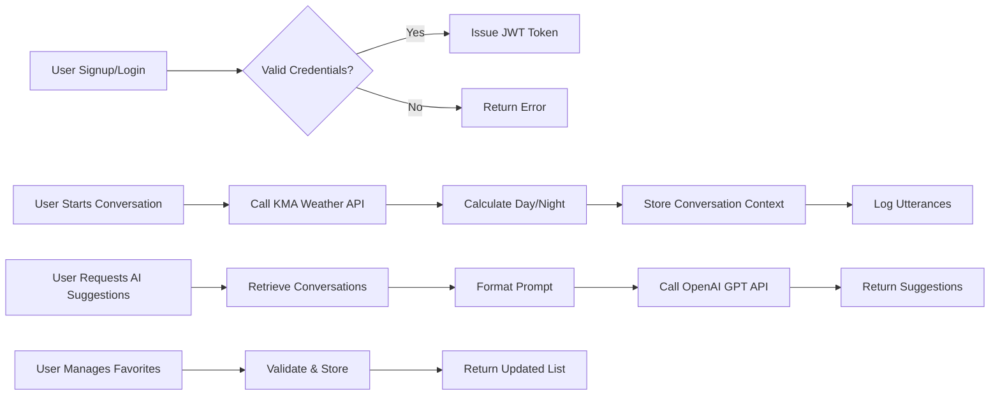

# Business Requirements for Echo Backend Service

## 1. Introduction and Business Justification

### 1.1 Business Context
Echo is an AI-powered assistive communication backend designed to help non-verbal individuals with brain lesions communicate effectively using text-to-speech and AI-driven sentence suggestions based on conversational context.

### 1.2 Business Justification
WHEN communication barriers exist for brain lesion patients, THE Echo backend SHALL provide adaptive, context-aware AI assistance to improve communication efficiency and user satisfaction.

### 1.3 Business Strategy
WHERE the app targets non-verbal users with brain injuries, THE system SHALL focus on intuitive conversation logging, AI-powered recommendations, and robust user management.

### 1.4 Success Metrics
THE system SHALL achieve AI suggestion response within 3 seconds and 99.9% system uptime.

## 2. User Roles and Authentication Requirements

### 2.1 User Roles
- **guest**: THE system SHALL permit signup and login access only.
- **user**: THE system SHALL allow full self-service profile updates, manage conversations, favorites, and request AI suggestions.
- **admin**: THE system SHALL allow management of all users, including role assignment and system monitoring.

### 2.2 Authentication Flow
WHEN a user submits signup data with unique userId, password, and survey data,
THE system SHALL validate uniqueness and data schema strictly before creation.

WHEN a user submits login credentials,
THE system SHALL verify and issue a JWT token with role claims upon success.

WHEN tokens expire or are invalid,
THE system SHALL deny access with HTTP 401 and proper error codes.

### 2.3 Token Management
THE system SHALL employ JWT with 15-minute expiration for access tokens.
THE system SHALL support refresh tokens valid for 7-30 days.

### 2.4 Permission Matrix
| Action | guest | user | admin |
|--------|-------|------|-------|
| Signup | ✅    | ❌   | ❌    |
| Login  | ✅    | ✅   | ✅    |
| Update Profile | ❌ | ✅ | ✅ |
| Manage Conversations | ❌ | ✅ | ✅ |
| Manage Favorites | ❌ | ✅ | ✅ |
| Access AI Suggestions | ❌ | ✅ | ✅ |
| Manage Users | ❌ | ❌ | ✅ |
| Monitor System | ❌ | ❌ | ✅ |

## 3. Functional Requirements

### 3.1 User Management
WHEN a user registers, THE system SHALL:
- Validate userId uniqueness.
- Validate survey data against fixed schema.
- Hash and store password securely.
- Issue JWT tokens on successful signup.

WHEN a user updates their profile,
THE system SHALL validate and save changes.

### 3.2 Conversation Management
WHEN a user initiates a conversation,
THE system SHALL:
- Retrieve KMA weather data for sunrise/sunset using lat/lon.
- Determine timeOfDay as "Day" or "Night" by comparing times.
- Store conversation context including timestamp and season.
- Log utterances in ping-pong order with timestamps and speaker classification.

WHEN a conversation ends,
THE system SHALL record end time.

WHEN a user requests conversation history,
THE system SHALL return metadata summaries.

### 3.3 AI Suggestions
WHEN a user requests AI suggestions,
THE system SHALL:
- Retrieve last two conversation contexts and utterances.
- Format a prompt for OpenAI GPT API.
- Securely call the API and retrieve at least three suggestions.
- Return suggestions within 3 seconds.

### 3.4 Favorites Management
WHEN a user adds a favorite sentence,
THE system SHALL check sentence uniqueness and length (max 500 chars).

THE system SHALL allow retrieval and deletion of favorite sentences separately from conversation logs.

### 3.5 External Integrations
THE system SHALL proxy requests to the KMA Weather API securely.
THE system SHALL manage OpenAI GPT API key securely and restrict access appropriately.

## 4. Business Rules and Validation

- Survey data SHALL strictly conform to fixed schema; invalid data shall be rejected with clear error.
- userId uniqueness MUST be enforced at signup.
- timeOfDay MUST be "Day" or "Night", no other values are allowed.
- Favorite sentences SHALL not duplicate existing favorites and must be under 500 characters.
- Conversations SHALL store context in ISO 8601 timestamps.

## 5. Error Handling and Recovery

### 5.1 Authentication Errors
IF signup userId exists, THEN THE system SHALL respond with "UserIdAlreadyExists" error.
IF login credentials are invalid, THEN THE system SHALL respond with HTTP 401 and "InvalidCredentials" code.
IF request lacks valid token, THEN THE system SHALL respond HTTP 401.

### 5.2 Data Validation Errors
IF survey data invalid, THEN THE system SHALL return detailed validation errors.
IF utterance data missing required fields, THEN THE system SHALL reject input.

### 5.3 External Service Failures
IF weather API call fails after retries, THEN THE system SHALL create context with null values but allow conversation creation.
IF AI API call fails, THEN THE system SHALL return empty suggestions with appropriate error message.

### 5.4 User Recovery
THE system SHALL allow retries for failed operations with retry limits.
THE system SHALL provide clear user-facing error messages supporting correction and resubmission.

## 6. Performance Requirements

- All API responses shall be delivered within 2 seconds, except AI suggestions which shall respond within 3 seconds.
- The system SHALL support at least 100 concurrent users.

## 7. Data Lifecycle and Audit

- User data SHALL be retained until account deletion.
- Conversation data SHALL be retained for at least 2 years.
- Audit logs recording critical events SHALL be immutable and stored securely.

## 8. Security and Compliance Overview

- Passwords SHALL be hashed using industry standards.
- API keys SHALL be stored securely.
- Data privacy compliant with relevant regulations.

## 9. Mermaid Diagrams

---

This document defines clear, actionable business requirements for the Echo backend system. All technical implementation aspects including architecture, API designs, and database schema are the responsibility of the development team. This document specifies WHAT the system must do, not HOW it must be built.