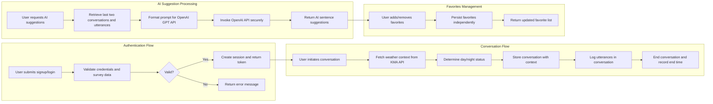

# Echo Backend Functional Requirements

## 1. Document Introduction
The Echo backend service provides assistive communication support for non-verbal individuals with brain lesions by delivering AI-powered sentence suggestions and context-aware conversation management. This document defines the comprehensive business requirements for the backend system's core functionalities.

## 2. Business Model Overview

### 2.1 Why the Service Exists
Echo addresses a critical communication barrier faced by non-verbal individuals with brain lesions, offering context-aware AI assistance to facilitate meaningful conversations beyond basic text-to-speech capabilities.

### 2.2 Business Strategy and Success Metrics
The service aims to grow through healthcare partnerships and user adoption, measuring success by active user numbers, AI suggestion utilization rates, and system responsiveness.

## 3. User Roles & Authentication

### 3.1 User Roles
- **Guest**: Access to public endpoints only (signup/login).
- **User**: Full personal data access including profile updates, conversations, favorites, and AI suggestions.
- **Admin**: Administrative privileges including user and system management.

### 3.2 Authentication Flow
- Users register with a unique userId and password.
- Survey data collected during signup is strictly validated.
- Successful login issues JWT tokens containing userId, role, and permissions.
- Tokens expire after 15 minutes; refresh tokens (optional) last 7-30 days.
- All protected endpoints require valid JWT tokens.

### 3.3 Permission Matrix
| Action                  | Guest | User | Admin |
|-------------------------|-------|------|-------|
| Signup                  | ✅    | ❌   | ❌    |
| Login                   | ✅    | ✅   | ✅    |
| Profile Access/Update   | ❌    | ✅   | ✅    |
| Conversation Management | ❌    | ✅   | ✅    |
| Favorites Management    | ❌    | ✅   | ✅    |
| AI Suggestions          | ❌    | ✅   | ✅    |
| User Management         | ❌    | ❌   | ✅    |
| System Settings         | ❌    | ❌   | ✅    |

## 4. User Management Requirements
- WHEN a user signs up, THE system SHALL validate userId uniqueness and survey data schema.
- WHEN login credentials are submitted, THE system SHALL authenticate and issue a token or error accordingly.
- WHEN an authenticated user updates survey data, THE system SHALL validate and persist changes.

## 5. Conversation Management
- WHEN a conversation is initiated, THE system SHALL fetch sunrise and sunset times from the KMA API based on user location.
- THE system SHALL determine timeOfDay (Day/Night) using fetched data.
- THE system SHALL store context (timestamp, season, timeOfDay) along with the conversation record.
- Utterances SHALL be logged in sequence with speaker attribution.
- Conversation history SHALL be retrievable with required metadata.

## 6. AI Suggestions
- WHEN AI suggestions are requested, THE system SHALL retrieve the last two completed conversations including utterances and context.
- THE system SHALL construct a formatted prompt for the OpenAI GPT API.
- THE system SHALL securely call OpenAI, handle the response, and return suggestions to the user.
- THE response time SHALL be under 3 seconds.

## 7. Favorites Management
- Users SHALL store favorite sentences separately from utterances.
- WHEN adding a favorite, THE system SHALL ensure sentence validity, length limits, and uniqueness.
- FAVORITES SHALL be capped at 100 sentences per user.
- FAVORITES SHALL be retrievable and removable on demand.

## 8. External Integrations
- THE system SHALL proxy KMA weather API calls for context data.
- THE system SHALL integrate with OpenAI GPT API for AI suggestions securely.
- API keys SHALL be securely managed and never exposed.

## 9. Error Handling
- Authentication failures SHALL return HTTP 401 with clear messages.
- Validation failures SHALL return HTTP 400 with detailed error info.
- External API failures SHALL be logged, retried when appropriate, and notify users gracefully.
- Users SHALL be able to retry failed operations.

## 10. Performance Requirements
- Authentication responses SHALL be under 2 seconds.
- Conversation and utterance operations SHALL complete within 1 second.
- AI suggestion generation SHALL complete within 3 seconds.
- The system SHALL support at least 100 concurrent authenticated users.

## 11. Non-functional Requirements
- Passwords SHALL be securely hashed.
- Data SHALL be encrypted at rest and in transit.
- Audit logs SHALL be immutable and retained for at least 3 years.

## 12. Mermaid Diagrams

## 13. Summary
This document defines only business requirements for the Echo backend service. All technical implementation, including architecture, database design, and API details, are left to the development team's discretion. The requirements specify WHAT the backend must achieve, not HOW to implement it.
