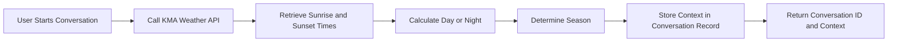
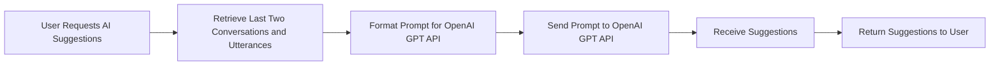

# Echo Backend Business Rules and Constraints

## 1. Introduction

This document defines the business rules, constraints, and validation logic that govern data handling and user interactions within the Echo backend service.

Echo is an assistive communication backend platform for non-verbal brain lesion patients, focusing on accurate data management, context-aware conversation support, and AI-driven communication aid.

## 2. Survey Data Validation Rules

### 2.1 Fixed Schema Enforcement

WHEN a user submits survey data at signup or profile update, THE system SHALL validate the survey data according to the predefined schema.

- The survey data SHALL be a JSON object reflecting the fixed survey structure.
- The system SHALL reject submissions missing required fields or containing incorrect types.
- The system SHALL produce clear validation error messages.

### 2.2 Storage of Valid Survey Data

WHEN survey data passes validation, THE system SHALL securely attach the survey data to the user's profile record.

### 2.3 Enforcement of Completeness

IF survey data is incomplete or invalid, THEN the user SHALL be prevented from completing signup or profile update until the issues are resolved.

## 3. Conversation Context Rules

### 3.1 Context Capture on Conversation Start

WHEN a new conversation session is created, THE system SHALL capture conversation start time, day/night status, and season.

- Date and time SHALL be recorded in ISO 8601 timestamp format.
- Day/night status SHALL be computed by comparing conversation start time with sunrise and sunset times fetched from the KMA API.
- Season SHALL be derived from the calendar date based on Korean seasonal definitions.

### 3.2 Context Storage

THE context SHALL be stored as a JSON object within the Conversation context field.

### 3.3 Context Usage

THE stored context SHALL be used to tailor AI-generated sentence suggestions to the user's current environment.

## 4. Favorite Sentences Management Rules

### 4.1 Favorites Entity Separation

THE system SHALL store favorite sentences in a dedicated Favorites table, separate from conversation utterances.

### 4.2 Adding Favorites

WHEN a user adds a favorite sentence, THE system SHALL:

- Validate that the sentence is a non-empty string.
- Enforce a maximum sentence length of 500 characters.
- Reject any sentence exceeding this limit.

### 4.3 Limits on Favorites

THE system SHALL cap the number of favorite sentences per user at 100.

### 4.4 Retrieving Favorites

THE system SHALL return favorites ordered by creation time or as per user preference.

## 5. AI Suggestion Constraints

### 5.1 Data Preparation

WHEN generating AI sentence suggestions, THE system SHALL concatenate context and utterances from the last two conversations into a prompt format for the OpenAI GPT API.

### 5.2 API Key Security

THE system SHALL securely manage the OpenAI GPT API key; it MUST never be exposed to the client.

### 5.3 Response Time Expectations

THE system SHALL return AI suggestions within 3 seconds under normal conditions.

### 5.4 Failure Handling

IF the AI suggestion request to OpenAI fails or times out, THEN the system SHALL return an informative, user-friendly error response.

## 6. Error Handling

### 6.1 Authentication Failures

IF an unauthenticated or invalidly authenticated user accesses protected endpoints, THEN the system SHALL respond with HTTP 401 Unauthorized.

### 6.2 Validation Failures

THE system SHALL provide clear validation error messages for all user input errors, including survey data, conversations, utterances, and favorites.

### 6.3 External Service Failures

IF external services like KMA API or OpenAI GPT API fail, THEN the system SHALL:

- Log the error.
- Return user-friendly messages.
- Provide fallbacks where possible.

## 7. Performance Requirements

- Signup and login requests SHALL complete within 2 seconds.
- Utterances SHALL be logged within 1 second.
- AI suggestions SHALL be delivered within 3 seconds.
- Weather data from KMA SHALL be cached to reduce latency and API load.

## Mermaid Diagram: Conversation Context Capture

## Mermaid Diagram: AI Suggestion Flow

This document defines the business requirements only for the Echo backend system. All technical implementation decisions—including architecture, APIs, and database design—are at the discretion of the development team. This document specifies WHAT must be done, not HOW to implement it.