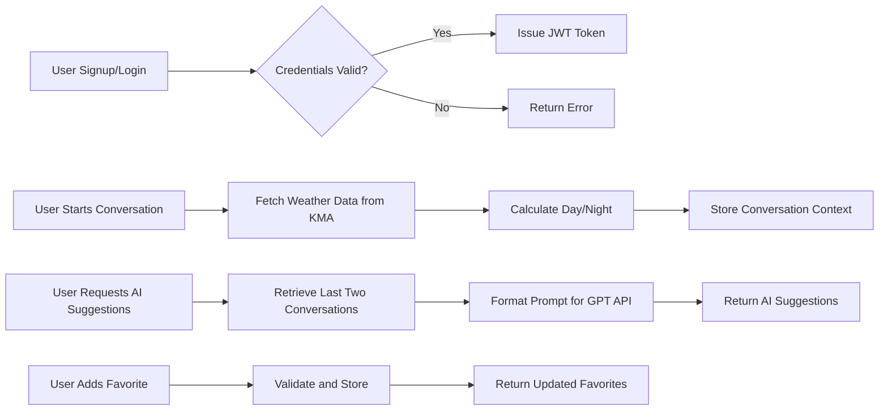

# Echo Backend Requirement Analysis Report

## 1. Introduction

Echo is a backend service for the Echo mobile application, designed to assist non-verbal individuals with brain lesions by enabling AI-powered assistive communication.

## 2. Business Model

### 2.1 Why This Service Exists
THE service SHALL provide non-verbal individuals with brain lesions a means to communicate using AI-powered text-to-speech and context-aware sentence suggestions.

### 2.2 Revenue Strategy
THE service SHALL be offered free initially, with plans to introduce subscription-based premium features and partnerships with healthcare providers.

### 2.3 Growth Plan
THE service SHALL increase user base by targeted outreach to medical institutions and caregiver networks.

### 2.4 Success Metrics
THE system SHALL measure success via active user counts, conversation frequency, AI suggestions usage, and user satisfaction scores.

## 3. User Roles and Authentication

THE system SHALL define the following roles:
- guest: Unauthenticated user accessing signup/login APIs only.
- user: Authenticated user managing profile, conversations, favorites, and AI suggestions.
- admin: User with full system administration privileges.

WHEN a user signs up, THE system SHALL require a unique userId and password.

WHEN a user logs in, THE system SHALL authenticate credentials and issue a JWT token with role claims.

THE system SHALL validate JWT token for each request.

THE system SHALL expire access tokens after 15 minutes.

THE system SHALL enforce role-based authorization for all resources.

### Permission Matrix
| Feature            | guest | user | admin |
|--------------------|-------|------|-------|
| Signup             | ✅    | ❌   | ❌    |
| Login              | ✅    | ✅   | ✅    |
| Profile Management  | ❌    | ✅   | ✅    |
| Conversations      | ❌    | ✅   | ✅    |
| Favorites          | ❌    | ✅   | ✅    |
| AI Suggestions      | ❌    | ✅   | ✅    |
| User Management     | ❌    | ❌   | ✅    |
| System Settings     | ❌    | ❌   | ✅    |

## 4. Functional Requirements

### 4.1 User Management
WHEN a user signs up, THE system SHALL verify userId uniqueness and validate survey data against a fixed schema.

WHEN a user updates their profile, THE system SHALL validate and update survey data accordingly.

WHEN login credentials are submitted, THE system SHALL authenticate and issue JWT token.

### 4.2 Conversation Management
WHEN a conversation is initiated, THE system SHALL call the Korea Meteorological Administration (KMA) API to get sunrise/sunset times.

THE system SHALL calculate timeOfDay based on this data and store context including timestamp and season.

THE system SHALL log utterance data for user and interlocutor in order.

WHEN requested, THE system SHALL provide conversation history metadata.

### 4.3 AI Suggestions
WHEN a user requests AI suggestions, THE system SHALL retrieve the last two conversations and their utterances.

THE system SHALL format context and conversation history into a prompt and send it securely to OpenAI GPT API.

THE system SHALL return at least three suggestion sentences.

### 4.4 Favorites Management
THE system SHALL allow users to create, retrieve, and delete favorite sentences stored separately from conversations.

### 4.5 External API Proxy
THE system SHALL provide a secure proxy for weather API calls to the KMA service.

## 5. Business Rules and Validation

THE system SHALL strictly validate survey data against the fixed schema.

THE timeOfDay SHALL be one of "Day" or "Night" based on sunrise/sunset times.

THE system SHALL prevent duplicate favorite sentences.

THE system SHALL limit favorite sentences per user to 100.

## 6. Error Handling and Recovery

WHEN signup userId duplicates exist, THE system SHALL reject with a descriptive error.

WHEN invalid credentials are submitted, THE system SHALL reject with Unauthorized error.

WHEN external services fail, THE system SHALL retry and fallback gracefully, notifying users appropriately.

## 7. Performance Requirements

THE system SHALL respond to authentication within 2 seconds.

AI suggestion generation SHALL complete within 3 seconds under typical load.

## 8. Data Lifecycle and Event Processing

User data, conversations, utterances, and favorites SHALL be retained for at least 2 years.

Audit logs SHALL be kept for 3 years.

## 9. Non-Functional Requirements

THE system SHALL protect all sensitive data, apply rate limiting, and comply with data protection legislation.

## 10. Appendices

Glossary and references to related documentation.

---

### Mermaid Diagrams

---

This document contains ONLY business requirements. Technical implementation details such as API definition, data schema, and infrastructure are the responsibility of the development team. This document defines WHAT the system must do, not HOW to build it.
