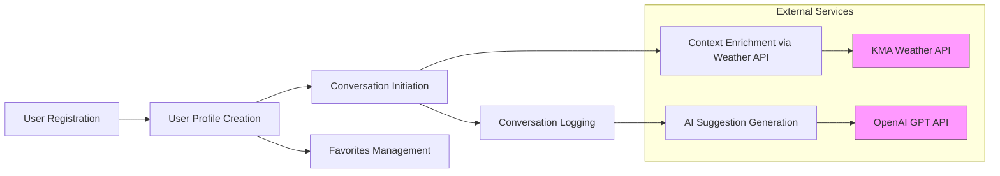

# Echo Backend Data Lifecycle and Event Processing Requirements

This document specifies the complete business requirements for data lifecycle and event processing in the Echo backend service. It provides backend developers with clear, detailed, and unambiguous guidance on how data flows within the system, how events trigger changes, policies for retaining data, and audit logging requirements.

This document focuses exclusively on business requirements and logical workflows. It does not include technical implementation details such as database schemas or API design.

---

## 1. Introduction

The Echo backend serves to assist non-verbal individuals with brain lesions by converting text to speech and providing AI-powered sentence suggestions. To fulfill its mission, the backend must manage user data securely and efficiently, log conversations, support AI suggestions, and handle favorites.

This document addresses how data moves and transforms throughout the backend, how relevant system events are processed, and the rules that govern data retention and audit logging.

Key business drivers:
- Ensure user confidentiality and data integrity.
- Provide accurate, contextual AI suggestions.
- Support reliable conversation history and favorites management.
- Enable system traceability and compliance through audit logs.

## 2. Data Flow Diagrams

### 2.1 Data Flow Overview

### 2.2 Detailed Data Flow Explanation

- When a user signs up (`User Registration`), their profile along with survey data is created and stored (`User Profile Creation`).
- When a conversation is started (`Conversation Initiation`), the system captures environmental context by querying the external KMA Weather API via a proxy.
- Utterances during the conversation are logged in a ping-pong format (`Conversation Logging`).
- AI Suggestions are generated in real-time by sending contextual conversation data to the OpenAI GPT API.
- Users can manage a list of favorite sentences separately from the conversation logs (`Favorites Management`).

## 3. Event Processing Logic

### 3.1 User Registration

WHEN a new user submits signup data, THE system SHALL:
- Validate that the userId is unique and adheres to allowed formats.
- Validate the password meets security criteria.
- Validate the survey data matches the fixed schema.
- Create a new user profile including the hashed password and survey data.
- Record the timestamp of profile creation.
- Provide an authentication token for subsequent access.

### 3.2 User Authentication

WHEN a user submits login credentials, THE system SHALL:
- Validate the userId exists.
- Verify the password against the stored hash.
- On success, generate a valid authentication token.
- On failure, return an authentication error.

### 3.3 Profile Update

WHEN an authenticated user submits a profile update request, THE system SHALL:
- Validate the new survey data against the defined schema.
- Update the user profile with new data.
- Record the update timestamp.

### 3.4 Conversation Initiation

WHEN a user starts a new conversation, THE system SHALL:
- Capture the current timestamp.
- Query the KMA Weather API for sunrise and sunset times at the user's location.
- Calculate if the conversation occurs during day or night.
- Store the conversation context, including timestamp, season, and timeOfDay.
- Create a new Conversation record associated with the user.

### 3.5 Utterance Logging

WHEN a user or interlocutor sends an utterance, THE system SHALL:
- Validate the conversation exists and is active.
- Store the utterance with speaker, text content, and timestamp.
- Maintain the correct sequence to preserve conversational order.

### 3.6 AI Sentence Suggestion

WHEN a user requests AI suggestions, THE system SHALL:
- Retrieve the last two completed conversations along with their utterances.
- Format this data as a prompt compliant with the OpenAI GPT API requirements.
- Send the data securely to the API.
- Return multiple sentence suggestions to the user.

### 3.7 Favorites Management

WHEN a user adds a sentence to favorites, THE system SHALL:
- Validate the sentence text is non-empty and within length limits.
- Create a Favorite record linked to the user.

WHEN a user requests favorite sentences, THE system SHALL:
- Retrieve all favorites associated with the user.

WHEN a user deletes a favorite, THE system SHALL:
- Remove the favorite record.

## 4. Data Retention Policies

### 4.1 User Data Retention

THE system SHALL retain user profiles, including survey data, for as long as the user account is active.

WHEN a user deletes their account, THE system SHALL:
- Delete all associated data including profile, conversations, utterances, and favorites within 30 calendar days.

### 4.2 Conversation History

THE system SHALL:
- Retain conversation records and related utterances for a minimum of 2 years from the last update.
- Archive older conversation data if necessary to maintain system performance.

### 4.3 Favorites Data

THE system SHALL retain favorite sentences as long as the associated user account exists.

WHEN a user deletes a favorite sentence, THE system SHALL remove it permanently.

### 4.4 Audit Logs

Audit logs SHALL be retained for 3 years minimum to comply with security and compliance needs.

## 5. Audit Trail Management

THE system SHALL log the following actions with timestamps, user identifiers, and action details:
- User account creation, login, logout, and profile updates.
- Conversation creations and closures.
- Utterance additions.
- Favorite sentence additions, updates, and deletions.
- External API requests and responses (weather and AI suggestion calls).

THE audit logs SHALL be immutable and securely stored to prevent tampering.

Logs MUST support querying by userId and action type for troubleshooting and audits.

## 6. Summary

This document provides all necessary business requirements for the data lifecycle and event processing system of the Echo backend. It ensures clarity, integrity, and compliance for user data management and processing.

Backend developers have full autonomy over architecture, API design, and database implementations. This documentation specifies what the system must do, not how to build it.

---

> *Developer Note: This document provides business requirements only. All technical implementation decisions (architecture, APIs, database design, etc.) belong to the development team.*
