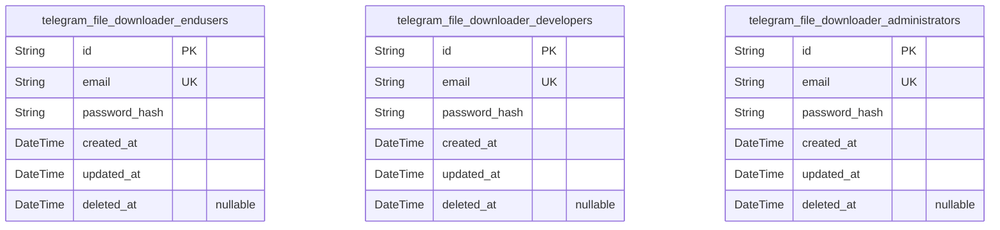
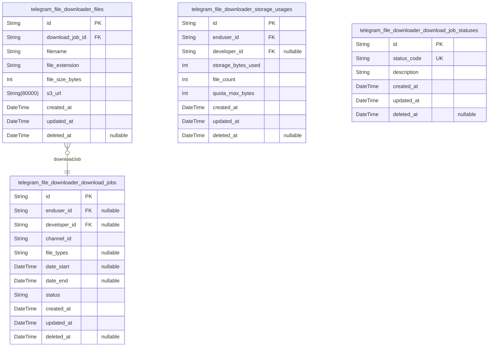
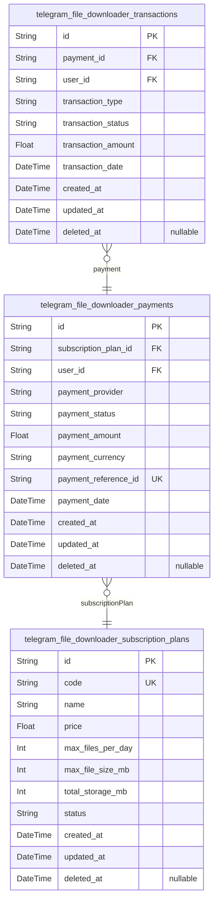
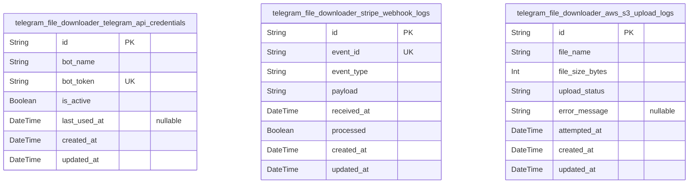
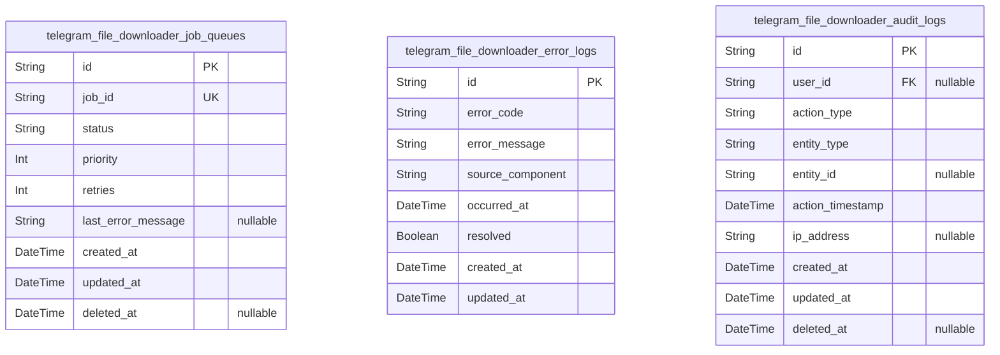
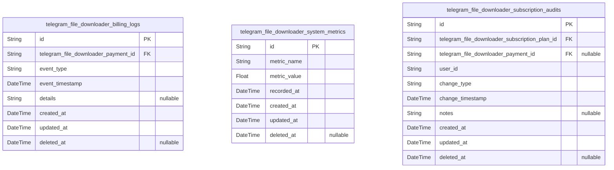

# Prisma Markdown

> Generated by [`prisma-markdown`](https://github.com/samchon/prisma-markdown)

- [Actors](#actors)
- [FileManagement](#filemanagement)
- [Subscription](#subscription)
- [Integrations](#integrations)
- [SystemOperations](#systemoperations)
- [AdminManagement](#adminmanagement)

## Actors

### `telegram_file_downloader_endusers`

End users who access the Telegram File Downloader service via web
dashboard. Store authentication credentials, email, and audit timestamps.
Unique email per end user. Supports soft deletion and timestamps for
auditing user record changes.

Properties as follows:

- `id`: Primary Key.
- `email`: Email address of the end user, unique across end users.
- `password_hash`: Hashed password for authenticating the end user.
- `created_at`: Timestamp when the end user record was created.
- `updated_at`: Timestamp when the end user record was last updated.
- `deleted_at`: Timestamp when the end user record was soft deleted; null if active.

### `telegram_file_downloader_developers`

Developer users who access the Telegram File Downloader service via API.
Store authentication credentials, email, and audit timestamps. Unique
email per developer. Supports soft deletion and timestamps for auditing
user record changes.

Properties as follows:

- `id`: Primary Key.
- `email`: Email address of the developer user, unique across developers.
- `password_hash`: Hashed password for authenticating the developer user.
- `created_at`: Timestamp when the developer user record was created.
- `updated_at`: Timestamp when the developer user record was last updated.
- `deleted_at`: Timestamp when the developer user record was soft deleted; null if active.

### `telegram_file_downloader_administrators`

Administrator users who manage subscriptions, payment statuses, and logs.
Store authentication credentials, email, and audit timestamps. Unique
email per administrator. Supports soft deletion and timestamps for
auditing user record changes.

Properties as follows:

- `id`: Primary Key.
- `email`: Email address of the administrator user, unique across administrators.
- `password_hash`: Hashed password for authenticating the administrator user.
- `created_at`: Timestamp when the administrator user record was created.
- `updated_at`: Timestamp when the administrator user record was last updated.
- `deleted_at`
  > Timestamp when the administrator user record was soft deleted; null if
  > active.

## FileManagement

### `telegram_file_downloader_download_jobs`

User-submitted download job requests capturing parameters such as channel
ID, filters, and status. Used to track download lifecycle and quota
enforcement.

Properties as follows:

- `id`: Primary Key.
- `enduser_id`: Belonged end user's [telegram_file_downloader_endusers.id](#telegram_file_downloader_endusers).
- `developer_id`: Belonged developer's [telegram_file_downloader_developers.id](#telegram_file_downloader_developers).
- `channel_id`: Telegram channel or group identifier targeted for file download.
- `file_types`
  > Comma-separated list of requested file extensions for filtering, e.g.,
  > "mp4,zip,jpg,pdf".
- `date_start`: Start date of inclusive date range to filter files.
- `date_end`: End date of inclusive date range to filter files.
- `status`
  > Current status code of the download job (e.g., pending, in_progress,
  > completed, failed).
- `created_at`: Timestamp when the download job was created.
- `updated_at`: Timestamp when the download job was last updated.
- `deleted_at`: Soft delete timestamp for logical deletion; null if active.

### `telegram_file_downloader_files`

Metadata and storage details of files downloaded from Telegram
channels/groups. Stores URLs and file information for retrieval and quota
calculations.

Properties as follows:

- `id`: Primary Key.
- `download_job_id`
  > Reference to associated download job {@link
  > telegram_file_downloader_download_jobs.id}.
- `filename`: Name of the downloaded file including extension.
- `file_extension`: File extension or type, e.g., mp4, zip, jpg, pdf.
- `file_size_bytes`: Size of the file in bytes.
- `s3_url`: Signed URL to access the stored file in AWS S3 with expiration.
- `created_at`: Timestamp when the file record was created.
- `updated_at`: Timestamp when the file record was last updated.
- `deleted_at`: Soft delete timestamp; null if file is active.

### `telegram_file_downloader_storage_usages`

Tracking of storage usage by users to enforce quota limits on downloaded
files and storage allocation.

Properties as follows:

- `id`: Primary Key.
- `enduser_id`: Belonged end user's [telegram_file_downloader_endusers.id](#telegram_file_downloader_endusers).
- `developer_id`: Belonged developer's [telegram_file_downloader_developers.id](#telegram_file_downloader_developers).
- `storage_bytes_used`: Amount of storage used in bytes by the user.
- `file_count`: Number of files stored by the user.
- `quota_max_bytes`: Maximum storage quota in bytes allowed by the user's subscription plan.
- `created_at`: Timestamp when the usage record was created.
- `updated_at`: Timestamp when the usage record was last updated.
- `deleted_at`: Soft delete timestamp; null if active.

### `telegram_file_downloader_download_job_statuses`

Master list of possible status codes for download jobs, used for
reference and validation.

Properties as follows:

- `id`: Primary Key.
- `status_code`: Unique status code string (e.g., pending, in_progress, completed, failed).
- `description`: Human-readable description of the status code.
- `created_at`: Timestamp when the status record was created.
- `updated_at`: Timestamp when the status record was last updated.
- `deleted_at`: Soft delete timestamp; null if active.

## Subscription

### `telegram_file_downloader_subscription_plans`

Defines the subscription plans available for users, including pricing,
features, and status. Subscription plans are managed independently and
referenced by user subscriptions. Includes business context for plan
lifecycle management and billing operations.

Properties as follows:

- `id`: Primary Key.
- `code`: Unique code identifier for the subscription plan.
- `name`: Human-readable name of the subscription plan.
- `price`: Monthly price of the plan in USD.
- `max_files_per_day`: Maximum number of files that can be downloaded per day under this plan.
- `max_file_size_mb`: Maximum allowed file size per download in megabytes.
- `total_storage_mb`: Total storage quota in megabytes for this plan.
- `status`: Current status of the subscription plan, e.g., active, inactive.
- `created_at`: Timestamp when this subscription plan was created.
- `updated_at`: Timestamp when this subscription plan was last updated.
- `deleted_at`: Timestamp when this subscription plan was soft deleted, if applicable.

### `telegram_file_downloader_payments`

Records payment events from users subscribing to plans. Stores payment
metadata, statuses and links to subscription plans and user identities.
Critical for billing and subscription status tracking.

Properties as follows:

- `id`: Primary Key.
- `subscription_plan_id`
  > Referenced subscription plan for this payment. {@link
  > telegram_file_downloader_subscription_plans.id}
- `user_id`
  > Reference to the paying user (enduser or developer). {@link
  > telegram_file_downloader_endusers.id} or {@link
  > telegram_file_downloader_developers.id}
- `payment_provider`: Payment gateway provider, e.g., Stripe.
- `payment_status`: Status of the payment, e.g., pending, succeeded, failed.
- `payment_amount`: Amount paid in USD.
- `payment_currency`: Currency code, e.g., USD.
- `payment_reference_id`: External payment reference ID from the provider.
- `payment_date`: Timestamp of the payment event.
- `created_at`: Record creation timestamp.
- `updated_at`: Record update timestamp.
- `deleted_at`: Soft deletion timestamp.

### `telegram_file_downloader_transactions`

Stores detailed payment transactions for reconciliation and audit
purposes. Tracks transaction states, amounts, statuses, and associations
with payments and users. Supports accurate billing and fraud detection.

Properties as follows:

- `id`: Primary Key.
- `payment_id`: Associated payment record. [telegram_file_downloader_payments.id](#telegram_file_downloader_payments)
- `user_id`
  > Reference to user who performed the transaction. {@link
  > telegram_file_downloader_endusers.id} or {@link
  > telegram_file_downloader_developers.id}
- `transaction_type`: Type of transaction, e.g., charge, refund.
- `transaction_status`: Status of the transaction, e.g., succeeded, failed, pending.
- `transaction_amount`: Amount involved in the transaction in USD.
- `transaction_date`: Timestamp when the transaction occurred.
- `created_at`: Record creation timestamp.
- `updated_at`: Record update timestamp.
- `deleted_at`: Soft deletion timestamp.

## Integrations

### `telegram_file_downloader_telegram_api_credentials`

Stores Telegram API bot credentials used for authenticating and
interacting with Telegram services. Each record represents a single
credential set for a bot instance including its token and metadata for
management.

Properties as follows:

- `id`: Primary Key.
- `bot_name`: The display name of the Telegram bot.
- `bot_token`: The secret bot token used for authenticating Telegram API calls.
- `is_active`
  > Flag indicating if this credential is currently active and used for
  > operations.
- `last_used_at`: Timestamp of the last time this credential was used to make an API call.
- `created_at`: Record creation timestamp.
- `updated_at`: Record last updated timestamp.

### `telegram_file_downloader_stripe_webhook_logs`

Tracks events received from Stripe webhooks related to payments,
subscriptions, and billing for audit and troubleshooting.

Properties as follows:

- `id`: Primary Key.
- `event_id`: Unique identifier of the Stripe webhook event.
- `event_type`
  > Type of Stripe event, e.g., 'payment_intent.succeeded',
  > 'invoice.payment_failed'.
- `payload`: Full JSON payload of the webhook event stored as string.
- `received_at`: Timestamp when the webhook was received by the system.
- `processed`: Flag indicating if the webhook event has been processed successfully.
- `created_at`: Record creation timestamp.
- `updated_at`: Record last updated timestamp.

### `telegram_file_downloader_aws_s3_upload_logs`

Logs all file upload attempts to AWS S3 including success or failure
status, file metadata, and error information for auditability and
troubleshooting.

Properties as follows:

- `id`: Primary Key.
- `file_name`: Name of the file uploaded to AWS S3.
- `file_size_bytes`: Size of the uploaded file in bytes.
- `upload_status`: Status of the upload operation, e.g., 'success', 'failed'.
- `error_message`: Error details if the upload failed; null if successful.
- `attempted_at`: Timestamp when the upload attempt was made.
- `created_at`: Record creation timestamp.
- `updated_at`: Record last updated timestamp.

## SystemOperations

### `telegram_file_downloader_job_queues`

Job queue entries representing file download tasks queued for processing.
Contains metadata about job status, priority, retry attempts, and
timestamps for queueing and processing. Independent primary table for
managing active download jobs in the system operations domain.

Properties as follows:

- `id`: Primary Key.
- `job_id`
  > Reference to the file download job. Links to the
  > telegram_file_downloader_download_jobs.id.
- `status`
  > Current status of the job in the queue, e.g., 'pending', 'processing',
  > 'failed', 'completed'.
- `priority`: Priority level for job processing, higher value means higher priority.
- `retries`: Number of times this job has been retried due to failure.
- `last_error_message`: Last error message if job processing failed.
- `created_at`: Timestamp when this job queue entry was created.
- `updated_at`: Timestamp when this job queue entry was last updated.
- `deleted_at`
  > Soft deletion timestamp, if the job queue entry has been logically
  > deleted.

### `telegram_file_downloader_error_logs`

Error logs recording system failures, exceptions, and notable errors
encountered during file download processing and other backend operations.
Used for troubleshooting and monitoring system health.

Properties as follows:

- `id`: Primary Key.
- `error_code`: Error code identifier for categorizing the type of error.
- `error_message`: Detailed error message or stack trace information.
- `source_component`: The system component or module where the error originated.
- `occurred_at`: Timestamp when the error occurred.
- `resolved`: Flag indicating whether the error has been resolved.
- `created_at`: Timestamp when this error log was created.
- `updated_at`: Timestamp when this error log was last updated.

### `telegram_file_downloader_audit_logs`

Audit logs capturing system-level changes, user actions, and other
significant events within the Telegram File Downloader service. Supports
traceability and compliance auditing.

Properties as follows:

- `id`: Primary Key.
- `user_id`
  > Optional reference to the user who performed the action. {@link
  > telegram_file_downloader_endusers.id}
- `action_type`
  > Type of action performed, e.g., 'login', 'download_request',
  > 'subscription_change'.
- `entity_type`: Type of entity involved in action, e.g., 'user', 'download_job'.
- `entity_id`: UUID of the related entity, if applicable.
- `action_timestamp`: Timestamp when the action was performed.
- `ip_address`: Optional IP address from which the action was performed.
- `created_at`: Timestamp when this audit log entry was created.
- `updated_at`: Timestamp when this audit log entry was last updated.
- `deleted_at`: Soft deletion timestamp for audit log entry.

## AdminManagement

### `telegram_file_downloader_billing_logs`

Billing log entries capturing payment transactions and billing related
events in the Telegram File Downloader system. Used by administrators to
review and reconcile billing activity.

Properties as follows:

- `id`: Primary Key.
- `telegram_file_downloader_payment_id`: Related payment record. [telegram_file_downloader_payments.id](#telegram_file_downloader_payments)
- `event_type`: Type of billing event (e.g., 'payment_success', 'refund', 'chargeback').
- `event_timestamp`: Timestamp when the event occurred.
- `details`: Additional details or metadata JSON about the billing event.
- `created_at`: Record creation timestamp.
- `updated_at`: Record last update timestamp.
- `deleted_at`: Soft delete timestamp for billing logs.

### `telegram_file_downloader_system_metrics`

System metrics capture performance, usage, and operational statistics for
the Telegram File Downloader backend. Enables administrators to monitor
service health and capacity.

Properties as follows:

- `id`: Primary Key.
- `metric_name`: Name of the metric (e.g., 'cpu_usage', 'api_requests_per_minute').
- `metric_value`: Value of the metric at the recorded time.
- `recorded_at`: Timestamp when the metric was recorded.
- `created_at`: Record creation timestamp.
- `updated_at`: Record last update timestamp.
- `deleted_at`: Soft delete timestamp for system metrics.

### `telegram_file_downloader_subscription_audits`

Historical records capturing changes and events related to user
subscriptions. Provides audit trails for subscription state changes and
billing plan updates.

Properties as follows:

- `id`: Primary Key.
- `telegram_file_downloader_subscription_plan_id`
  > Referenced subscription plan. {@link
  > telegram_file_downloader_subscription_plans.id}
- `telegram_file_downloader_payment_id`
  > Payment associated with this audit record. {@link
  > telegram_file_downloader_payments.id}
- `user_id`
  > User undergoing the subscription change. Referenced from user tables
  > outside this component.
- `change_type`
  > Type of subscription change event (e.g., 'upgrade', 'downgrade',
  > 'cancellation').
- `change_timestamp`: Timestamp when the subscription change occurred.
- `notes`: Additional notes or metadata about the subscription change.
- `created_at`: Record creation timestamp.
- `updated_at`: Record last update timestamp.
- `deleted_at`: Soft delete timestamp for subscription audit records.
