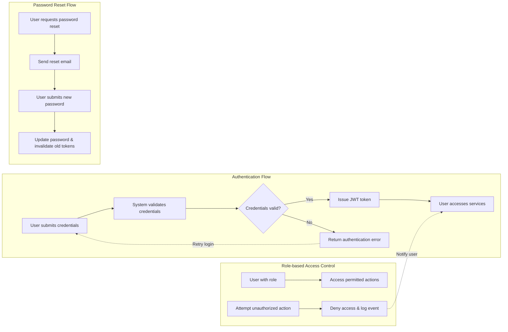

# Telegram File Downloader API
## User Roles and Authentication Requirements

### 1. Introduction
This document specifies the complete set of user roles, authentication flows, token strategy, and permission mappings for the Telegram File Downloader API service. It is intended to serve the backend development team with unambiguous, actionable business requirements that govern access control and user identity management.

### 2. User Role Definitions

#### 2.1 End User
End Users are individuals who access the Telegram File Downloader service primarily through the web dashboard to download files shared in Telegram channels or groups. They register via email and password and can operate within the limits of their subscription tier.

Permissions for End Users include:
- Registering an account with an email and password
- Logging in to the dashboard
- Requesting file downloads within the subscription limits (e.g., max 10 files/day for free plan)
- Viewing download status and managing download requests
- Accessing and managing subscription plans (Free or Pro)
- Downloading completed files via secure links

Restrictions:
- Limited to dashboard access only; no API usage allowed
- Subject to daily and file size limits based on subscription plan
- Cannot access administrative controls or logs

#### 2.2 Developer
Developers or marketers access the service programmatically using the API endpoints. They authenticate with their credentials and subscribe to the applicable plan (Free or Pro) that governs their API usage limits.

Permissions for Developers include:
- Authenticating via API with email and password
- Initiating download jobs using the POST /download endpoint
- Checking download progress via GET /status/{jobId}
- Listing completed files via GET /files
- Viewing profile and subscription status via GET /me
- Monitoring daily quota usage via GET /usage

Restrictions:
- Subject to API rate limits and quota enforcement
- Cannot access the web dashboard
- No administrative permissions

#### 2.3 Administrator
Administrators have elevated privileges to manage the overall system, monitor user activities, subscriptions, payments, and troubleshoot issues via an admin panel.

Administrator permissions include:
- Viewing all user subscriptions and their statuses
- Managing billing and subscription plans
- Accessing logs for downloads, API usage, and payments
- Overseeing system health and active subscriptions
- No direct file download capabilities through user or API features

Restrictions:
- No use of download or API service features for personal use

### 3. Authentication Flow Requirements

#### 3.1 User Registration
WHEN a new user submits registration details (email and password), THE system SHALL create a user profile, validate the email format, check uniqueness, and store hashed password securely.
WHEN registration completes successfully, THE system SHALL send a verification email to the user's provided email address.

#### 3.2 User Login
WHEN a user submits login credentials, THE system SHALL validate these credentials using secure password hashing comparison.
IF credentials are valid, THEN THE system SHALL issue a signed JWT access token.
IF credentials are invalid, THEN THE system SHALL respond with HTTP 401 Unauthorized and an error message indicating invalid credentials.

#### 3.3 Password Reset
WHEN a user requests a password reset, THE system SHALL send an email containing a secure reset link valid for a limited time (e.g., 24 hours).
WHEN the user submits a new password via the reset link, THE system SHALL validate password strength, update the stored password, and invalidate all previously issued tokens for security.

#### 3.4 Logout
WHEN a user initiates a logout, THE system SHALL invalidate the user's active JWT access token immediately, preventing further use.

### 4. Role Hierarchy and Permissions

Roles are mutually exclusive with no inheritance; permissions are explicitly assigned per role.

#### 4.1 Permissions Overview
- End Users have access only to dashboard features and file management within their plan limits.
- Developers have access exclusively to API endpoints with subscription-based quotas.
- Administrators have broad read and management privileges over users, subscriptions, payments, and system health but cannot perform file downloads or use the API or dashboard as end users do.

#### 4.2 Role Restrictions
- Attempts to access unauthorized features or APIs SHALL result in clear error responses (e.g., HTTP 403 Forbidden).
- All unauthorized access attempts SHALL be logged with user ID, timestamp, and attempted action.

### 5. Token Management Strategy

#### 5.1 JWT Token Specification
THE system SHALL issue JWT access tokens signed with a secure server-side secret.

Tokens SHALL include these claims:
- userId: Unique identifier of the user
- role: Identifier of the user's role ("endUser", "developer", "administrator")
- subscriptionPlan: The current active subscription ("Free", "Pro")
- iat: Token issue timestamp
- exp: Expiration timestamp

#### 5.2 Expiration Policies
- Access tokens SHALL expire 30 minutes after issuance.
- Refresh tokens SHALL expire 30 days after issuance to allow session renewal.

#### 5.3 Payload Content
JWT payload SHALL carry the minimal required information to identify the user and their permissions without sensitive data.

#### 5.4 Token Storage Recommendations
THE client applications SHALL store tokens securely, preferably using httpOnly cookies to mitigate cross-site scripting risks. Alternatively, secure localStorage may be used with caution.

### 6. Permission Matrix

| Action                         | End User | Developer | Administrator |
|--------------------------------|----------|-----------|---------------|
| Register Account               | ✅       | ✅        | ❌            |
| Login                         | ✅       | ✅        | ✅            |
| Password Reset                | ✅       | ✅        | ✅            |
| Access Web Dashboard          | ✅       | ❌        | ✅            |
| Use API Endpoints             | ❌       | ✅        | ❌            |
| Request File Download         | ✅       | ✅        | ❌            |
| Check Download Status         | ✅       | ✅        | ❌            |
| List Completed Files          | ✅       | ✅        | ❌            |
| Manage Subscriptions          | ❌       | ❌        | ✅            |
| View System Logs and Metrics  | ❌       | ❌        | ✅            |
| Monitor Payments              | ❌       | ❌        | ✅            |

### 7. Summary
This document provides the complete, clear requirements for user roles, authentication processes, and authorization logic for the Telegram File Downloader API. Developers have full autonomy to implement technical details, focusing here on WHAT the system must enforce.

### 8. Appendix: Mermaid Diagrams

This diagram demonstrates the authentication, password reset, and role-based access control flows with clear user decisions and system responses.

---

This document provides business requirements only. All technical implementation decisions including architecture, API design, database modeling, and deployment strategies are at the full discretion of the development team. This document specifies WHAT the system must achieve regarding user roles and authentication but not HOW to implement it.
