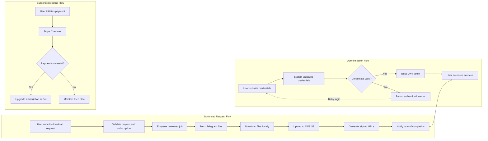

# Telegram File Downloader API – Functional Specification

## 1. Service Overview

### 1.1 Business Model

WHEN a user wants to download files shared in Telegram channels or groups,
THE Telegram File Downloader API SHALL provide an automated and scalable service that fetches, stores, and delivers these files securely to users.

WHERE the user is an individual or developer requiring efficient bulk access to files,
THE system SHALL offer a subscription-based model with Free and Pro tiers.

WHEN a user selects the Pro tier,
THE system SHALL enable unlimited downloads and larger file size support, monetized via Stripe payment integration.

### 1.2 Revenue and Growth

THE system SHALL generate revenue through monthly subscription fees processed by Stripe.

THE system SHALL attract users by providing a free tier with limited daily downloads and storage, facilitating user acquisition.

THE system SHALL track success metrics such as active subscriber count, download volume, storage utilization, and payment conversion rate.

## 2. User Roles and Permissions

### 2.1 End Users

WHEN a user registers and logs in via the web dashboard,
THE system SHALL allow them to submit download requests subject to free or Pro tier usage limits.

THE system SHALL restrict access to downloading files, viewing download progress and completed files, and managing personal subscriptions.

### 2.2 Developers/Marketers

WHEN a developer authenticates via API JWT tokens,
THE system SHALL allow programmatic download requests, status checks, and file listings within subscription and rate limits.

### 2.3 Administrators

WHEN an administrator logs into the admin panel,
THE system SHALL provide full access to subscription management, logs, user monitoring, and billing status.

Administrators SHALL NOT use the service for file downloads.

### 2.4 Authentication Flow

WHEN users register with email and password,
THE system SHALL send confirmation emails and secure the password storage.

WHEN users log in successfully,
THE system SHALL issue JWT access tokens including user ID, role, and subscription plan.

WHEN users request password resets,
THE system SHALL send reset links via email.

THE system SHALL enforce role-based access controls on all endpoints and dashboard functions.

## 3. Functional Requirements

### 3.1 Authentication & User Management

WHEN a user registers,
THE system SHALL validate email and password strength, store credentials securely, and send verification email.

WHEN a user logs in,
THE system SHALL authenticate credentials and issue JWT tokens valid for a configurable expiration.

WHEN a user resets password,
THE system SHALL verify reset tokens and allow password updates.

Subscription plans SHALL be stored on the user profile and used for quota checks.

### 3.2 File Download

WHEN a user submits a download request with a Telegram channel/group ID,
THE system SHALL validate the request and subscription quotas.

WHERE a file-type filter is specified,
THE system SHALL return only files matching the types.

WHERE a date range is specified,
THE system SHALL fetch files only within those dates.

Only one channel/group ID SHALL be processed per request.

Free plan users SHALL be limited to 10 files per day and files up to 100MB.

Pro users SHALL have configurable higher limits (up to 2GB per file).

Download jobs SHALL be processed asynchronously with unique job IDs.

### 3.3 Storage Management

THE system SHALL store files temporarily locally, then upload to AWS S3.

FILES SHALL be retained for 7 days, after which they SHALL be deleted.

Download links SHALL be authenticated using signed URLs with the 7-day validity.

### 3.4 API Endpoints

THE system SHALL provide these endpoints with authentication and rate limiting:
- POST /download: submit new download job
- GET /status/{jobId}: get download progress
- GET /files: list completed files
- GET /me: user profile and subscription
- GET /usage: quota usage

### 3.5 Pricing & Billing

THE system SHALL integrate Stripe for subscriptions.

WHEN a payment succeeds,
THE system SHALL update user subscription to Pro immediately.

Free tier limits SHALL be enforced until upgrade.

### 3.6 Dashboard & Admin Panel

END users SHALL use the dashboard to submit requests, track progress, and manage billing.

Admins SHALL have separate access to monitor subscriptions, payments, logs, and system metrics.

## 4. Business Rules

WHEN enforcing quotas,
THE system SHALL prevent download requests exceeding daily limits or file size limits.

THE system SHALL validate inputs (channel ID format, date ranges, file types) strictly.

THE system SHALL enforce file retention and cleanup after 7 days.

Access control SHALL differentiate between roles.

## 5. Error Handling

IF inputs are invalid, quota exceeded, or external services fail,
THE system SHALL return clear error messages with HTTP status codes.

Download jobs SHALL notify users of failures and provide options to retry or cancel.

## 6. Performance Requirements

THE system SHALL respond to download job submission within 2 seconds.

Status queries SHALL return progress within 1 second.

Files SHALL be accessible promptly after upload.

## 7. External Integrations

### 7.1 Telegram API

WHEN downloading files, THE system SHALL authenticate with Telegram API using bot tokens.

APPLY filters (file type, date range) to Telegram API queries.

HANDLE Telegram API rate limits with retries and backoff.

### 7.2 Stripe Payment Integration

PROCESS payments via Stripe Checkout and webhooks.

UPDATE subscription plans on payment events.

PROVIDE Customer Portal for subscription management.

### 7.3 AWS S3 Storage

UPLOAD files to AWS S3 after local download.

GENERATE signed URLs for secure file access.

IMPLEMENT automatic deletion after retention period.

## 8. Diagrams

This document provides business requirements only. All technical implementation decisions belong to developers, who have full autonomy over architecture, API design, and storage schemas. The document describes WHAT the system must do, not HOW to implement it.