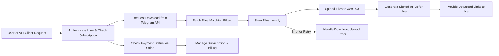

# External Integrations Requirement Analysis for Telegram File Downloader API

## 1. Introduction
This document describes the required external integrations for the Telegram File Downloader API MVP service. It clarifies how the system interacts with Telegram API to download files on demand, manages subscription payments via Stripe, and securely stores and serves files using AWS S3. The content is intended to provide backend developers with a precise business-focused description of each integration, covering workflows, business rules, error handling, and security considerations.

---

## 2. Telegram API Integration

### 2.1 Overview
The system shall enable downloading of files shared publicly in Telegram channels or groups by using Telegram's Bot API or Telegram APIs suitable for operating at scale. The integration is on-demand: files are downloaded only after user/API requests.

### 2.2 Authentication with Telegram
WHEN the system initiates a file download from Telegram,
THE system SHALL authenticate to Telegram using a bot token or configured API credentials.

The bot token shall be securely stored and rotated according to security policies.

### 2.3 File Retrieval Methods
WHEN a download request is received with a Telegram channel or group ID,
THE system SHALL query the Telegram API to fetch files matching the request parameters.

The system SHALL support filtering by file type (e.g., mp4, zip, jpg, pdf) and date range (e.g., from 2025-09-01 to 2025-09-15).

The system SHALL handle fetching media files including videos, images, documents, and archives.

### 2.4 File Type Filtering and Date Range Requests
WHEN the download request specifies file-type filters and/or date ranges,
THE system SHALL apply these filters to the Telegram API query to retrieve only matching files.

IF the system encounters unsupported file types, THEN it SHALL exclude the files from download and record this in logs.

### 2.5 Error Handling and Rate Limits
IF the Telegram API returns errors such as authentication failure, resource not found, or rate limiting,
THEN the system SHALL log detailed error information and notify the requesting user or API client with appropriate error messages.

IF the Telegram API rate limits are approached or exceeded,
THEN the system SHALL implement back-off and retry policies conforming to Telegram API usage guidelines.

---

## 3. Stripe Payment Integration

### 3.1 Overview
The service SHALL integrate with Stripe to manage subscription plans, payments, and upgrades for end users and developers accessing the API.

### 3.2 Subscription Plan Management
THE system SHALL support two subscription tiers: Free and Pro.

WHEN a user purchases a Pro subscription via Stripe Checkout,
THE system SHALL update the user's subscription plan status accordingly.

Users SHALL be able to manage subscriptions through Stripe Customer Portal integration.

### 3.3 Payment Workflow
WHEN the user initiates a payment through Stripe Checkout,
THE system SHALL redirect the user to Stripe’s secure checkout page.

WHEN Stripe confirms payment success via webhook,
THE system SHALL update the user’s subscription status to Pro.

### 3.4 Webhooks and Payment Status Updates
WHEN the system receives Stripe webhook events for payments, subscription changes, or cancellations,
THE system SHALL update internal subscription records accordingly and notify users of status changes.

### 3.5 Limits and Plan Upgrades
WHERE a user upgrades from Free to Pro,
THE system SHALL immediately grant increased API usage limits, file size support, and storage quotas.

IF a payment fails or subscription is cancelled,
THE system SHALL revert users to Free plan limits after an appropriate grace period.

### 3.6 Error Handling
IF a payment or webhook processing error occurs,
THE system SHALL log the error and send notifications to administrators to investigate.

---

## 4. AWS S3 Storage Integration

### 4.1 Overview
The system SHALL store downloaded files temporarily on local storage and then upload them to AWS S3.

AWS S3 SHALL serve as the primary persistent storage for all downloaded files.

### 4.2 Local File Handling and Upload Process
WHEN files are downloaded from Telegram,
THE system SHALL first save the files in local temporary storage.

WHEN the file is fully saved locally,
THE system SHALL upload the file asynchronously to the configured AWS S3 bucket.

### 4.3 S3 Bucket Structure and Naming
THE AWS S3 bucket SHALL be organized to segregate files by user and date of download to support efficient management and retrieval.

File names in S3 SHALL maintain uniqueness to avoid collisions and enable traceability.

### 4.4 Signed URLs for Download Access
WHEN files are successfully uploaded to AWS S3,
THE system SHALL generate signed URLs with limited validity for authenticated users to download files securely.

THE signed URLs SHALL prevent unauthorized public access.

### 4.5 Retention Policy and Automatic Deletion
WHILE files are stored in AWS S3,
THE system SHALL automatically delete files that have aged beyond the 7-day retention period.

### 4.6 Error Handling
IF file upload to AWS S3 fails,
THE system SHALL retry the upload a configurable number of times.

IF retries fail,
THE system SHALL log the failure and notify administrators.

---

## 5. Integration Workflows

The following Mermaid diagram shows the high-level integration workflow from user request through external service interactions:

---

## 6. Security Considerations
- The bot tokens and API keys for Telegram, Stripe, and AWS S3 SHALL be stored securely and not exposed.
- All communication with external services SHALL happen over TLS.
- Generated signed URLs for file downloads from AWS S3 SHALL expire after a short window (e.g., minutes to hours).
- Payment and subscription data SHALL be kept in sync with Stripe using webhook event verification.

---

## 7. Performance Requirements
- WHEN a user initiates a file download request,
  THE system SHALL begin processing and provide status updates within 5 seconds.
- File uploads to AWS S3 SHALL complete in a timely manner to enable user access within minutes of request.
- Stripe payment status updates SHALL be processed within seconds of webhook receipt.

---

## 8. Summary
This document defines the comprehensive business requirements for all external integrations of the Telegram File Downloader API MVP, including Telegram API for on-demand file downloads, Stripe for subscription payment management, and AWS S3 for secure file storage and access. It clearly specifies workflows, business rules, error handling, and performance expectations, enabling backend developers to implement these integrations accurately and efficiently.

---

> This document provides business requirements only. All technical implementation decisions belong to developers. Developers have full autonomy over architecture, APIs, and database design. The document describes WHAT the system should do, not HOW to build it.
