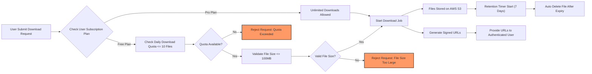

# Business Rules and Validation Constraints for Telegram File Downloader API

This document defines the complete set of business rules, validation constraints, quota management, storage policies, and access control regulations that the Telegram File Downloader API system shall enforce. It directs backend developers to implement the business logic ensuring correct and secure operation of subscriptions, file downloads, storage handling, and usage limits.

---

## 1. Introduction

The Telegram File Downloader API is a service enabling users to fetch files shared in Telegram channels or groups either via a web dashboard (end users) or programmatically through API (developers/marketers). Subscriptions managed via Stripe allow monetization through free and paid tiers.

This document captures all static and dynamic business rules, quotas, validations, and access controls critical to maintaining service integrity, user fairness, and system security.

## 2. Subscription and Quota Rules

### 2.1 Subscription Plans

THE telegramFileDownloader system SHALL support two subscription plans:
- Free Tier: Limited usage, capped downloads, and storage
- Pro Tier: Unlimited downloads with higher storage and file size limits

### 2.2 Quota Management

WHEN a user initiates a file download request, THE telegramFileDownloader system SHALL check the user's subscription plan and enforce quotas as follows:

| Plan | Max Files Per Day | Max File Size |
|-------|------------------|--------------|
| Free  | 10 files         | 100 MB       |
| Pro   | Unlimited        | 2 GB (configurable) |

WHERE the user exceeds their daily file download limit, THE telegramFileDownloader system SHALL reject additional file download requests with an appropriate error message signaling quota exhaustion.

WHERE a requested file exceeds the size allowed by the user's subscription plan, THE telegramFileDownloader system SHALL reject the download request.

### 2.3 Subscription Status Updates

WHEN a user's payment is successfully processed via Stripe, THE telegramFileDownloader system SHALL update the user's subscription plan to Pro.

WHEN a payment fails or subscription expires, THE telegramFileDownloader system SHALL update the user's subscription plan back to Free and enforce corresponding quotas.

## 3. Download Request Validations

### 3.1 Valid Input Parameters

WHEN a user submits a download request via API or web dashboard, THE telegramFileDownloader system SHALL validate the following inputs:
- Channel/Group ID: non-empty string identifying target Telegram channel/group
- File Type Filters: list of valid file extensions (e.g., mp4, zip, jpg, pdf); if provided, each must be from the supported set
- Date Range: valid start and end dates in ISO 8601 format, with start date earlier than or equal to end date

IF input parameters are invalid, THEN THE telegramFileDownloader system SHALL reject the request with an explanatory error.

### 3.2 Single Channel per Request

THE system SHALL accept only one channel/group ID per download request; requests attempting multiple channels SHALL be rejected.

### 3.3 File Filtering and Limits

WHERE file filtering criteria are provided, THE system SHALL apply them strictly, returning only files that match filters and date range.

WHERE no file filters or date range are specified, THE system SHALL default to downloading all files available in the specified channel/group, subject to quota limits.

### 3.4 Rate Limiting

WHILE a user has an ongoing download job, THE telegramFileDownloader system SHALL accept new download requests only as allowed by subscription-specific rate limits to prevent abuse.

## 4. Storage Retention Policies

### 4.1 File Retention Period

THE telegramFileDownloader system SHALL retain downloaded files for a maximum of 7 calendar days from the time of upload to AWS S3.

### 4.2 Automatic Deletion

WHEN a file's retention period expires, THE system SHALL permanently delete the file from AWS S3 storage and remove related metadata from the system.

### 4.3 Storage Limits Enforcement

THROUGHOUT the retention period, THE system SHALL enforce total storage limits per user according to subscription plan:
- Free Plan: 1 GB total storage
- Pro Plan: Much larger configurable storage limit

IF a user's total stored files exceed their quota, THEN THE system SHALL reject new download requests until storage usage falls below limits.

## 5. Access Control Rules

### 5.1 User Roles and Permissions

THE telegramFileDownloader system SHALL enforce role-based access as follows:

| Role          | Allowed Actions                                     |
|---------------|----------------------------------------------------|
| End User      | Initiate file downloads via dashboard, view own files, manage own subscription |
| Developer     | Use API endpoints for downloads, view own files, manage own subscription |
| Administrator | Manage all subscriptions, monitor system logs, access payment status, administer users |

### 5.2 Subscription Plan Visibility

THE system SHALL allow users (End User and Developer roles) to view their current subscription plan status and quota usage.

### 5.3 Authenticated Access to Files

WHEN users request file download links, THE system SHALL provide signed URLs valid only for authenticated access.

IF an unauthenticated or unauthorized request attempts to access files, THEN THE system SHALL deny access.

## 6. Business Rules Summary

- The system SHALL reject download requests that violate quota and subscription limits.
- The system SHALL validate all user inputs strictly before processing.
- The system SHALL enforce file retention and automatic deletion policies.
- The system SHALL implement rate-limiting to prevent abuse.
- The system SHALL differentiate capabilities and access rights by user role.
- The system SHALL update user subscription plans promptly on payment events.

---

## Mermaid Diagram: Business Rule Flow

---

This document provides business requirements only. All technical implementation decisions, including architecture and APIs, are delegated fully to the development team. It describes WHAT the system must do, not HOW to build it.