# Telegram File Downloader API - Error Handling Specification

## 1. Introduction

The Telegram File Downloader API backend shall provide comprehensive error handling to ensure clear communication with users, maintain system reliability, and facilitate rapid recovery from failures. The goal is to enable users and administrators to understand issues promptly and take appropriate actions while minimizing disruption.

## 2. User-Facing Errors

### 2.1 Authentication Errors

WHEN a user attempts to log in with invalid credentials, THE system SHALL respond with HTTP 401 Unauthorized and an error message stating "Invalid email or password".

IF a user requests a password reset with an unregistered or invalid email, THEN THE system SHALL respond with a generic confirmation message to avoid revealing account existence.

WHEN a user's JWT token expires or is invalid, THE system SHALL reject the request with an explicit "Session expired, please log in again" message and HTTP 401 status.

### 2.2 Authorization Errors

IF a user attempts to access a feature or API endpoint restricted to higher subscription tiers, THEN THE system SHALL respond with an HTTP 403 Forbidden error and a message indicating "Access denied: Upgrade required to use this feature".

WHEN a user exceeds API rate limits, THE system SHALL return HTTP 429 Too Many Requests with a message stating "Rate limit exceeded. Please wait before retrying."

### 2.3 Input Validation Errors

WHEN a user submits a download request with an invalid or malformed Telegram channel or group ID, THE system SHALL reject the request with HTTP 400 Bad Request and a descriptive message "Invalid channel or group ID format".

IF unsupported file types are submitted for filtering, THEN THE system SHALL respond with HTTP 400 and "Unsupported file type filter specified".

WHEN the date range is invalid (e.g., start date after end date, future dates), THE system SHALL reject with HTTP 400 and message "Invalid date range specified".

IF the user requests downloads exceeding quota limits (file count, size), THEN THE system SHALL return HTTP 400 with "Request exceeds allowed quotas".

### 2.4 Download Request Errors

WHEN a download job is submitted for a non-existent or inaccessible Telegram channel/group, THE system SHALL notify the user with HTTP 404 Not Found and "Channel or group not found or inaccessible".

IF the Telegram API is temporarily unavailable or returns errors, THE system SHALL inform the user via HTTP 503 Service Unavailable and "Telegram service temporarily unavailable, please retry later".

WHEN system resources such as storage or processing capacity are insufficient, THE system SHALL return HTTP 503 and "System resources insufficient, please try again later".

### 2.5 Billing and Subscription Errors

IF payment attempts fail, THEN THE system SHALL notify users with "Payment failed, please verify your payment method and try again" and deny access to Pro features.

WHEN a user's subscription expires or is canceled, THE system SHALL restrict Pro-only features and inform the user with "Subscription inactive, please renew to access premium features".

### 2.6 File Access Errors

IF a user accesses files via expired or invalid signed URLs, THE system SHALL return HTTP 403 Forbidden and message "File access unauthorized or expired".

WHEN files expire after the retention period and are deleted, THE system SHALL respond with HTTP 404 Not Found and message "File not found or expired".

## 3. System Failure Handling

### 3.1 Telegram API Failures

WHEN the Telegram API returns rate limiting errors or other temporary failures, THE system SHALL implement exponential backoff with a configurable retry policy limited to 5 attempts.

IF Telegram API credentials are invalid or revoked, THE system SHALL alert administrators immediately for corrective action.

### 3.2 Storage (AWS S3) Failures

IF uploads to AWS S3 fail, THEN THE system SHALL retry uploads up to 3 times with incremental delays.

WHEN storage quotas are exceeded globally or per user, THE system SHALL prevent further uploads and notify administrators.

### 3.3 Payment Processing Failures

WHEN Stripe payment or webhook processing encounters failures, THE system SHALL log errors and notify administrators promptly.

THE system SHALL retry webhook event processing up to 3 times before marking as failed.

### 3.4 Internal Processing Failures

IF internal queue processing jobs fail, THE system SHALL attempt automated restarts.

FOR persistent failure on a job, THE system SHALL escalate via administrator notification and suspend further processing for that job.

## 4. Recovery Processes

### 4.1 Retry Mechanisms

WHEN external service calls fail, THE system SHALL automatically retry with increasing delays up to configured maximum attempts.

FAILED download jobs due to transient errors SHALL be re-queued for retry automatically.

### 4.2 User Request Recovery

IF a download job fails permanently, THE system SHALL notify the user via dashboard and API status endpoints with clear failure reasons.

WHEN a user cancels an active download job, THE system SHALL immediately halt processing and release associated resources.

### 4.3 Admin Intervention

Administrators SHALL have capability to manually retry or cancel failed jobs through the admin panel.

WHEN user storage limits are exceeded causing job failures, THE system SHALL notify administrators to take corrective measures.

## 5. Notification and Logging

### 5.1 User Notifications

THE system SHALL present clear, user-friendly error messages on the dashboard and API responses.

WHEN critical failures occur or affect user requests, THE system SHALL proactively notify users via dashboard alerts.

### 5.2 Admin Notifications and Alerts

THE system SHALL send real-time alerts to administrators for significant failures including Telegram API issues, storage capacity breaches, payment failures, and repeated job errors.

### 5.3 Logging Requirements

All errors SHALL be logged with timestamp, user context, error category, and detailed diagnostic information.

Logs SHALL be accessible to administrators for troubleshooting and auditing purposes.

## 6. Summary and Success Criteria

- WHEN authentication or authorization errors occur, THE system SHALL inform users promptly with appropriate status codes and messages.
- THE system SHALL explicitly validate all user inputs and respond with meaningful errors on invalid data.
- System failures SHALL be handled gracefully with automated retry and escalation mechanisms.
- Users SHALL receive clear notifications of failure conditions and recovery options.
- Administrators SHALL receive alerts enabling timely intervention.
- THE system SHALL maintain comprehensive logs facilitating root cause analysis.

---

## Mermaid Diagram: Error Handling Flow

```mermaid
graph LR
  A["User Action"] --> B{"Valid Input?"}
  B -- "No" --> C["Return Input Validation Error"]
  B -- "Yes" --> D{"Authenticated?"}
  D -- "No" --> E["Return Authentication Error"]
  D -- "Yes" --> F{"Authorized?"}
  F -- "No" --> G["Return Authorization Error"]
  F -- "Yes" --> H["Process Request"]
  H --> I{"External API Failure?"}
  I -- "Yes" --> J["Retry with Backoff"]
  J -->|"Max Retries Exceeded"| K["Notify Admin and Fail Request"]
  I -- "No" --> L["Complete Request"]
  L --> M["Return Success"]

  subgraph Notification
    N["Notify User"]
    O["Notify Admin"]
  end

  C --> N
  E --> N
  G --> N
  K --> O

```

---

This document provides business requirements only. All technical implementation decisions belong to developers. The document describes WHAT the system should do, not HOW to build it.