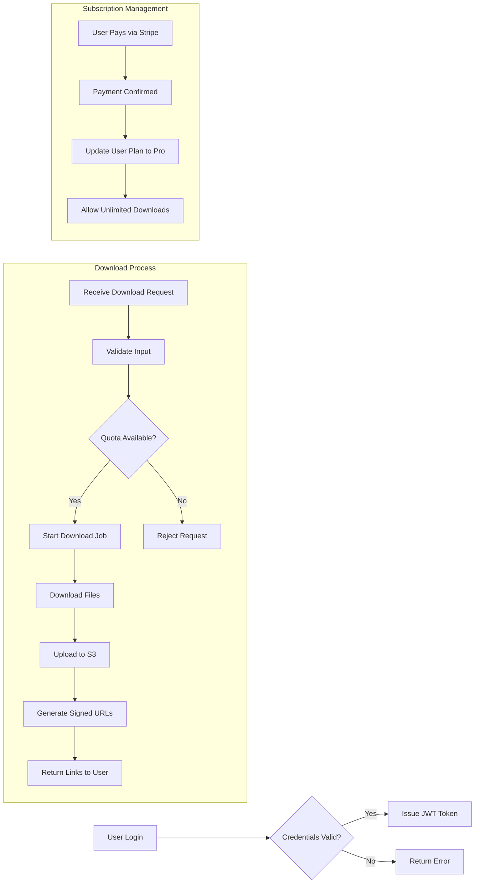

# Telegram File Downloader API – Functional Specification

## 1. Overview

A service that automatically downloads files (videos, images, archives, documents, etc.) shared in Telegram channels/groups.

Users can access downloaded files via API or a web dashboard.

Stripe is integrated to offer free and paid subscription tiers for instant monetization.

## 2. User Roles

### End Users
Download specific channel files through the web dashboard.

### Developers/Marketers
Use API endpoints to automatically fetch large volumes of Telegram files.

### Administrators
Manage subscriptions, monitor logs, and check payment status.

## 3. Core Features

### 3.1 Authentication & User Management
- Sign up/login with email & password (JWT issued).
- Subscription plan stored in user profile (Free / Pro).
- Stripe integration (Checkout & Customer Portal).

### 3.2 File Download
- Input channel/group ID → fetch shared files.
- File-type filtering (e.g., mp4, zip, jpg, pdf).
- Date-range download option (e.g., 2025-09-01 ~ 2025-09-15).

### 3.3 Storage Management
- Files saved locally, then automatically uploaded to AWS S3.
- Download links returned to users after upload completion.

### 3.4 API Endpoints
- POST /download : Request file download.
- GET /status/{jobId} : Check download progress.
- GET /files : List completed files.

### 3.5 Pricing & Billing
- Free Tier: 10 files/day, 1GB total storage limit.
- Pro Tier ($9.99/month): Unlimited downloads, large-file support.
- On successful payment, user plan is updated to Pro.

### 3.6 Dashboard (Web UI)
- Login & manage download requests.
- View download progress and logs.
- Manage subscription & billing status.

## 4. Business Rules
- Enforce daily download and file size limits based on subscription.
- Validate all inputs strictly.
- Retain files for 7 days, then delete automatically.
- Download links are authenticated and expire after retention.
- Only one channel per request supported in MVP.

## 5. Error Handling
- Return clear error messages for authentication failures, quota violations, validation errors, and payment issues.
- Implement retries for external service failures (Telegram API, AWS S3 uploads).
- Notify users clearly in UI and API responses.

## 6. Performance Requirements
- Respond to job submissions within 2 seconds.
- Provide status updates at least every 5 seconds.
- Generate download links immediately after upload.

## 7. Mermaid Diagrams

This specification document provides business requirements detailing WHAT the Telegram File Downloader API backend must deliver, including user roles, subscriptions, file downloads, storage, APIs, billing, and error handling. All technical implementation decisions including architecture, API design, and database schema are deferred to the development team.
