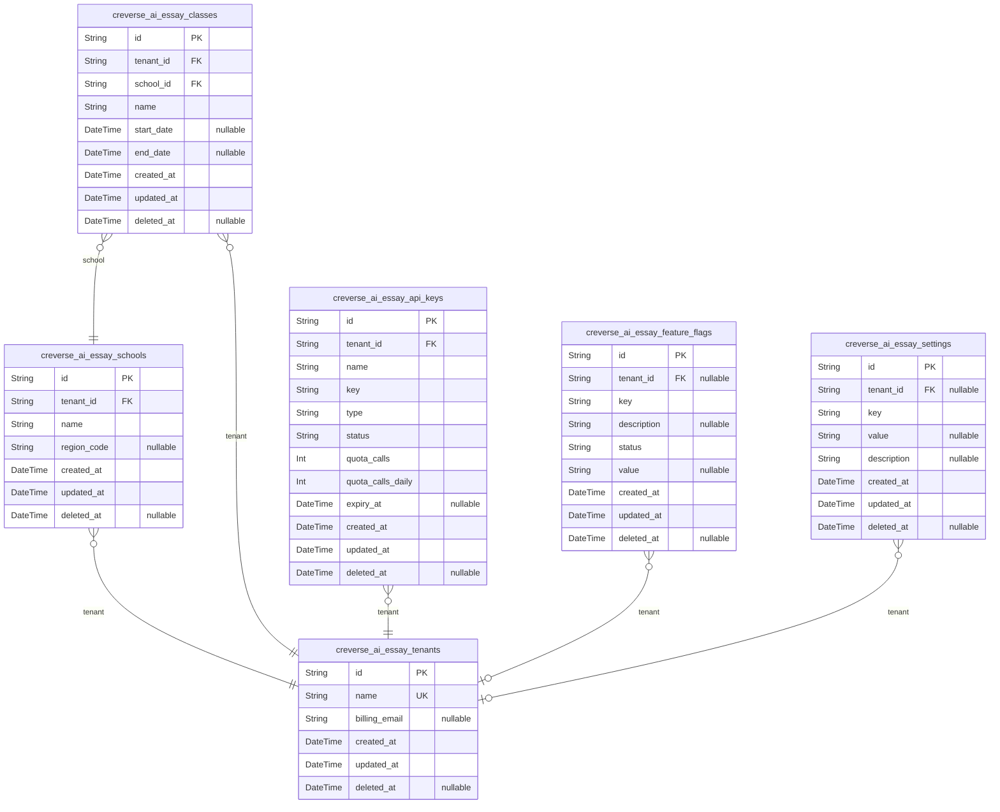
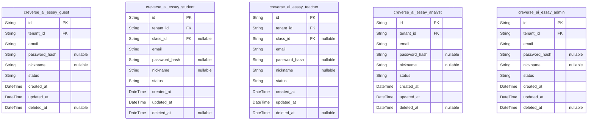
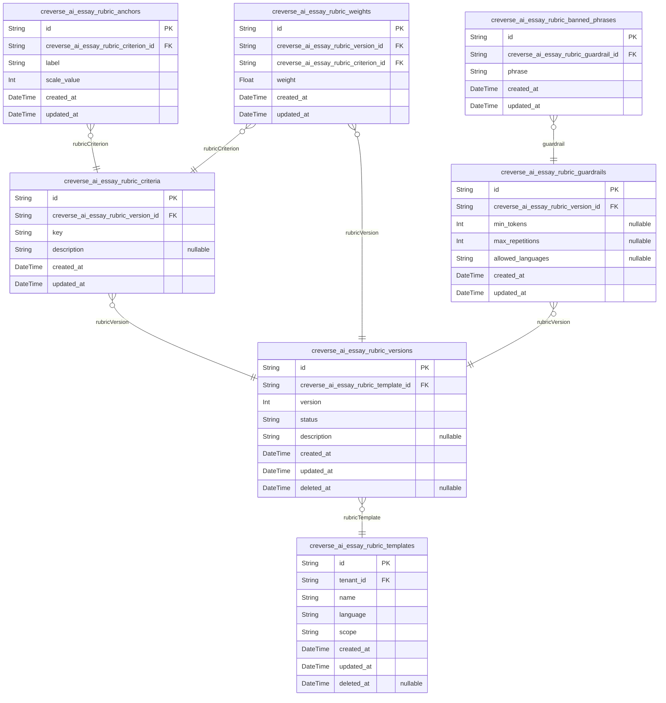
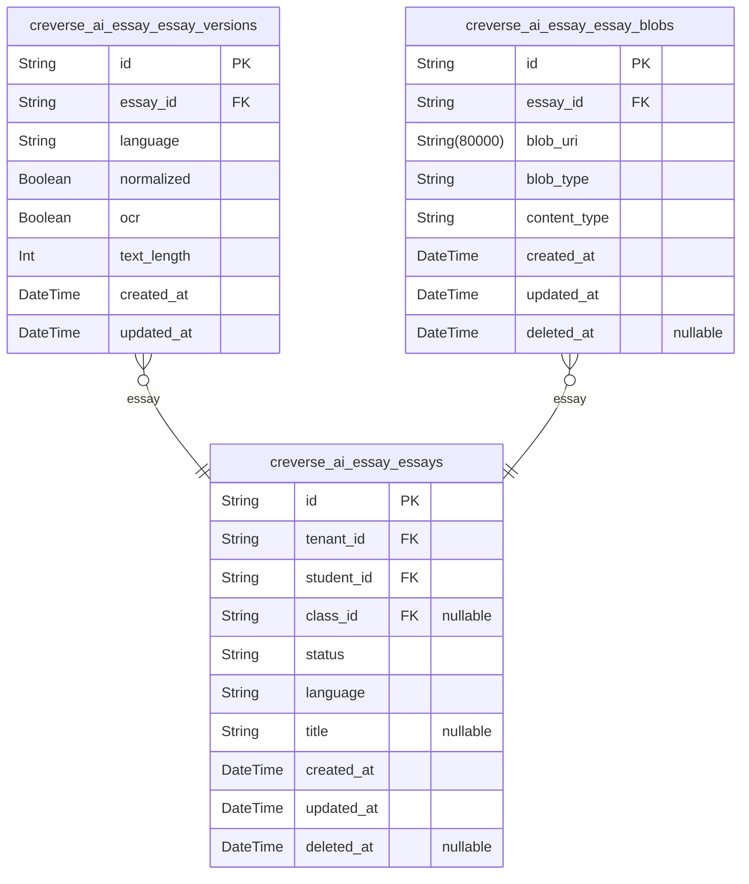
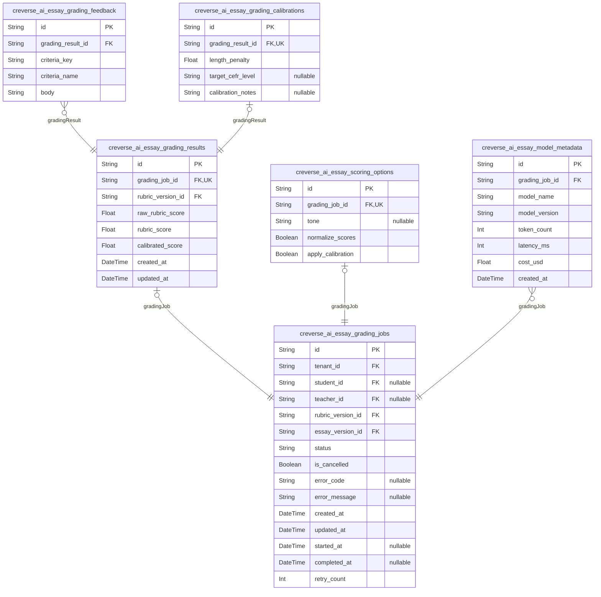
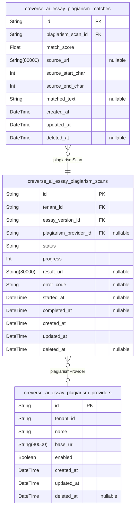
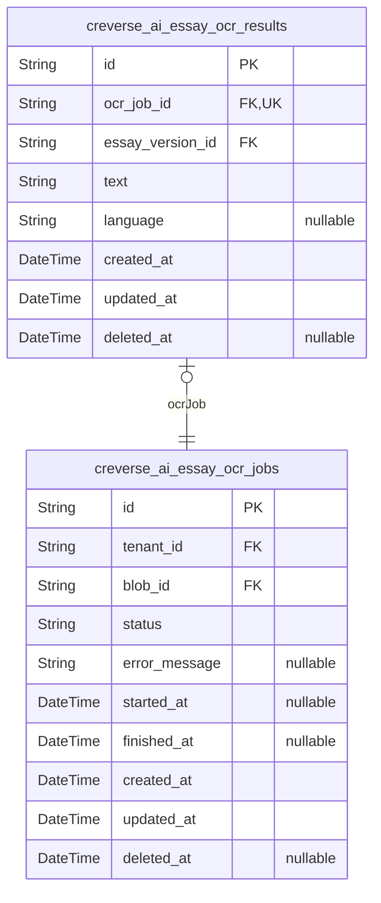
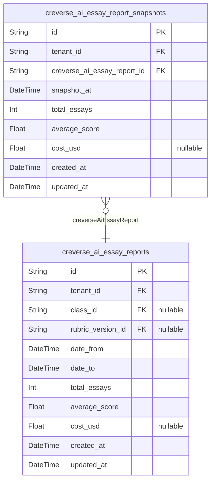
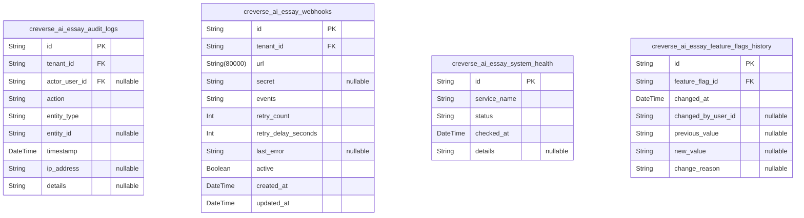
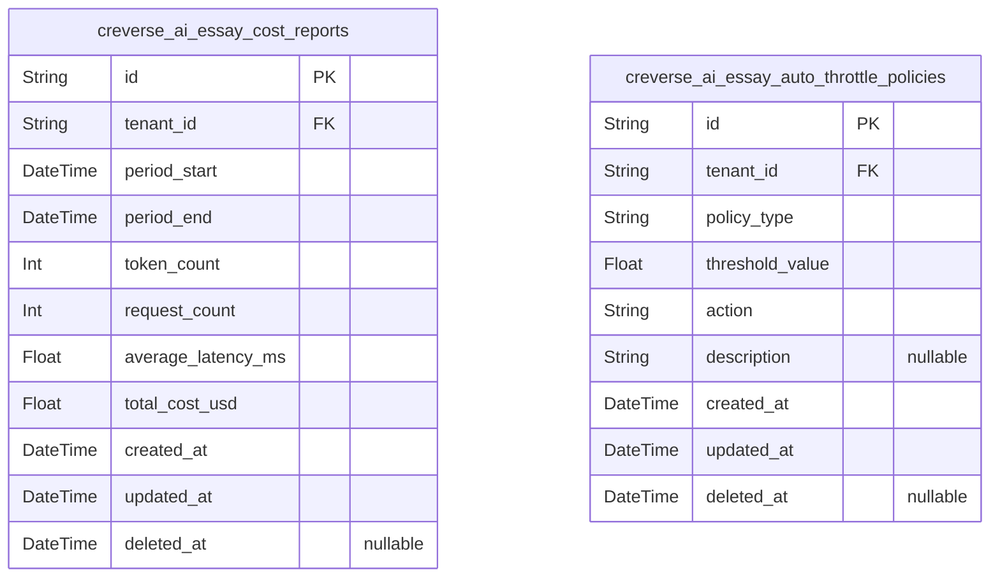

# Prisma Markdown

> Generated by [`prisma-markdown`](https://github.com/samchon/prisma-markdown)

- [Systematic](#systematic)
- [Actors](#actors)
- [Rubrics](#rubrics)
- [Essays](#essays)
- [Grading](#grading)
- [Plagiarism](#plagiarism)
- [Ocr](#ocr)
- [Reports](#reports)
- [Admin](#admin)
- [CostGovernance](#costgovernance)

## Systematic

### `creverse_ai_essay_tenants`

Multi-tenant organizations representing independent educational clients.
Each tenant is the top-level owner for schools, users, and configuration.
Manages billing, contact, and operational metadata for tenant isolation
and multi-tenancy enforcement.

Properties as follows:

- `id`: Primary Key.
- `name`: Tenant name for identification.
- `billing_email`: Email address for billing and contact.
- `created_at`: Timestamp of tenant creation.
- `updated_at`: Timestamp of last tenant update.
- `deleted_at`: Timestamp of soft deletion.

### `creverse_ai_essay_schools`

Schools represent educational institutions within a tenant. Each school
belongs to one tenant and manages its own classes and teaching staff.
Enforces tenant isolation for multi-tenant architectures.

Properties as follows:

- `id`: Primary Key.
- `tenant_id`: Belonged tenant's [creverse_ai_essay_tenants.id](#creverse_ai_essay_tenants).
- `name`: School's name within the tenant's organization.
- `region_code`: ISO region code for localization and filtering.
- `created_at`: Timestamp of school creation.
- `updated_at`: Timestamp of last school update.
- `deleted_at`: Timestamp of soft deletion.

### `creverse_ai_essay_classes`

Classes represent academic groups within a school used for organizing
students and teachers. Each class belongs to a single school and tenant
and serves as a scope for essay assignments and grading.

Properties as follows:

- `id`: Primary Key.
- `tenant_id`: Belonged tenant's [creverse_ai_essay_tenants.id](#creverse_ai_essay_tenants).
- `school_id`: Belonged school's [creverse_ai_essay_schools.id](#creverse_ai_essay_schools).
- `name`: Class name or code within the school.
- `start_date`: Scheduled start date of the class.
- `end_date`: Scheduled end date of the class.
- `created_at`: Timestamp of class creation.
- `updated_at`: Timestamp of last class update.
- `deleted_at`: Timestamp of soft deletion.

### `creverse_ai_essay_api_keys`

API keys associated with tenants for scoped programmatic access. Keys
include usage quotas, types, states, and expiration for security and
operational governance.

Properties as follows:

- `id`: Primary Key.
- `tenant_id`: Belonged tenant's [creverse_ai_essay_tenants.id](#creverse_ai_essay_tenants).
- `name`: Descriptive name of the API key.
- `key`: The opaque API key string used for authentication.
- `type`: API key type (e.g., 'read-only', 'full-access').
- `status`: Current operational status of the API key.
- `quota_calls`: Monthly API call quota for rate limiting.
- `quota_calls_daily`: Daily API call quota for rate limiting.
- `expiry_at`: Expiration timestamp after which the key is disabled.
- `created_at`: Timestamp of API key creation.
- `updated_at`: Timestamp of last API key update.
- `deleted_at`: Timestamp of soft deletion.

### `creverse_ai_essay_feature_flags`

Feature flags that enable or disable functionality at tenant or system
scope. Flags include keys, descriptions, statuses, and value
representations supporting dynamic configuration.

Properties as follows:

- `id`: Primary Key.
- `tenant_id`: Belonged tenant's [creverse_ai_essay_tenants.id](#creverse_ai_essay_tenants).
- `key`: Unique feature flag key identifier.
- `description`: Description of the feature's purpose.
- `status`: Current status of the feature flag (e.g., 'enabled', 'disabled').
- `value`: String representation of the flag's value, e.g., true/false/json.
- `created_at`: Timestamp of feature flag creation.
- `updated_at`: Timestamp of last feature flag update.
- `deleted_at`: Timestamp of soft deletion.

### `creverse_ai_essay_settings`

General system and tenant-specific settings for configurable platform
behavior and feature toggles. Settings allow key-value configuration with
optional JSON values per tenant.

Properties as follows:

- `id`: Primary Key.
- `tenant_id`: Belonged tenant's [creverse_ai_essay_tenants.id](#creverse_ai_essay_tenants).
- `key`: Setting key identifier.
- `value`: String or JSON encoded value for the setting.
- `description`: Human-readable description of the setting purpose.
- `created_at`: Timestamp when the setting was created.
- `updated_at`: Timestamp when the setting was last updated.
- `deleted_at`: Timestamp of soft deletion.

## Actors

### `creverse_ai_essay_guest`

Guest user entities represent unauthenticated or minimal-permission users
with access primarily to login and public information. Linked to tenants
for multi-tenant scoping. Authentication fields include optional
password_hash for tracking login credentials. Includes status and soft
delete for lifecycle management.

Properties as follows:

- `id`: Primary Key.
- `tenant_id`
  > Belonged tenant's [creverse_ai_essay_tenants.id](#creverse_ai_essay_tenants) to enforce
  > multi-tenancy scoping.
- `email`: Email address used for login and notifications.
- `password_hash`: Password hash for authentication login.
- `nickname`: User's display nickname for personalization and identification.
- `status`
  > Account status indicating lifecycle state such as active, suspended, or
  > disabled.
- `created_at`: Timestamp of creation.
- `updated_at`: Timestamp of last update.
- `deleted_at`: Soft delete timestamp indicating if user is deleted.

### `creverse_ai_essay_student`

Student user entities represent learners submitting essays and viewing
personal grading results. Scoped per tenant and optionally associated
with classes for enrollment. Stores authentication credentials, personal
display info, status, and audit timestamps.

Properties as follows:

- `id`: Primary Key.
- `tenant_id`: Belonged tenant's [creverse_ai_essay_tenants.id](#creverse_ai_essay_tenants) for scoping.
- `class_id`
  > Associated class [creverse_ai_essay_classes.id](#creverse_ai_essay_classes) for student
  > enrollment.
- `email`: Email address for student login and notifications.
- `password_hash`: Password hash for authentication login.
- `nickname`: Preferred display nickname of the student.
- `status`: Account status such as active, suspended, or disabled.
- `created_at`: Account creation timestamp.
- `updated_at`: Last update timestamp.
- `deleted_at`: Soft delete timestamp for marking deletion without actual data removal.

### `creverse_ai_essay_teacher`

Teacher user entities represent educators managing rubrics, assignments,
plagiarism reviews, and reports. Scoped by tenant and optionally linked
to classes they teach. Authentication stored via password_hash. Account
lifecycle and soft deletion supported.

Properties as follows:

- `id`: Primary Key.
- `tenant_id`: Belonged tenant [creverse_ai_essay_tenants.id](#creverse_ai_essay_tenants) for multi-tenancy.
- `class_id`
  > Class [creverse_ai_essay_classes.id](#creverse_ai_essay_classes) associated with this teacher
  > if applicable.
- `email`: Email address for teacher login and notifications.
- `password_hash`: Authentication password hash.
- `nickname`: Display nickname or name for the teacher user.
- `status`: Lifecycle status of the teacher account.
- `created_at`: Timestamp of account creation.
- `updated_at`: Timestamp of last update.
- `deleted_at`: Soft delete flag timestamp for account deactivation.

### `creverse_ai_essay_analyst`

Analyst user entities represent read-only analytical users accessing
reports, audits, and costs. Scoped to tenants, but typically no class
association. Include authentication credentials and lifecycle management.

Properties as follows:

- `id`: Primary Key.
- `tenant_id`: Tenant to which analyst belongs [creverse_ai_essay_tenants.id](#creverse_ai_essay_tenants).
- `email`: Email used for login and notifications.
- `password_hash`: Password hash for authentication.
- `nickname`: Optional display nickname of the analyst.
- `status`: Current status of the analyst's account.
- `created_at`: Creation timestamp of the user account.
- `updated_at`: Timestamp of last update to user info.
- `deleted_at`: Soft deletion timestamp if account is deactivated.

### `creverse_ai_essay_admin`

Admin user entities have full control over tenants, API keys, features,
audits, and system ops. Scoped per tenant. Authentication managed via
password_hash. Soft delete and status track account lifecycle.

Properties as follows:

- `id`: Primary Key.
- `tenant_id`: Tenant to which admin belongs [creverse_ai_essay_tenants.id](#creverse_ai_essay_tenants).
- `email`: Email address for login and notifications.
- `password_hash`: Password hash used for authentication.
- `nickname`: Administrator nickname or display name.
- `status`: Lifecycle status of the admin account such as active or suspended.
- `created_at`: Account creation timestamp.
- `updated_at`: Last update timestamp to the admin record.
- `deleted_at`: Soft delete timestamp marking account deactivation.

## Rubrics

### `creverse_ai_essay_rubric_templates`

Defines rubric templates as the blueprint for essay grading rubrics owned
by tenants. They consist of metadata including tenant reference, name,
language, scope, and timestamps. These templates are managed
independently by users and serve as the basis for immutable rubric
versions.

Properties as follows:

- `id`: Primary Key.
- `tenant_id`
  > References the tenant owning this rubric template. {@link
  > creverse_ai_essay_tenants.id}
- `name`: Unique name of the rubric template within the tenant scope.
- `language`: Language code for the rubric template (e.g., en, fr).
- `scope`: Scope of the rubric template such as class, school, tenant, or global.
- `created_at`: Timestamp of rubric template creation.
- `updated_at`: Timestamp of last rubric template update.
- `deleted_at`: Soft delete timestamp if the template is removed.

### `creverse_ai_essay_rubric_versions`

Represents immutable rubric versions created from templates. Each version
contains weighted criteria, anchors, guardrails, and lifecycle status
such as draft, published, or deprecated. Published versions are
immutable. Users may manage versions independently requiring dedicated
API endpoints.

Properties as follows:

- `id`: Primary Key.
- `creverse_ai_essay_rubric_template_id`
  > Foreign key link to parent rubric template. {@link
  > creverse_ai_essay_rubric_templates.id}
- `version`: Sequential version number of this rubric within the template.
- `status`: Version lifecycle status, e.g. draft, published, deprecated.
- `description`: Optional text description of this rubric version.
- `created_at`: Timestamp of version creation.
- `updated_at`: Timestamp of last version update.
- `deleted_at`: Soft delete timestamp if this version is removed.

### `creverse_ai_essay_rubric_criteria`

Criteria define the individual grading components within each rubric
version. Each criterion has a unique key within the rubric version and
descriptive text. This subsidiary entity is dependent on rubric versions
and is managed through the version API.

Properties as follows:

- `id`: Primary Key.
- `creverse_ai_essay_rubric_version_id`
  > Parent rubric version foreign key. {@link
  > creverse_ai_essay_rubric_versions.id}
- `key`: Unique key for this criterion within the rubric version.
- `description`: Optional descriptive text for the criterion.
- `created_at`: Criterion creation date.
- `updated_at`: Criterion update date.

### `creverse_ai_essay_rubric_anchors`

Anchors define grading anchor points connected to rubric criteria,
marking minimum, maximum, or intermediate scale values. This subsidiary
table belongs to rubric criteria and is managed through rubric APIs.

Properties as follows:

- `id`: Primary Key.
- `creverse_ai_essay_rubric_criterion_id`
  > Foreign key to rubric criterion. {@link
  > creverse_ai_essay_rubric_criteria.id}
- `label`: Text label for the anchor point.
- `scale_value`: Integer scale value representing the anchor on the scoring scale.
- `created_at`: Date-time anchor created.
- `updated_at`: Date-time anchor last updated.

### `creverse_ai_essay_rubric_weights`

Weights define the importance of each criterion within a rubric version,
used in overall scoring calculations. Weights tie rubric versions and
criteria as foreign keys, with a double precision weight field.

Properties as follows:

- `id`: Primary Key.
- `creverse_ai_essay_rubric_version_id`
  > Foreign key to rubric version. {@link
  > creverse_ai_essay_rubric_versions.id}
- `creverse_ai_essay_rubric_criterion_id`
  > Foreign key to rubric criterion. {@link
  > creverse_ai_essay_rubric_criteria.id}
- `weight`: Weight factor indicating criterion significance.
- `created_at`: Timestamp weight record created.
- `updated_at`: Timestamp weight record last updated.

### `creverse_ai_essay_rubric_guardrails`

Guardrails impose constraints on rubric versions including allowed
languages, minimum token counts, maximum repetitions, and linked banned
phrases. This subsidiary entity supports enforcement during grading and
essay validation.

Properties as follows:

- `id`: Primary Key.
- `creverse_ai_essay_rubric_version_id`
  > Foreign key to rubric version. {@link
  > creverse_ai_essay_rubric_versions.id}
- `min_tokens`: Optional minimum token count required in essays.
- `max_repetitions`: Optional maximum number of repeated tokens allowed.
- `allowed_languages`: Comma separated allowed language codes for essay submissions.
- `created_at`: Timestamp guardrail created.
- `updated_at`: Timestamp guardrail updated.

### `creverse_ai_essay_rubric_banned_phrases`

Banned phrases linked to rubric guardrails, used to flag or disallow
essay text. Each phrase must be unique per guardrail context and
timestamped for auditing.

Properties as follows:

- `id`: Primary Key.
- `creverse_ai_essay_rubric_guardrail_id`
  > Foreign key to related rubric guardrail. {@link
  > creverse_ai_essay_rubric_guardrails.id}
- `phrase`: Banned phrase text content.
- `created_at`: Timestamp when the banned phrase was created.
- `updated_at`: Timestamp when the banned phrase was last updated.

## Essays

### `creverse_ai_essay_essays`

Contains essay submissions representing individual essays submitted by
students within tenants and classes. Links to tenant, student, and
optionally class. Tracks essay language, status, and related metadata to
support grading workflows. Contains created_at, updated_at and optional
deleted_at timestamps for audit and soft delete support. Acts as a
primary business entity for independent CRUD operations.

Properties as follows:

- `id`: Primary Key.
- `tenant_id`: Tenant to which this essay belongs. [creverse_ai_essay_tenants.id](#creverse_ai_essay_tenants)
- `student_id`: Student who submitted the essay. [creverse_ai_essay_student.id](#creverse_ai_essay_student)
- `class_id`
  > Class associated with this essay, optional. {@link
  > creverse_ai_essay_classes.id}
- `status`
  > Current status of the essay submission, e.g., 'received', 'processing',
  > or 'graded'.
- `language`: Language code of the essay, following BCP 47 standard, e.g., 'en-US'.
- `title`: Optional title of the essay, provided by student or system.
- `created_at`: Timestamp when the essay was created.
- `updated_at`: Timestamp when the essay was last updated.
- `deleted_at`: Optional timestamp when the essay was soft deleted.

### `creverse_ai_essay_essay_versions`

Represents different versions of essays including original, normalized,
and OCR processed texts. Each version links to a parent essay, tracks
language, normalized flags, and text length. Supports audit trail via
created_at and updated_at timestamps. Primary entity for versioned
textual content supporting grading and analysis.

Properties as follows:

- `id`: Primary Key.
- `essay_id`
  > Parent essay to which this version belongs. {@link
  > creverse_ai_essay_essays.id}
- `language`: Language code for this essay version, BCP 47 format, e.g., 'en-US'.
- `normalized`: Indicates whether this text version is normalized for consistent grading.
- `ocr`: True if this version was created via OCR processing of original file.
- `text_length`: Length of the essay text in tokens or characters.
- `created_at`: Timestamp of version creation.
- `updated_at`
  > Timestamp of last update to this version, typically immutable after
  > creation.

### `creverse_ai_essay_essay_blobs`

Stores references to file artifacts related to essays such as original
uploads, OCR source files, or normalized text files. Linked to essays by
foreign keys. Supports audit timestamps and soft deletion. Subsidiary
entity supporting storage and retrieval of essay-related binary blobs.

Properties as follows:

- `id`: Primary Key.
- `essay_id`: Essay related to this blob. [creverse_ai_essay_essays.id](#creverse_ai_essay_essays)
- `blob_uri`
  > URI referencing the location of the stored blob artifact, typically Azure
  > Blob Storage SAS URL.
- `blob_type`: Type of the blob artifact, e.g., 'original', 'normalized', 'ocr'.
- `content_type`
  > MIME content type of the stored blob, e.g., 'application/pdf',
  > 'text/plain'.
- `created_at`: Timestamp when the blob entry was created.
- `updated_at`: Timestamp when the blob entry was last updated.
- `deleted_at`: Optional timestamp for soft deletion.

## Grading

### `creverse_ai_essay_grading_jobs`

Represents asynchronous grading jobs binding an essay version and rubric
version. Stores job status, cancellation flags, error messages,
timestamps, and associations to tenants and users. Supports retry logic
and job lifecycle management including queued, processing, succeeded,
failed, and cancelled states.

Properties as follows:

- `id`: Primary Key.
- `tenant_id`: Associated tenant's [creverse_ai_essay_tenants.id](#creverse_ai_essay_tenants).
- `student_id`: Associated student's [creverse_ai_essay_student.id](#creverse_ai_essay_student).
- `teacher_id`: Associated teacher's [creverse_ai_essay_teacher.id](#creverse_ai_essay_teacher).
- `rubric_version_id`
  > Target rubric version [creverse_ai_essay_rubric_versions.id](#creverse_ai_essay_rubric_versions) for
  > grading.
- `essay_version_id`
  > Target essay version [creverse_ai_essay_essay_versions.id](#creverse_ai_essay_essay_versions) for
  > grading.
- `status`
  > Current job status such as queued, processing, succeeded, failed, or
  > cancelled.
- `is_cancelled`: Flag indicating if job cancellation was requested.
- `error_code`: Error code if the job failed or was cancelled, null if no error.
- `error_message`: Detailed error message if any, null if none.
- `created_at`: Timestamp when the job was created.
- `updated_at`: Timestamp when the job record was last updated.
- `started_at`: Timestamp when job processing started, null before processing.
- `completed_at`: Timestamp when job processing completed, null if not finished.
- `retry_count`: Number of retry attempts performed for the job.

### `creverse_ai_essay_grading_results`

Stores detailed scoring results for a completed grading job. Includes
overall rubric score, raw rubric score, normalized score, and
associations to grading job and rubric version. Supports strict
referential integrity and auditability.

Properties as follows:

- `id`: Primary Key.
- `grading_job_id`: Associated grading job [creverse_ai_essay_grading_jobs.id](#creverse_ai_essay_grading_jobs).
- `rubric_version_id`
  > The rubric version [creverse_ai_essay_rubric_versions.id](#creverse_ai_essay_rubric_versions) used for
  > scoring.
- `raw_rubric_score`: Raw rubric score prior to normalization and calibration.
- `rubric_score`: Normalized rubric score scaled to 0-100 based on rubric scale boundaries.
- `calibrated_score`
  > Final calibrated score after applying length penalty and other
  > adjustments.
- `created_at`: Timestamp of result creation.
- `updated_at`: Timestamp of last update to the result.

### `creverse_ai_essay_grading_feedback`

Stores per-criteria qualitative feedback entries for a given grading
result. Linked to grading results for comprehensive review and analytics.

Properties as follows:

- `id`: Primary Key.
- `grading_result_id`: Associated grading result [creverse_ai_essay_grading_results.id](#creverse_ai_essay_grading_results).
- `criteria_key`: Unique key for the rubric criteria this feedback refers to.
- `criteria_name`: Human-readable name of the rubric criteria.
- `body`: Textual feedback for the criteria.

### `creverse_ai_essay_grading_calibrations`

Captures calibration details for grading results including length
penalties and CEFR adjustments. Supports auditability and historical
reference.

Properties as follows:

- `id`: Primary Key.
- `grading_result_id`: Associated grading result [creverse_ai_essay_grading_results.id](#creverse_ai_essay_grading_results).
- `length_penalty`: Applied length penalty value.
- `target_cefr_level`
  > Target Common European Framework of Reference (CEFR) level for score
  > calibration, null if not applied.
- `calibration_notes`: Optional notes describing the calibration.

### `creverse_ai_essay_scoring_options`

Options and parameters used to configure scoring behavior per grading job
such as tone, normalization, and calibration directives.

Properties as follows:

- `id`: Primary Key.
- `grading_job_id`
  > The grading job [creverse_ai_essay_grading_jobs.id](#creverse_ai_essay_grading_jobs) this scoring
  > option is linked to.
- `tone`: Requested tone for scoring feedback (e.g., formal, friendly).
- `normalize_scores`: Flag to apply normalization to raw rubric scores.
- `apply_calibration`: Flag to enable score calibration adjustments.

### `creverse_ai_essay_model_metadata`

Metadata about each AI model invocation for grading jobs, including token
counts, model version, latency, and cost for audit and cost governance.

Properties as follows:

- `id`: Primary Key.
- `grading_job_id`: Associated grading job [creverse_ai_essay_grading_jobs.id](#creverse_ai_essay_grading_jobs).
- `model_name`: The name of the AI model invoked for scoring.
- `model_version`: Specific version tag of the AI model used.
- `token_count`: Number of tokens consumed during the model call.
- `latency_ms`: Latency in milliseconds for the model call.
- `cost_usd`: Cost in USD charged for the model call.
- `created_at`: Timestamp when this metadata record was created.

## Plagiarism

### `creverse_ai_essay_plagiarism_providers`

Plagiarism detection providers metadata, including service name, URLs,
and operational status. Supports asynchronous scans by various plagiarism
engines within CREVERSE AI multi-tenant architecture. No independent user
management APIs; managed as a solitary supporting entity.

Properties as follows:

- `id`: Primary Key.
- `tenant_id`
  > Tenant owning the plagiarism provider configuration. {@link
  > creverse_ai_essay_tenants.id}
- `name`
  > Unique name identifier of the plagiarism provider service, e.g.,
  > "Turnitin", "CustomInternal"
- `base_uri`: Base URI endpoint for contacting the plagiarism provider
- `enabled`: Flag indicating if the plagiarism provider is currently enabled for use
- `created_at`: Timestamp when this provider record was created
- `updated_at`: Timestamp when this provider record was last updated
- `deleted_at`: Timestamp marking deletion (soft delete) of this provider record

### `creverse_ai_essay_plagiarism_scans`

Records of plagiarism scan requests and results, each linked to a tenant
and a specific essay version. Captures scan lifecycle state, provider
used, result metadata, errors, and timing for asynchronous plagiarism
detection integration.

Properties as follows:

- `id`: Primary Key.
- `tenant_id`: Owning tenant of the plagiarism scan. [creverse_ai_essay_tenants.id](#creverse_ai_essay_tenants)
- `essay_version_id`
  > Referenced essay version being scanned. {@link
  > creverse_ai_essay_essay_versions.id}
- `plagiarism_provider_id`
  > Plagiarism provider used for this scan. {@link
  > creverse_ai_essay_plagiarism_providers.id}
- `status`: Status of the scan, e.g., "pending", "processing", "completed", "failed"
- `progress`: Percentage progress of the scan operation, 0-100
- `result_url`: URL to the detailed plagiarism scan results, if available
- `error_code`: Optional error code if the scan failed
- `started_at`: Timestamp when the scan started
- `completed_at`: Timestamp when the scan completed
- `created_at`: Record created timestamp
- `updated_at`: Record last updated timestamp
- `deleted_at`: Soft deletion timestamp

### `creverse_ai_essay_plagiarism_matches`

Historical snapshots of individual plagiarism matches detected per
plagiarism scan. Stores matched source spans, similarity scores, matched
text excerpts, and reference URIs for audit and investigation. Immutable
once created for audit compliance.

Properties as follows:

- `id`: Primary Key.
- `plagiarism_scan_id`: Parent plagiarism scan. [creverse_ai_essay_plagiarism_scans.id](#creverse_ai_essay_plagiarism_scans)
- `match_score`: Similarity score for this match, e.g., 0.0–100.0 percentage
- `source_uri`: URI of the matched source document or resource
- `source_start_char`: Inclusive start character offset of the matched text in the source
- `source_end_char`: Inclusive end character offset of the matched text in the source
- `matched_text`: Extracted matched text snippet for audit display
- `created_at`: Timestamp when this match was recorded
- `updated_at`: Timestamp when this match record was last updated
- `deleted_at`: Soft deletion timestamp

## Ocr

### `creverse_ai_essay_ocr_jobs`

OCR ingestion jobs represent asynchronous requests to convert essay blobs
such as PDFs or images into text. Each job is uniquely identified by a
UUID and associated with a tenant and a source essay blob. The model
tracks the OCR processing lifecycle through status fields, optional error
messages for diagnostics, start and finish timestamps, and usual created,
updated, and soft deletion timestamps. The entity serves as a primary
domain object reflecting OCR processing pipeline states independent from
essay or grading workflows.

Properties as follows:

- `id`: Primary Key.
- `tenant_id`
  > Tenant that owns this OCR job, ensuring strict multi-tenant data
  > isolation. Foreign key references creverse_ai_essay_tenants.id.
- `blob_id`
  > Reference to the essay blob (PDF or image) to process in this OCR job.
  > Foreign key to creverse_ai_essay_essay_blobs.id.
- `status`
  > Current state of the OCR job such as 'queued', 'processing', 'succeeded',
  > or 'failed'. Enables tracking and workflow management.
- `error_message`
  > Optional detailed error message if OCR processing failed. Useful for
  > troubleshooting and retry logic.
- `started_at`: Timestamp when OCR processing started. Null if processing not yet begun.
- `finished_at`: Timestamp when OCR processing completed. Null if job pending or failed.
- `created_at`: Timestamp when this OCR job was created.
- `updated_at`: Timestamp when this OCR job was last updated.
- `deleted_at`: Soft deletion timestamp; null if not deleted.

### `creverse_ai_essay_ocr_results`

OCR results contain extracted text from OCR jobs linked to specific essay
versions generated by processing blobs. Each result record uniquely
identifies the OCR job it belongs to and the resultant essay version. The
model stores the plain text output, optional detected language, and
timestamps for creation, updates, and soft deletion. This primary entity
supports independent querying and management of OCR results in the essay
processing pipeline.

Properties as follows:

- `id`: Primary Key.
- `ocr_job_id`
  > Foreign key referencing the OCR job that generated this result. Links to
  > creverse_ai_essay_ocr_jobs.id.
- `essay_version_id`
  > Foreign key referencing the essay version created from this OCR text.
  > Links to creverse_ai_essay_essay_versions.id.
- `text`: Extracted OCR plain text content from essay blobs.
- `language`
  > Detected or specified language of the OCR text such as 'en' or 'fr'.
  > Facilitates language-based filtering and processing. Nullable if unknown.
- `created_at`: Timestamp when the OCR result record was created.
- `updated_at`: Timestamp when the OCR result record was last updated.
- `deleted_at`: Soft deletion timestamp; null if not deleted.

## Reports

### `creverse_ai_essay_reports`

This table aggregates overall essay grading reports including progress,
distribution, and cost governance metrics per tenant, class, and rubric
over specified time ranges. It supports filtering by tenant, class,
rubric, and time periods and enables efficient read access to analytic
rollups for reporting purposes. The table maintains relationships to
tenant, class, and rubric entities for scoping. Standard temporal fields
track record creation and update times. This table is classified as
primary as users query and browse report summaries independently.

Properties as follows:

- `id`: Primary Key.
- `tenant_id`: Tenant of this report. [creverse_ai_essay_tenants.id](#creverse_ai_essay_tenants)
- `class_id`: Class related to report entries. [creverse_ai_essay_classes.id](#creverse_ai_essay_classes)
- `rubric_version_id`
  > Specific rubric version referenced in the report. {@link
  > creverse_ai_essay_rubric_versions.id}
- `date_from`: Start date of the reporting period.
- `date_to`: End date of the reporting period.
- `total_essays`: Total number of essays included in this report.
- `average_score`: Average normalized score (0-100 scale) across essays.
- `cost_usd`: Reported cost of grading in USD for the period.
- `created_at`: Record creation timestamp.
- `updated_at`: Record last update timestamp.

### `creverse_ai_essay_report_snapshots`

Historical snapshots of essay reports for audit trails and trend
analysis. Each snapshot captures the state of a specific report at a
point in time, preserving data immutability. The snapshots link to the
main report entity and tenant. This table supports temporal queries for
historical report comparisons and analytics. This is a snapshot table
reflecting append-only audit data.

Properties as follows:

- `id`: Primary Key.
- `tenant_id`: Tenant of this snapshot. [creverse_ai_essay_tenants.id](#creverse_ai_essay_tenants)
- `creverse_ai_essay_report_id`: Main report this snapshot refers to. [creverse_ai_essay_reports.id](#creverse_ai_essay_reports)
- `snapshot_at`: Timestamp when the snapshot was taken.
- `total_essays`: Total essays counted in this snapshot.
- `average_score`: Average normalized score (0-100 scale).
- `cost_usd`: Cost in USD at snapshot time.
- `created_at`: Record creation timestamp.
- `updated_at`: Record last update timestamp.

## Admin

### `creverse_ai_essay_audit_logs`

Audit logs capturing all user and system actions including PII access,
changes to rubric, grading operations, and administrative activities.
Tracks actor, action type, entity referenced, IP address, and timestamp,
ensuring tenant isolation and compliance auditing.

Properties as follows:

- `id`: Primary Key.
- `tenant_id`
  > Tenant associated with the audit log. {@link
  > creverse_ai_essay_tenants.id}.
- `actor_user_id`
  > User who performed the action, may be null for system events. {@link
  > creverse_ai_essay_admin.id}.
- `action`
  > Type of action performed, e.g., rubric_publish, grading_create,
  > pii_access.
- `entity_type`
  > Type of entity affected by the action, e.g., rubric_version, essay, user,
  > feature_flag.
- `entity_id`: UUID of the entity affected, if applicable.
- `timestamp`: Timestamp when the action occurred.
- `ip_address`: IP address from which action was performed, supports IPv4 and IPv6.
- `details`: Optional JSON string with additional context or metadata about the action.

### `creverse_ai_essay_webhooks`

Webhook configurations for delivering event notifications to external
systems. Includes settings for destination URL, secret for signature
validation, retry policies, and event filters. Tracks delivery status and
error reasons.

Properties as follows:

- `id`: Primary Key.
- `tenant_id`
  > Tenant owning the webhook configuration. {@link
  > creverse_ai_essay_tenants.id}.
- `url`: Destination endpoint URL for webhook delivery.
- `secret`: Secret key for HMAC signature to verify webhook payload integrity.
- `events`
  > Comma-separated list of event types that trigger this webhook, e.g.,
  > grading.completed, plagiarism.scanned.
- `retry_count`: Number of retry attempts made after a failure.
- `retry_delay_seconds`: Delay in seconds before the next retry attempt.
- `last_error`: Last error message if delivery failed, null if no errors.
- `active`: Indicates if the webhook is currently active and should receive events.
- `created_at`: Webhook configuration creation timestamp.
- `updated_at`: Timestamp of the last update to webhook configuration.

### `creverse_ai_essay_system_health`

System health check records for tracking uptime and operational status
metrics. Captures service names, health status, check timestamps, and
optional detailed status information for monitoring and alerting.

Properties as follows:

- `id`: Primary Key.
- `service_name`
  > Name of the monitored service or subsystem, e.g. grading_worker,
  > webhook_dispatcher.
- `status`: Current health status (e.g., healthy, degraded, down).
- `checked_at`: Timestamp when the health check was performed.
- `details`: Optional JSON string with detailed health check information or metrics.

### `creverse_ai_essay_feature_flags_history`

Historical records of feature flag changes capturing state over time, the
author of the change, and reason for changes for audit and rollback
capabilities.

Properties as follows:

- `id`: Primary Key.
- `feature_flag_id`
  > Reference to current feature flag entity. {@link
  > creverse_ai_essay_feature_flags.id}.
- `changed_at`: Timestamp when this change occurred.
- `changed_by_user_id`: User who made the change. [creverse_ai_essay_admin.id](#creverse_ai_essay_admin).
- `previous_value`: Feature flag value before the change, stored as a JSON string.
- `new_value`: Feature flag value after the change, stored as a JSON string.
- `change_reason`: Text explaining the reason for the feature flag change.

## CostGovernance

### `creverse_ai_essay_cost_reports`

This table captures cost and usage reports related to essay grading
activities per tenant for specific time intervals. It records metrics
such as token usage, latency, request counts, and cost amounts, enabling
budget tracking and financial reporting within the multi-tenant system.
It references the tenant entity and is indexed by tenant and report
interval for efficient queries.

Properties as follows:

- `id`: Primary Key.
- `tenant_id`: Reference to the tenant entity. [creverse_ai_essay_tenants.id](#creverse_ai_essay_tenants).
- `period_start`: Start timestamp of the reporting period in ISO 8601 format, inclusive.
- `period_end`: End timestamp of the reporting period in ISO 8601 format, exclusive.
- `token_count`: Total number of AI tokens consumed during this period for essay grading.
- `request_count`: Total count of essay grading requests processed during this period.
- `average_latency_ms`: Average latency in milliseconds for grading requests within this period.
- `total_cost_usd`
  > Total cost in US dollars incurred during the reporting period related to
  > grading activities.
- `created_at`: Record creation timestamp.
- `updated_at`: Record last updated timestamp.
- `deleted_at`
  > Soft deletion timestamp to indicate if the record has been logically
  > deleted.

### `creverse_ai_essay_auto_throttle_policies`

This table defines auto-throttling policies that apply to tenants to
control request rates and prevent budget overruns. It stores policy
types, thresholds, and actions to enforce limits at runtime. Each policy
is uniquely associated with a tenant and a policy type.

Properties as follows:

- `id`: Primary Key.
- `tenant_id`
  > Reference to the tenant which this throttle policy applies to. {@link
  > creverse_ai_essay_tenants.id}.
- `policy_type`
  > Type of throttling policy, such as 'budget_limit', 'rate_limit',
  > indicating the enforcement scope.
- `threshold_value`
  > Numeric threshold value for the policy, e.g., maximum allowed tokens per
  > time unit or maximum request rate.
- `action`
  > Action to take when the threshold is exceeded, e.g., 'reject', 'warn', or
  > 'throttle'.
- `description`: Detailed human-readable explanation of the policy purpose and application.
- `created_at`: Timestamp when this policy record was created.
- `updated_at`: Timestamp when this policy record was last updated.
- `deleted_at`: Soft delete timestamp indicating logical deletion.
