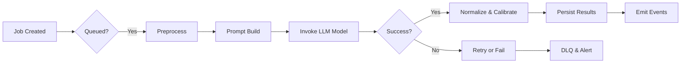

# CREVERSE AI Essay Auto-Grading Backend Business Requirements

## 1. Business Model

### 1.1 Business Justification
WHEN educational institutions require scalable, consistent, and objective essay evaluations, THE CREVERSE AI Essay Auto-Grading platform SHALL provide enterprise-grade automation powered by AI scoring and customizable rubrics.

### 1.2 Revenue Model
THE platform SHALL generate revenue via tiered subscription plans charging by tenant size, grading volume, and premium features such as plagiarism scanning and advanced analytics.

### 1.3 Operations and Success Metrics
THE platform SHALL monitor active tenant count, average grading turnaround, user satisfaction, and cost efficiency to measure success.

## 2. User Roles and Authentication

### 2.1 User Roles
- Guest
- Student
- Teacher
- Analyst
- Admin

### 2.2 Authentication Flow
WHEN a user submits credentials via OIDC or email/password, THE system SHALL validate and issue JWT tokens with embedded tenant_id and role claims.
THE tokens SHALL expire after 15-30 minutes with refresh tokens valid for 7-30 days.

### 2.3 Authorization
ROLE-BASED ACCESS CONTROL shall restrict API access and data visibility per user role and tenant membership.

### 2.4 Permission Matrix
| Action | Guest | Student | Teacher | Analyst | Admin |
|---|---|---|---|---|---|
| Submit Essay | ❌ | ✅ | ❌ | ❌ | ❌ |
| View Own Grades | ❌ | ✅ | ❌ | ❌ | ❌ |
| Manage Rubrics | ❌ | ❌ | ✅ | ❌ | ❌ |
| Access Reports | ❌ | ❌ | ✅ | ✅ | ❌ |
| Manage Tenants | ❌ | ❌ | ❌ | ❌ | ✅ |

## 3. Multi-Tenancy and Security

WHEN processing requests, THE system SHALL enforce tenant_id scoping using Postgres RLS and scoped JWT claims.
UNAUTHORIZED cross-tenant accesses SHALL return TENANT_FORBIDDEN.
THE system SHALL enforce encryption of PII at rest, redact PII in logs, and log all PII access.

## 4. Functional Requirements

### 4.1 Rubric Management
WHEN creating or editing rubric drafts, THE system SHALL validate that all criterion weights sum to 1.0±0.001 and criteria anchors cover scale boundaries.
Rubric versions SHALL progress through draft → published → deprecated states, with immutability after publishing.

### 4.2 Essay Submission and Versioning
WHEN a student submits an essay, THE system SHALL create an Essay entity with status "received" and store original blobs securely.
Multiple EssayVersions SHALL be managed to support normalization and OCR text.

### 4.3 OCR Processing
WHEN an essay requires OCR, THE system SHALL enqueue ocr:ingest jobs and update essay versions once extraction completes.

### 4.4 Grading Workflow
WHEN a grading request is submitted, THE system SHALL enqueue grading:score jobs binding essayVersion and rubricVersion.
THE system SHALL preprocess essay text, build prompts with rubric anchors and guardrails, and call AI LLM with retry and circuit breaker policies.
Scores SHALL be normalized to 0-100 with optional calibration (length penalties, CEFR adjustments).

### 4.5 Plagiarism Detection
THE system SHALL enqueue plagiarism scan jobs asynchronously and store matches with source spans and scores.

### 4.6 Reporting
THE system SHALL provide reports on progress trends, score distributions, rubric breakdowns, anomalies, and costs with filtering capabilities.

## 5. Asynchronous Processing Pipelines

THE system SHALL use BullMQ queues for grading, OCR, plagiarism, analytics rollups, and webhook delivery with retry and dead-letter queue policies.

## 6. API Usage and Rate Limiting

API calls SHALL be authenticated with JWT or API keys scoped by tenant.
Rate limits SHALL be enforced per user and API key, returning 429 with Retry-After on limits.

## 7. Audit and Compliance Logging

All user and system actions including PII access SHALL be logged with actor, action, entity, IP, and timestamp.
Audit logs SHALL be immutable and queryable by tenant, actor, and time.

## 8. Error Handling and Recovery

WHEN validation fails, THE system SHALL return detailed error codes such as RUBRIC_INVALID.
Transient errors SHALL be retried with exponential backoff up to 5 times.
Jobs exceeding retries SHALL enter DLQ and notify admins.

## 9. Performance and Scalability

THE system SHALL horizontally scale processing workers with concurrency limits.
95% of grading jobs SHALL complete within 5 minutes for median essay size.
Read replicas SHALL be used for heavy analytic queries.

## 10. Observability and Monitoring

THE system SHALL implement OpenTelemetry tracing from API calls through async queues and AI model calls.
Sentry SHALL capture errors with Slack/PagerDuty alerts.
Operational dashboards SHALL display queue depths, latency, success rates, token and cost metrics.

## 11. Deployment and Release

Deployments SHALL use AKS with HPA, supporting canary and blue-green patterns.
Database migrations SHALL be forward-only.
Emergency rollbacks SHALL use feature flags to switch models or pause queues.

## 12. Testing and Quality Assurance

Unit, integration, contract, load and chaos testing SHALL be performed to ensure system stability.
Golden datasets SHALL prevent grading regressions.

## 13. Cost Governance and Budget Controls

Costs SHALL be tracked per job by token usage and model.
Budgets shall trigger auto-throttling and alerts when exceeded.

## 14. Webhook Event Management

Webhooks shall deliver signed events with retry and DLQ on failures.

---

# Mermaid Diagrams

## Grading Job Lifecycle


## Multi-Tenant Enforcement Flow
```mermaid
graph LR
  A["Request"] --> B{"Tenant ID Valid?"}
  B --|"Yes"| C{"Role Authenticated & Authorized?"}
  B --|"No"| D["Return 403 TENANT_FORBIDDEN"]
  C --|"Yes"| E["Process Request"]
  C --|"No"| F["Return 403 AUTHORIZATION_DENIED"]
```

---

This document provides business requirements only. All technical implementation decisions belong to developers. Developers have full autonomy over architecture, APIs, and database design. The document describes WHAT the system should do, not HOW to build it.