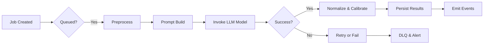

# CREVERSE AI Essay Auto-Grading Backend API Functional Requirements

## 1. Introduction and Business Context

CREVERSE AI Essay Auto-Grading system is designed to provide scalable, enterprise-grade automated evaluation of student essays using sophisticated AI models. The service addresses the demand for consistent, reliable scoring at scale with rich customization capabilities tailored to educational institutions, promoting improved feedback quality and academic integrity.

## 2. User Roles and Authentication

The system recognizes several user roles, each with defined permissions and responsibilities to securely manage access and data integrity across multiple tenants.

### Roles

- **Guest:** Unauthenticated users limited to public access and login functionalities.
- **Student:** Authorized to submit essays, view personal grading feedback, and access their own reports.
- **Teacher:** Empowered to create and manage rubric templates and versions, assign essays for grading, analyze results, and oversee plagiarism scans.
- **Analyst:** Provides readonly access to reports, auditing data, and cost governance details for institutional insights.
- **Admin:** Full operational control over tenant management, API keys, feature flags, audit logs, and system administration.

### Authentication Requirements

- The system SHALL implement OIDC/JWT-based authentication protocols.
- THE system SHALL generate JWT tokens embedding tenant identification and role claims.
- THE system SHALL support API key issuance with scope-based restrictions and call quotas.
- THE system SHALL enforce role-based access control (RBAC) at the API route level.
- THE system SHALL apply rate limiting per user and API key to prevent abuse.

## 3. Essay Submission Workflow

### Submission Types and Versioning

- Essays can be submitted through text input, file uploads, or OCR pipelines.
- THE system SHALL store original submission artifacts securely using Azure Blob Storage with SAS URLs.
- THE system SHALL manage multiple versions of each essay, supporting manual or automated normalization processes.

### Essay Entity Details

- Each essay record SHALL include tenant identifier, student identifier, optional class reference, language, and submission status.
- Status values include 'received', 'processing', 'graded', 'error' among others.
- THE system SHALL provide indexed search capabilities by tenant, student, class, date range, and language.

### Functional Requirements

- WHEN a student submits an essay, THE system SHALL create a new Essay record marked as 'received'.
- IF the submission includes a file upload, THEN THE system SHALL generate a presigned SAS URL for direct client upload.
- THE system SHALL allow addition of subsequent EssayVersions reflecting normalized or OCR-processed text.
- THE system SHALL maintain an audit trail for submissions and version changes.

## 4. Rubric Building and Publishing

### Template and Version Lifecycle

- THE system SHALL support defining rubric templates containing metadata such as name, language, and scope.
- Rubric versions SHALL be immutable after publishing with states: draft → published → deprecated.

### Criteria and Validation

- Each rubric version SHALL define weighted criteria with anchored scoring descriptors.
- THE system SHALL enforce weights summing to approximately 1.0.
- Each criterion SHALL have at least one anchor associated with minimum, maximum, and a mid-scale value.
- Valid scale ranges are integer values with scaleMin less than scaleMax.
- Optional guardrails may include forbidden phrases, minimum length, or repetition limitations.

### Business Rules

- WHEN saving rubric drafts, THE system SHALL validate:
  - Criteria weights are within acceptable tolerance (0.999 to 1.001).
  - Anchors fully cover scale boundaries.
  - Scale values are valid integers with correct ordering.
- AFTER publishing, THE rubric version SHALL be immutable.

## 5. Grading Process

### Scoring Job Lifecycle

- Grading jobs bind one EssayVersion to one RubricVersion and are managed asynchronously.
- Job statuses include queued, processing, succeeded, failed, and cancelled.

### Scoring Model and Prompt Construction

- THE system SHALL prepare grading prompts by combining rubric anchors, weights, user tone, and guardrails.
- THE system SHALL interact with Azure OpenAI / ML backends ensuring retry, backoff, and circuit breaker patterns.

### Result Normalization and Calibration

- Raw rubric scores SHALL be normalized to a 0-100 scale as configured.
- Calibration adjustments such as length penalties or CEFR level mappings SHALL be applied where defined.

### Optional Plagiarism Integration

- THE system SHALL trigger plagiarism scans integrated into grading workflows as configured.
- Plagiarism results SHALL be incorporated into grading feedback where enabled.

### Data Persistence and Notification

- Upon job completion, THE system SHALL persist scores, criterion feedback, calibration data, model metadata, and plagiarism results.
- THE system SHALL emit events for downstream webhook or notification consumption.

## 6. OCR Pipeline

- WHEN an OCR request is submitted for an essay artifact, THE system SHALL enqueue 'ocr:ingest' jobs.
- THE OCR process SHALL convert supported file formats to text and append as new EssayVersion.
- THE OCR job status and results SHALL be retrievable via API.

## 7. Plagiarism Scanning

- THE system SHALL integrate multiple plagiarism providers in a provider-agnostic fashion.
- Plagiarism scans SHALL be enqueued asynchronously and support progress tracking.
- Scan results SHALL include detected matches with source spans and score metrics.

## 8. Reports and Analytics

- THE system SHALL provide reports on student progress trends, class grade distributions, rubric criteria breakdowns, and anomaly detection.
- Support filters by tenant, class, rubric version, and date ranges.
- Cost and usage analytics SHALL be available to facilitate budget management and optimization.

## 9. Error Handling and Recovery

### Error Types

- THE system SHALL categorize errors such as rubric validation failures, grading rate-limit breaches, model invocation errors, plagiarism timeouts, tenant authorization failures, SAS token expiration, and webhook delivery failures.

### Client Behavior

- WHEN errors occur, THE system SHALL return standardized error messages with specific error codes and context details.
- In transient failure cases, THE system SHALL apply retry logic with exponential backoff and detect poison pill errors.
- THE system SHALL move failed jobs exceeding retry limits into dead-letter queues and alert administrators.

## 10. Performance Expectations

- Synchronous API calls related to reads SHALL respond under 2 seconds at the 95th percentile.
- Asynchronous grading jobs SHALL complete within 5 minutes for 95% of median-sized essays.
- Batch processing SHALL handle submissions in configurable chunk sizes to balance throughput and resource utilization.

## Mermaid Diagram: Grading Job Lifecycle

---

This document comprehensively captures all business functional requirements of the CREVERSE AI Essay Auto-Grading platform for backend implementation.

This document provides business requirements only. All technical implementation decisions (architecture, APIs, database schema design) are at the discretion of the development team.
This document describes WHAT the system SHALL do, not HOW to build it.