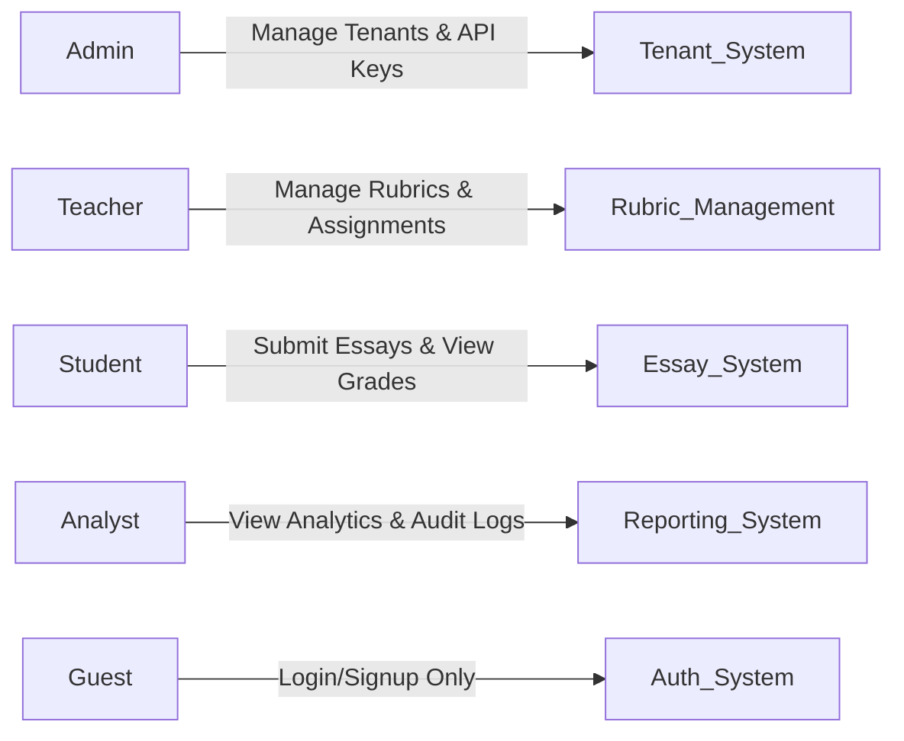
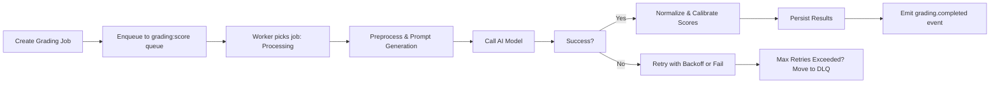
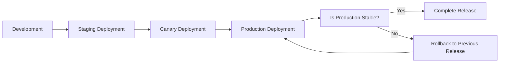

# CREVERSE AI Essay Auto-Grading Backend API - Business Requirements Specification

## 1. Introduction
The CREVERSE AI Essay Auto-Grading system delivers an enterprise-grade, multi-tenant platform for scalable, automated essay evaluation. The service addresses the growing demand for consistent, reliable, and customizable essay grading for educational institutions by integrating AI-driven scoring, plagiarism detection, robust audit compliance, and advanced analytics.

## 2. Business Model
### Why This Service Exists
Educational institutions and enterprises struggle with the high cost, inconsistency, and delays inherent in manual essay grading. CREVERSE provides an efficient, consistent, and scalable solution, enabling organizations to automate essay evaluation with flexible rubrics that accommodate diverse pedagogical needs.

### Revenue Strategy
THE platform SHALL generate revenue primarily through subscription licensing based on tenant size and usage, supplemented by premium features such as advanced plagiarism detection and analytics.

### Growth Plan
THE system SHALL encourage growth via partnerships with educational institutions, learning management systems, and ed-tech platforms, focused on expanding tenant adoption and usage volume.

### Success Metrics
THE platform’s success SHALL be measured through tenant acquisition rates, essay grading throughput, average grading turnaround times, user satisfaction metrics, and cost efficiency.

## 3. User Roles and Permissions
### Roles Defined
- **Guest**: Unauthenticated users with access limited to public resources.
- **Student**: Can submit essays, view personal grading results, and access personal reports.
- **Teacher**: Can create and manage rubric templates and versions, assign essays, moderate plagiarism scans, and access class-level reporting.
- **Analyst**: Provides read-only access to analytics, audit logs, and cost reports for operational insights.
- **Admin**: Full system control including tenant management, API key issuance, audit oversight, and operational configurations.

### Permission Matrix
||Guest|Student|Teacher|Analyst|Admin|
|-|-|-|-|-|-|
|Login/Logout|✅|✅|✅|✅|✅|
|Submit Essay|❌|✅|❌|❌|❌|
|View Own Grades|❌|✅|❌|❌|❌|
|Manage Rubrics|❌|❌|✅|❌|❌|
|Publish Rubrics|❌|❌|✅|❌|❌|
|Assign Grading|❌|❌|✅|❌|❌|
|View Plagiarism|❌|Own Only|✅|❌|❌|
|Access Reports|❌|❌|Class-Level|Tenant-Level|Full|
|Manage Tenants|❌|❌|❌|❌|✅|
|Manage Feature Flags|❌|❌|❌|❌|✅|

### Authentication Requirements
- WHEN users authenticate, THE system SHALL accept secure OIDC or email/password credentials.
- THE system SHALL issue JWT tokens containing user ID, tenant ID, and role claims.
- THE system SHALL support API keys scoped by tenant and privileges with quota constraints.
- User sessions SHALL expire after configurable durations, requiring regular reauthentication.

## 4. Multi-Tenancy and Tenant Isolation
- THE system SHALL enforce row-level data isolation by tenant using PostgreSQL RLS policies on all relevant tables.
- API keys and JWT tokens SHALL be scoped to tenants; cross-tenant data access SHALL be forbidden.
- IF unauthorized tenant access is detected, THE system SHALL return an error with code TENANT_FORBIDDEN and HTTP 403.

## 5. Rubric Management
### Template and Versioning
- Rubrics SHALL be created as templates with metadata including name, language, scope, and ownership.
- Rubric versions SHALL progress through draft, published, and deprecated states.
- Once published, rubric versions SHALL be immutable.

### Criteria and Validation
- Each rubric version SHALL specify criteria with weighted scores; weights MUST sum to 1.0 within a tolerance of ±0.001.
- Criteria MUST have score anchors covering minimum, maximum, and at least one midpoint on the scale.
- Scale ranges SHALL be integer-based with scaleMin < scaleMax.
- Optional guardrails SHALL enforce banned phrases, minimum token count, repetition limits, and allowed languages.

### Rubric Validation
- WHEN a rubric version is validated, THE system SHALL check weights sum, anchor coverage, scale integrity, and guardrail consistency.
- Invalid drafts SHALL be rejected with error code RUBRIC_INVALID.

## 6. Essay Submission and Versioning
- Students SHALL submit essays by text, file upload, or OCR pipeline.
- The system SHALL store original artifacts in Azure Blob Storage with secure SAS URLs.
- Essay versions SHALL maintain normalized or OCR-processed text as immutable scoring units.
- Essays SHALL be tagged with tenant ID, student ID, class ID, language, and status.

## 7. Grading and Scoring Process
- Grading jobs SHALL bind one essay version and one rubric version.
- Jobs SHALL be processed asynchronously with statuses: queued, processing, succeeded, failed, and cancelled.
- THE system SHALL preprocess text (language detection, sentence split, profanity masking).
- Prompts for AI scoring SHALL incorporate rubric criteria, weights, tone, and guardrails.
- Scoring SHALL be normalized to 0-100 and calibrated per configured length penalties and CEFR levels.
- Optional plagiarism data SHALL be integrated into feedback.
- THE system SHALL persist detailed scoring results, feedback, calibration data, and model metadata.
- Cancellation requests SHALL be supported for active jobs.

## 8. Plagiarism Detection
- Plagiarism scans SHALL be asynchronous, provider-agnostic, and track scan status.
- Scan results SHALL include match scores and matched text spans with sources.
- Scans timing out SHALL report PLAGIARISM_TIMEOUT errors.

## 9. OCR Processing
- OCR requests SHALL convert pdf/image essays into text asynchronously.
- Language hints SHALL improve OCR accuracy.
- OCR results SHALL be stored as new essay versions.

## 10. Reporting and Analytics
- Reports SHALL cover student progress trends, class score distributions, rubric breakdowns, anomaly detection, and usage costs.
- Reports SHALL support filtering by tenant, class, rubric version, date ranges.

## 11. Asynchronous Queues and Processing
- BullMQ queues SHALL orchestrate workflows for OCR ingestion, grading, plagiarism scanning, analytics rollups, and webhook deliveries.
- Retry policies involve exponential backoff starting at 0.5s up to 30s with max 5 attempts.
- Jobs failing retry limits SHALL move to dead-letter queues and alert admins.
- Poison pill detection SHALL avoid futile retries on invalid jobs.

## 12. Error Handling and Recovery
- Errors SHALL return structured JSON with `code`, `message`, and optional `details`.
- Common error codes include RUBRIC_INVALID, ESSAY_NOT_FOUND, GRADING_RATE_LIMITED, MODEL_PROVIDER_ERROR, TENANT_FORBIDDEN, among others.
- Clients SHALL receive HTTP codes appropriate to error types (e.g., 400, 403, 404, 429, 502).
- Retryable errors SHALL trigger exponential backoff retries.
- DLQ SHALL hold jobs exceeding retry thresholds with administrative alerts.

## 13. Performance and Scalability
- API read endpoints SHALL respond within 2 seconds at the 95th percentile.
- 95% of grading jobs SHALL complete within 5 minutes for median essay length.
- Horizontal scaling of workers and HPA based on CPU and custom metrics SHALL handle load surges.
- Caching of rubric versions and common lookups SHALL reduce latency.
- Read replicas SHALL support analytics queries without impacting transactional workloads.

## 14. Deployment and Release Management
- Kubernetes (AKS) with canary and blue-green deployments SHALL be used for minimal downtime releases.
- Database migrations SHALL be forward-only with rubric immutability contracts respected.
- Feature flags SHALL enable controlled rollouts and emergency switches.

## 15. Observability and Monitoring
- Distributed tracing SHALL be implemented via OpenTelemetry spanning HTTP, queues, and external calls.
- Errors SHALL be captured and reported via Sentry with alerts.
- Operational dashboards SHALL display queue depths, success rates, latency, token usage, and webhook health.

## 16. Cost Governance
- Per-job token usage, latency, cost BY model/provider SHALL be tracked.
- Usage reports SHALL be available filtered by tenant and class.
- Auto-throttling SHALL be triggered on budget overruns with administrative notifications.

---

## Mermaid Diagrams

### User Role Permission Matrix

### Grading Job Lifecycle

### Deployment Flow

---

This document defines the comprehensive business requirements for the CREVERSE AI Essay Auto-Grading backend platform. All technical implementation decisions, including architecture, API design, data models, and infrastructure, are at the discretion of the development team. Developers have full autonomy over system design. The document focuses on WHAT the system must do, not HOW to build it.