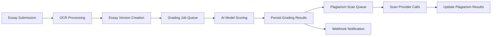

# CREVERSE AI Essay Auto-Grading Backend API Business Requirements

## 1. Introduction and Business Model

The CREVERSE AI Essay Auto-Grading platform is designed to provide enterprise-grade, scalable essay evaluation services for multi-tenant educational organizations. It automates grading using AI-powered scoring models combined with customizable rubrics, ensuring consistent, objective feedback for students and educators.

### 1.1 Business Justification

WHEN the education sector requires scalable, consistent essay grading solutions matching institutional standards, THE CREVERSE system SHALL provide automated essay evaluation through AI models integrated with custom rubric definitions. This addresses challenges in manual grading including inconsistency, late feedback, and high labor costs.

### 1.2 Revenue Strategy

THE platform SHALL generate revenue through tiered subscriptions based on tenant size and feature access, including premium modules such as advanced plagiarism detection, granular analytics, and increased processing quotas.

### 1.3 Growth and Success Metrics

THE system SHALL support strategic growth by integrating with learning management systems and expanding analytics capabilities. Success SHALL be measured by tenant acquisition, retention rates, processing volumes, and user satisfaction.

## 2. User Roles and Authentication

### 2.1 User Roles

THE system SHALL define and implement the following roles with specific permissions:
- GUEST: Access limited to public APIs and login operations only.
- STUDENT: Capable of submitting essays and viewing personal grading results.
- TEACHER: Authorized to create/manage rubrics, assign grading tasks, review plagiarism scans, and generate reports for their classes.
- ANALYST: Provided read-only access to analytics, audit logs, and cost reports within their tenant.
- ADMIN: Granted full control over tenant management, API keys, feature flags, audits, and system health.

### 2.2 Authentication Requirements

- WHEN a user attempts login, THE system SHALL authenticate using OIDC or email/password mechanisms and issue JWT tokens encapsulating tenant and role claims.
- THE system SHALL maintain user sessions securely and enforce token expiration and refresh policies.
- API keys SHALL be issued to allow tenant-scoped programmatic access with scopes and quotas, manageable by ADMIN role users.
- THE system SHALL enforce RBAC at API route and data levels respecting user roles and tenant boundaries.

## 3. Functional Requirements

### 3.1 Rubric Management
- TEACHERS SHALL create and manage rubric templates with versioning supporting draft, published, and deprecated states.
- THE system SHALL enforce rubric validation rules ensuring total criterion weights sum to approximately 1.0 and anchors cover scale boundaries.
- Guardrails including banned phrases, minimum token counts, and language restrictions SHALL be enforced during grading.
- Rubrics SHALL be scoped to class, school, tenant, or globally.

### 3.2 Essay Submission
- STUDENTS SHALL submit essays by text input, file upload (via presigned SAS URLs), or OCR processed text.
- THE system SHALL maintain versioned essay records for each submission including normalization and OCR versions.
- Essays SHALL be linked to tenant, student, and optionally class records.

### 3.3 Grading Workflow
- Grading jobs created SHALL link essay versions and rubric versions with scoring options including tone and calibration.
- THE system SHALL preprocess essays with language detection, profanity filtering, and sentence splitting.
- LLM scoring SHALL be invoked with retry and circuit breaker logic.
- Scores SHALL be normalized and calibrated per rubric settings.
- Grading results SHALL include per-criterion scores, feedback, calibration metadata, model usage statistics, and optional plagiarism results.

### 3.4 Plagiarism Scanning
- THE system SHALL enqueue plagiarism scans via configured providers.
- Scan results SHALL include matched text spans and similarity scores.
- Plagiarism scans SHALL be linked to essay versions and grading jobs.

### 3.5 OCR Pipeline
- THE OCR pipeline SHALL ingest PDFs or image files to extract text versions asynchronously.
- Extracted text SHALL be added as new essay versions for grading.

### 3.6 Reporting and Analytics
- Teachers and analysts SHALL access reports on grading trends, distributions, anomalies, and cost governance.
- Reports SHALL filter by tenant, class, rubric version, and date ranges.

### 3.7 Administrative APIs
- ADMIN users SHALL manage feature flags, audit logs, API keys, webhook configurations, and system health statuses.

## 4. Security and Compliance

- THE system SHALL enforce strict tenant isolation by scoping all data operations by tenant_id and applying Postgres RLS.
- THE system SHALL ensure all API calls and background jobs carry tenant claims to enforce data isolation.
- Sensitive PII SHALL be encrypted at rest and access to PII MUST be audited with logs capturing actor, timestamp, and action.
- GDPR-like compliance SHALL be implemented with subject access and deletion workflows.
- Rate limiting and quota enforcement SHALL apply per user and per API key.

## 5. Performance and Scalability

- THE system SHALL horizontally scale service modules and workers with configurable concurrency.
- API read requests SHALL respond within 2 seconds at the 95th percentile.
- 95% of grading jobs SHALL complete within 5 minutes for median essay lengths.
- Batch processing SHALL chunk workloads for efficient resource utilization.

## 6. Asynchronous Processing and Retry Strategies

- BullMQ queues SHALL process grading, OCR, plagiarism, analytics rollups, and webhook deliveries.
- Retry logic SHALL employ exponential backoff starting at 0.5 seconds with max 30 seconds delay and max 5 attempts.
- Dead-letter queues SHALL capture failed jobs exceeding retry limits with alerting.

## 7. Error Handling and Standard Responses

- THE system SHALL return specific error codes such as RUBRIC_INVALID, ESSAY_NOT_FOUND, TENANT_FORBIDDEN, with descriptive messages.
- Errors SHALL be returned promptly with HTTP codes reflecting the error type.
- Retryable errors SHALL include Retry-After headers to inform clients.

## 8. Deployment and Release Management

- Deployments SHALL use canary and blue-green strategies with zero downtime.
- Configuration via environment variables and Azure App Configuration SHALL enable dynamic feature toggling.
- Database migrations SHALL be forward-only.
- Emergency rollback SHALL be supported via feature flags and queue pausing.

## 9. Testing and Quality Assurance

- Unit, integration, contract, load, and chaos tests SHALL verify functionality and reliability.
- Golden test datasets SHALL validate scoring consistency per rubric version.
- CI/CD pipelines SHALL enforce test execution with failure blocking deployments.

## 10. Cost Governance and Budget Controls

- THE system SHALL track per-job token consumption, latency, and cost metadata.
- Usage reports SHALL provide tenant-level and model-level breakdowns.
- Auto-throttle SHALL reject new jobs when tenants exceed budget thresholds with clear error codes.

## Appendices

### Mermaid Diagrams

---

This document provides business requirements only. All technical implementation choices, architecture, API contracts, and database designs are the sole responsibility of the development team. This document defines WHAT the system shall do, not HOW to build it.