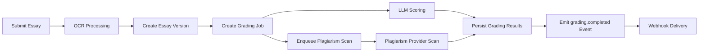

# CREVERSE AI Essay Auto-Grading Backend API Business Requirements

## 1. Introduction
The CREVERSE AI Essay Auto-Grading platform provides an enterprise-grade solution for large-scale automated essay evaluation. By combining scalable multi-tenant backend services with advanced AI scoring, customizable rubric templates, and plagiarism detection, the platform addresses the growing demand for consistent and cost-effective grading.

The platform targets educational institutions of all sizes, enabling teachers, students, and administrators to engage in a secure, compliant environment.

## 2. Business Model
### Why the Service Exists
Educational institutions face challenges in providing timely, consistent essay evaluation to large student bodies. CREVERSE AI automates grading workflows to address resource constraints, reduce grading bias, and provide detailed, actionable feedback.

### Revenue and Growth Strategies
The platform monetizes via subscription tiers based on usage, feature access, and support levels. Growth will be driven through partnerships with schools and educational platforms.

### Success Metrics
Measured by essay throughput, user adoption, grading accuracy, and operational cost efficiency.

## 3. User Roles and Authentication
### Authentication Workflows
WHEN a user submits login credentials via OIDC or email/password, THE system SHALL validate the credentials and issue a JWT including tenant and role claims.
THE system SHALL maintain secure sessions with token expiration and refresh mechanisms.
THE system SHALL allow API key issuance by admins with scope and quota definitions.

### User Role Definitions
- Guest: Public access and login
- Student: Submit essays, view own grades and plagiarism scans
- Teacher: Manage rubrics, assign grading jobs, review plagiarism, generate reports
- Analyst: Read-only access to analytics and audit trails
- Admin: Full control over tenants, API keys, audit, and system config

### Permissions
An explicit permission matrix SHALL govern allowed actions per role, ensuring principle of least privilege.

## 4. Multi-Tenancy and Security
THE system SHALL enforce tenant isolation using JWT scoped claims and Postgres Row-Level Security.
All data row accesses SHALL be constrained by tenant_id.
IF tenant scope is violated, THE system SHALL respond with TENANT_FORBIDDEN error.
PII SHALL be encrypted at rest and redacted in logs.
Audit trails SHALL track all PII accesses.
Rate limits SHALL be applied per user and API key.

## 5. Rubric Management
Rubric templates, versions, and criteria SHALL be managed with states draft, published, and deprecated.
Weights of criteria SHALL sum to 1.0 within tolerance.
Criteria SHALL include anchors covering min, max, and intermediate scale values.
Guardrails MAY specify min tokens, banned phrases, repetition limits.
Published rubric versions SHALL be immutable.

## 6. Essay Submission and Versioning
Essays MAY be submitted via text, file upload (with presigned SAS URLs), or OCR.
Essay versions SHALL track normalized and raw text variants.
Submissions SHALL be indexed by tenant, student, class, and date.

## 7. Grading and Scoring
Grading jobs bind essayVersion and rubricVersion entities.
Jobs SHALL progress through queued, processing, succeeded, failed, and cancelled states.
Scoring routines SHALL build LLM prompts with rubric anchors and weights.
Scores SHALL be normalized to a 0-100 range with optional calibration penalties applied.
Feedback SHALL include per-criterion comments and tone adaptations.
Model metadata (tokens, latency, cost) SHALL be recorded.

## 8. Plagiarism Detection
Plagiarism scans SHALL be queued asynchronously.
Multiple providers SHALL be supported.
Matches SHALL include source attribution and matched text spans.
Scan status SHALL be tracked with retry policies.

## 9. OCR Pipeline
OCR jobs SHALL convert PDFs/images to text asynchronously.
Resulting text SHALL create new essay versions.
Status SHALL be queryable.

## 10. Reporting and Analytics
Reports SHALL include student progress, class distributions, rubric breakdowns, anomalies, and cost governance.
Reports SHALL be filterable by date, class, rubric, and tenant.
Data SHALL be obtained from read replicas and cached materialized views.

## 11. Async Queues
BullMQ queues SHALL be used for OCR ingestion, grading scoring, plagiarism scanning, analytics rollups, and webhook delivery.
Retry policies SHALL use exponential backoff with dead-letter queues for failure handling.

## 12. API Usage and Rate Limiting
Authenticated users SHALL use JWT or API keys.
Tenant context SHALL be passed in headers.
Requests SHALL support idempotency.
Quotas and rate limits SHALL be enforced with HTTP 429 responses.

## 13. Audit and Compliance
Audit logs SHALL record read, write, and admin actions with PII access flags.
Logs SHALL be queryable and retained per tenant policies.

## 14. Error Handling and Recovery
Errors SHALL be classified such as RUBRIC_INVALID, ESSAY_NOT_FOUND, GRADING_RATE_LIMITED, MODEL_PROVIDER_ERROR.
Error responses SHALL provide codes, messages, and actionable details.
Retry policies SHALL govern transient failures.

## 15. Performance and Scalability
Horizontal scaling SHALL be supported for workers and API modules.
API responses SHALL meet latency targets (p95 < 2 seconds).
Batch chunking SHALL optimize grading throughput.
Caching SHALL be employed for rubric data.

## 16. Observability
OpenTelemetry SHALL propagate trace context across services.
Errors SHALL be logged to Sentry with alert integrations.
Operational dashboards SHALL track queue metrics, latency, success rates, and costs.

## 17. Cost Governance
Token usage, latency, and cost SHALL be tracked per job and aggregated.
Budgets SHALL trigger alerts and auto-throttling when exceeded.
Reports SHALL provide detailed tenant consumption views.

## 18. Deployment and Release
Canary and blue-green deployments SHALL minimize downtime.
Forward-only DB migrations SHALL be enforced.
Rollback mechanisms and emergency feature flag toggles SHALL be supported.

## 19. Testing and Quality Assurance
Unit, integration, load, chaos, and regression testing SHALL ensure functional and performance reliability.
Golden datasets SHALL detect grading regressions.
Automated test suites SHALL be integrated in CI/CD.

## 20. Administration and Operations
Feature flags SHALL control feature rollouts.
Audit logs SHALL be accessible with filtering.
Health checks SHALL report dependency statuses.
Webhook endpoints SHALL be configurable with retry and DLQ handling.

## 21. Appendices
Sequence diagrams, business formulae, and glossaries SHALL be included to assist developers.

---

---

The document provides business requirements only and does not prescribe technical implementation details. All development decisions including architecture, APIs, and data design are delegated to the development team. The document defines WHAT the system must do, not HOW it is implemented.
