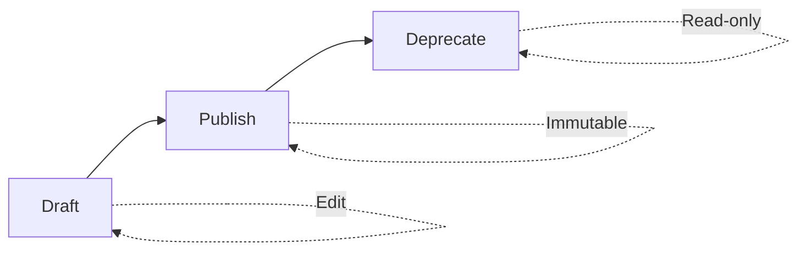
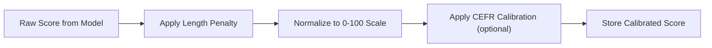
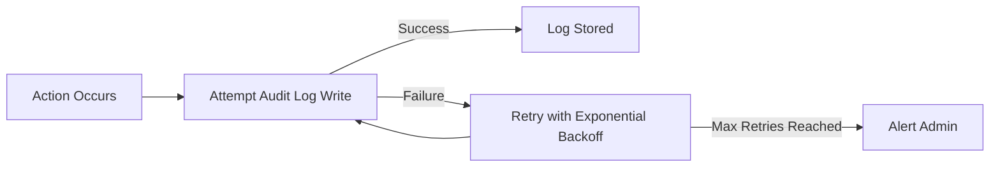

# CREVERSE AI Essay Auto-Grading: Business Rules and Validation Logic

## 1. Introduction and Overview

The CREVERSE AI Essay Auto-Grading system is designed to evaluate essays at scale by utilizing custom rubrics, advanced grading models, plagiarism detection, and comprehensive audit logging. This document defines the authoritative business rules and validation logic necessary to ensure accuracy, fairness, compliance, and operational integrity.

All requirements use EARS format and are expressed in English for clarity and precision.

## 2. Rubric Validation Rules

### 2.1 Rubric Version Lifecycle
- THE system SHALL allow rubric versions to transition through states: draft, published, and deprecated.
- WHEN a rubric version status is published, THEN THE system SHALL make the version immutable and reject any edits.

### 2.2 Criteria and Anchors
- THE system SHALL enforce that each rubric version includes criteria with anchors defining score boundaries: minimum, maximum, and at least one anchor at an intermediate score.
- WHEN creating or editing rubric drafts, THE system SHALL validate that the weights of all criteria sum to a value within the inclusive range [0.999, 1.001].
- THE system SHALL enforce that scaleMin and scaleMax are integers, with scaleMin less than scaleMax.
- THE system SHALL reject rubric versions missing coverage of anchors for score scale boundaries.

### 2.3 Guardrails
- WHERE rubric guardrails are defined, THE system SHALL enforce constraints including:
  - Minimum token count per essay
  - Banned phrases disallowed in submissions
  - Maximum allowed repetition rates
  - Allowed languages for essays

### 2.4 Validation API Behavior
- WHEN validating a rubric version, IF the rubric violates any validation rule, THEN THE system SHALL respond with error codes such as RUBRIC_INVALID, indicating the precise failure reason.
- IF the rubric version is immutable due to published status, THEN THE system SHALL respond with RUBRIC_VERSION_IMMUTABLE error code.

## 3. Grading Normalization and Calibration

### 3.1 Normalization Formula
- WHEN a grading job completes, THE system SHALL normalize the raw rubric score to a 0-100 scale using the formula:
normalized_score = ((raw_score - scaleMin) / (scaleMax - scaleMin)) * 100 - lengthPenalty
- THE system SHALL clamp the normalized score to a minimum of 0 and a maximum of 100.

### 3.2 Length Penalty
- WHERE calibration parameters specify a length penalty, THE system SHALL calculate lengthPenalty based on the shortfall of actual essay length from a predefined minimum length.
- THE penalty SHALL be calculated as:
lengthPenalty = clamp(alpha * max(0, minLen - actualLen) / minLen, 0, 10)

### 3.3 CEFR Level Calibration
- WHERE a target CEFR level is specified, THE system SHALL adjust the normalized scores according to predefined mappings from raw scores to CEFR levels.

### 3.4 Calibration Metadata
- THE system SHALL persist calibration metadata including length penalty values, target levels, and applied transformations alongside each grading result.

## 4. Plagiarism Thresholds and Match Handling

### 4.1 Scan Process
- WHEN a plagiarism scan job is submitted, THE system SHALL enqueue the scan against configured providers.
- THE system supports multiple providers including internal algorithms and external services like Turnitin.

### 4.2 Match Storage and Details
- THE system SHALL record detected matches specifying the source, matched text span offsets, and relative percentage of copied content.

### 4.3 Thresholds and Flags
- WHERE plagiarism points exceed configurable thresholds, THE system SHALL flag the submission for manual review.

### 4.4 Scan Status Management
- THE system SHALL track scan statuses from queued to processing to succeeded or failed.
- IF a scan times out or repeatedly fails, THEN THE system SHALL report PLAGIARISM_TIMEOUT and trigger retry logic.

## 5. Audit Log Policies

### 5.1 Action Logging
- THE system SHALL log all critical user and system actions including rubric publishing, grading creation, essay views, and data downloads.

### 5.2 PII Access
- THE system SHALL log all accesses to Personally Identifiable Information combining actor ID, action details, timestamp, and source IP when available.

### 5.3 Retention and Granularity
- Audit logs SHALL be retained for a minimum of 365 days or as per tenant-specific policies.
- Logs SHALL include comprehensive metadata including action type, entity references, and optional IP addresses.

### 5.4 Error Handling
- WHEN audit log persistence fails, THE system SHALL implement exponential retry strategy with alerting for admin staff upon repeated failures.

## 6. Guardrails and Data Constraints

### 6.1 Text and Language Constraints
- THE system SHALL refuse essays or rubric components containing banned phrases or written in disallowed languages as defined by rubric guardrails.
- THE system SHALL enforce minimum token counts on essay text and normalized essay versions.

### 6.2 Data Integrity Constraints
- THE system SHALL ensure uniqueness of rubric template versions identified by the composite key (templateId, version).
- THE system SHALL enforce tenant consistency across all data entries, rejecting data that violates tenant scoping rules.

## 7. Error Handling and Recovery

### 7.1 Common Errors
- IF any validation or business rule fails, THEN THE system SHALL return structured error responses with precise error codes such as:
  - RUBRIC_INVALID
  - RUBRIC_VERSION_IMMUTABLE
  - ESSAY_NOT_FOUND
  - GRADING_RATE_LIMITED
  - MODEL_PROVIDER_ERROR
  - PLAGIARISM_TIMEOUT
  - TENANT_FORBIDDEN
  - FILE_SAS_EXPIRED
  - WEBHOOK_RETRIES_EXHAUSTED

### 7.2 Retry and Dead Letter Queue
- THE system SHALL retry transient operation failures with exponential backoff increasing delay intervals between attempts.
- THE system SHALL move repeatedly failing requests to a dead letter queue (DLQ) after configurable max retry attempts to prevent system blocking.

## 8. Performance Requirements

### 8.1 Grading Job Throughput
- THE system SHALL process 95% of grading jobs for median essay length within 5 minutes.

### 8.2 Queue Concurrency
- THE system SHALL allow configurable concurrency levels per processing queue, with grading defaults to 8 concurrent workers.

---

## Mermaid Diagrams

### Rubric Version State Machine

### Grading Normalization Flow

### Audit Log Write and Retry

This document provides business requirements only. All technical implementation decisions belong to developers. Developers have full autonomy over architecture, APIs, and database design. The document describes WHAT the system should do, not HOW to build it.