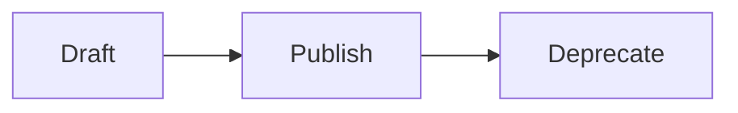
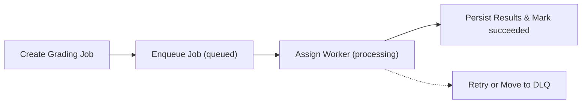
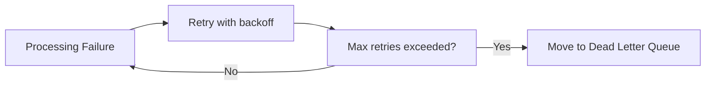
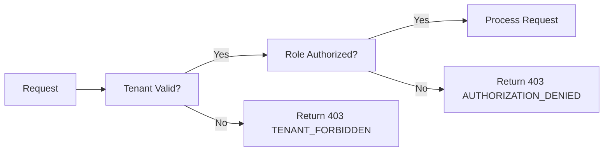
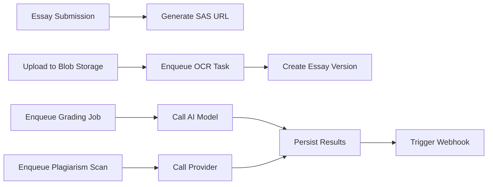
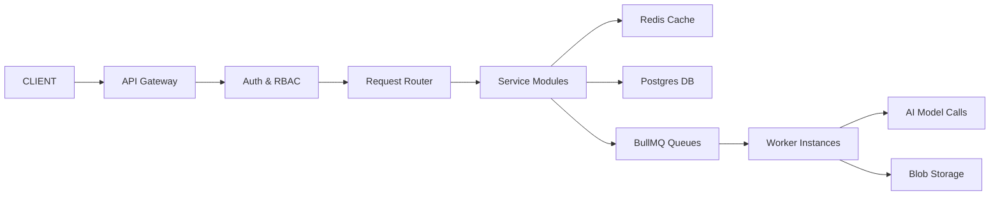
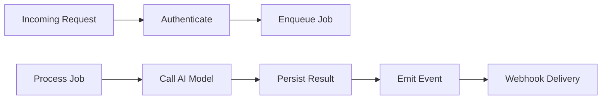

# CREVERSE AI Essay Auto-Grading Backend API - Business Requirements Specification

## 1. Introduction

The CREVERSE AI Essay Auto-Grading backend system is designed to provide a scalable, multi-tenant, AI-powered platform for automated essay evaluation in educational contexts. This document details full business requirements for developers to implement the backend capabilities, workflows, and policies. The system aims to ensure accuracy, consistency, scalability, and compliance with enterprise standards.

## 2. Business Model

### 2.1 Why This Service Exists

Educational institutions and enterprises require reliable, scalable methods to evaluate essay-based assessments across diverse student populations. Manual grading is labor intensive, inconsistent, and costly. CREVERSE AI addresses these issues by automating the grading process using customizable rubrics and AI models, enabling fast turnaround, detailed feedback, and rigorous academic integrity enforcement.

### 2.2 Revenue Strategy

The system will generate revenue via tiered subscriptions to tenants (schools, districts), usage-based pricing for AI grading calls, and premium features such as plagiarism detection and advanced analytics.

### 2.3 Growth and Success Metrics

Growth is planned via partnerships with education providers and integrations into learning platforms. Success metrics include tenant count, active users, volume of essays processed, grading accuracy, user satisfaction, and cost efficiency.

## 3. User Roles and Authentication

### 3.1 User Roles

- **Guest**: Limited to public and login endpoints.
- **Student**: Submit essays, view personal grades and feedback.
- **Teacher**: Manage rubrics, assign essays, review plagiarism reports, access class analytics.
- **Analyst**: Read-only access to reports and audit logs.
- **Admin**: Full tenant and system administration privileges.

### 3.2 Authentication Requirements

- THE system SHALL allow secure login via OIDC or email/password.
- WHEN users authenticate successfully, THE system SHALL issue JWT tokens containing tenant and role claims.
- THE system SHALL enforce token expiration and refresh policies.
- THE system SHALL implement API key generation and management with scoped permissions and quotas.

## 4. Multi-Tenancy and Security

- THE system SHALL enforce data isolation via `tenant_id` filtering and PostgreSQL Row-Level Security.
- API keys and sessions SHALL be scoped per tenant.
- Unauthorized cross-tenant data access SHALL be denied with clear errors.
- THE system SHALL audit all PII access and enforce compliance with data privacy laws.

## 5. Rubric Management

- Teachers SHALL create versioned rubric templates with weighted criteria, anchors, and optional guardrails.
- Rubric drafts SHALL validate that weights sum to 1.0, criteria cover scale boundaries, and scales have valid ranges.
- Published rubric versions SHALL be immutable.

## 6. Essay Submission and Versioning

- Students SHALL submit essays via text input, file upload, or OCR.
- THE system SHALL create essays associated with tenants, student ids, classes, and maintain version history for normalization or OCR text.

## 7. Grading and Scoring

- Grading jobs SHALL link essay versions with rubric versions, processed asynchronously.
- THE system SHALL preprocess essays (language detection, profanity masking).
- AI scoring SHALL use rubric anchors and weights, with tone and guardrails integrated.
- Scores SHALL be normalized to a 0-100 scale applying calibration such as length penalties.
- Feedback SHALL be per criterion with qualitative notes.
- Optionally, plagiarism detection SHALL be integrated with grading.

## 8. Plagiarism Detection

- THE system SHALL support multiple plagiarism providers.
- Plagiarism scan jobs SHALL run asynchronously with status tracking.
- Scan results SHALL include match percentages and matched source spans.

## 9. OCR Pipeline

- THE system SHALL process uploaded files asynchronously converting PDF/images to text.
- Results SHALL be saved as new essay versions for grading.

## 10. Reporting and Analytics

- Reports SHALL cover student progress, class score distributions, rubric breakdowns, anomalies, and cost governance.
- Filtering SHALL be supported by tenant, class, rubric version, and date ranges.

## 11. Asynchronous Processing and Queue Management

- Processing SHALL use BullMQ queues for grading, OCR, plagiarism, analytics rollups, and webhook delivery.
- Retry policies SHALL use exponential backoff and dead-letter queues for failed jobs.

## 12. API Usage and Rate Limits

- API calls SHALL authenticate via JWT or API key with tenant scoping headers.
- Rate limits SHALL be enforced at user and key levels, with 429 errors and Retry-After headers.

## 13. Audit and Compliance

- THE system SHALL log all significant user and system actions with metadata.
- PII access SHALL be flagged and protected.
- Logs SHALL be immutable and queryable.

## 14. Error Handling and Recovery

- Standardized error codes and messages SHALL be returned for validation failures, authorization errors, and external service failures.
- Retry limits SHALL be respected and poison-pill errors detected.

## 15. Performance and Scalability

- The system SHALL horizontally scale worker nodes with configurable concurrency.
- 95% of grading jobs SHALL complete within 5 minutes for median essays.
- Caching SHALL be used to optimize read-heavy workloads.

## 16. Observability

- Distributed tracing SHALL be implemented with OpenTelemetry.
- Error monitoring SHALL be integrated with Sentry with alerting.
- Operational dashboards SHALL provide visibility into queues, latency, errors, and costs.

## 17. Cost Governance

- Per job usage of tokens, latency, and cost SHALL be tracked.
- Budget thresholds SHALL trigger notifications and auto-throttling.

## 18. Administrative Operations

- Admin interfaces SHALL manage feature flags, audit logs, health checks, and webhooks.

## 19. Deployment and Release

- Deployments SHALL support canary and blue-green strategies with zero-downtime.
- Forward-only DB migrations SHALL be enforced.
- Emergency rollback SHALL be possible via feature flags.

## 20. Testing and Quality Assurance

- Unit, integration, contract, and load tests SHALL be implemented.
- Regression tests SHALL use golden datasets to detect scoring deviations.
- Chaos testing SHALL validate system resilience.

## 21. Appendices

- Includes API snippets, calibration formulas, and data flow diagrams.

---

## Mermaid Diagrams

### Rubric Version State Machine

### Grading Job Lifecycle

### Retry and Dead Letter Flow

### Security Request Flow

### External Integration Sequence

### Performance Scalability Architecture

### Observability Tracing Flow

---

This document provides business requirements only. All technical implementation decisions belong to development teams. Developers have full autonomy on how to implement the system. This document describes WHAT the system shall do, not HOW to build it.