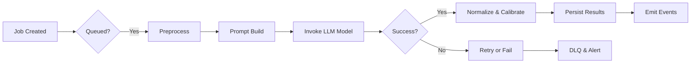
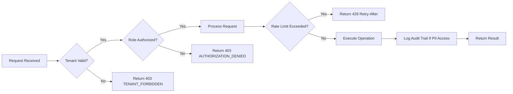
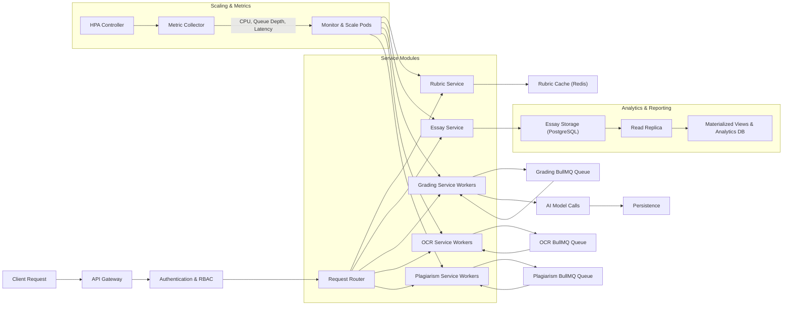

# CREVERSE AI Essay Auto-Grading Backend API - Business Requirements

## 1. Introduction and Business Context

The CREVERSE AI Essay Auto-Grading platform is an enterprise-grade backend system designed to automate the scoring and evaluation of essays for educational institutions and multi-tenant clients. The platform addresses challenges of grading consistency, scalability, and operational governance through AI-based scoring, customizable rubrics, plagiarism detection, and comprehensive audit and compliance features.

## 2. Business Model

### 2.1 Purpose and Market Need
Educational institutions require timely, consistent, and objective essay evaluations to support large-scale student populations and remote learning environments. CREVERSE AI provides these capabilities by automating essay grading while preserving customization and compliance.

### 2.2 Revenue Model
The service will operate on a subscription basis with tiered pricing reflecting tenant size, usage quotas on grading and OCR calls, and premium services such as advanced plagiarism detection and in-depth analytics.

### 2.3 Growth Strategy
Growth will be achieved through partnerships with schools, districts, and online education platforms, emphasizing continuous model improvements and user-driven rubric customization.

### 2.4 Success Metrics
Key performance indicators include the number of active tenants, essays graded monthly, grading turnaround times, user retention, and customer satisfaction scores.

## 3. User Roles and Authentication

### 3.1 Role Definitions
- **Guest:** Unauthenticated users limited to login and public-facing endpoints.
- **Student:** Can submit essays, view personal grading results and reports.
- **Teacher:** Manages rubrics, assigns essays, reviews grading and plagiarism reports, and accesses class/school analytics.
- **Analyst:** Read-only access to analytics, audit logs, and financial reports.
- **Admin:** Full system administration including tenant management, API keys, audit oversight, and system configuration.

### 3.2 Authentication Requirements
- WHEN users submit login credentials via OIDC or email/password, THE system SHALL authenticate and return JWT tokens containing scoped tenant claims and role information.
- THE system SHALL support session management, token refresh, logout, and password reset flows.
- THE system SHALL allow creation and revocation of API keys scoped per tenant with defined permissions and quotas.
- Rate limiting SHALL be enforced on authentication endpoints to prevent brute-force attacks.

### 3.3 Role-Based Access Control
- All APIs SHALL enforce RBAC using user roles and attributes such as class membership.
- Unauthorized access attempts SHALL result in HTTP 403 responses with explicit error codes.

## 4. Multi-Tenancy and Security

### 4.1 Tenant Isolation
- THE system SHALL enforce isolation of data by tenant using Postgres Row-Level Security policies and scoped JWT tokens.
- Access to data outside the user's tenant SHALL be denied with `TENANT_FORBIDDEN` errors.

### 4.2 PII and Audit
- THE system SHALL encrypt PII data at rest and redact it in logs unless explicitly flagged.
- Audit trails SHALL capture all sensitive data access and administrative actions.

### 4.3 Rate Limiting and Quotas
- Rate limits SHALL be applied per user and API key with 429 rate-limit errors including Retry-After headers.
- Quotas such as monthly call limits SHALL be configurable per tenant and tracked accurately.

### 4.4 Compliance
- THE system SHALL implement GDPR-like subject access and data deletion workflows mediated through admin roles.

## 5. Rubric Management

### 5.1 Template and Versioning
- THE system SHALL support rubric templates scoped per class, school, tenant, or globally.
- Rubric versions SHALL progress through draft, published, and deprecated states with immutability upon publishing.

### 5.2 Validation Rules
- Weights of all rubric criteria SHALL sum to 1.0 within a tolerance of ±0.001.
- Each criterion SHALL include anchors at the minimum, maximum, and at least one midpoint score.
- ScaleMin and ScaleMax SHALL be integers with ScaleMin < ScaleMax.
- Optional guardrails include minimum essay token count, banned phrases, repetition limits, and allowed languages.

### 5.3 Publishing
- Only validated rubrics meeting all criteria SHALL be published, becoming immutable thereafter.

## 6. Essay Submission and Versioning

### 6.1 Submission Types
- Students SHALL submit essays via direct text entry, file uploads, or OCR-derived text.
- Original blobs SHALL be stored securely using Azure Blob Storage with SAS URLs.

### 6.2 Version Control
- Essays SHALL maintain multiple versions including original, normalized, and OCR text.
- Statuses SHALL be managed to track workflow stages (received, processing, graded, error).

### 6.3 Searching and Indexing
- THE system SHALL support search by tenant, studentId, classId, date range, and language.

## 7. Grading Process

### 7.1 Job Lifecycle
- Grading jobs SHALL asynchronously process scored requests binding an essay version to a rubric version.
- Job statuses include queued, processing, succeeded, failed, and cancelled.

### 7.2 Processing Steps
- THE system SHALL preprocess essay text including language detection, sentence splitting, and profanity masking.
- THE grading prompt SHALL incorporate rubric anchors, weights, tone selection, and guardrails.
- Azure OpenAI/ML services SHALL be called with retry and circuit breaker mechanisms.

### 7.3 Score Normalization and Calibration
- Raw rubric scores SHALL be normalized to a 0-100 scale based on rubric scale range.
- Calibration adjustments SHALL apply length penalties and CEFR level mappings where configured.

### 7.4 Results and Feedback
- Scores, feedback per criterion, calibration metadata, and model call details SHALL be persistently stored.
- Grading completion events SHALL trigger webhook notifications with minimal PII.

## 8. Plagiarism Detection

### 8.1 Scanning Workflow
- Plagiarism scans SHALL be queued asynchronously for essay versions.
- THE system SHALL support multiple providers and internal scan engines.

### 8.2 Results
- Detected matches SHALL be recorded with source, match percentages, and affected text spans.
- Failure and timeout scenarios SHALL be handled with retries and error reporting.

## 9. OCR Pipeline

- OCR requests SHALL be submitted to process PDFs or images to extract text.
- Extracted text SHALL be stored as new essay versions linked accordingly.

## 10. Reporting and Analytics

- Reports SHALL include progress trends, class score distributions, rubric breakdowns, anomalies, and cost metrics.
- Support for filtering by tenant, class, rubric version, and date ranges SHALL be implemented.

## 11. Asynchronous Queues and Event Processing

- BullMQ queues SHALL manage grading, OCR, plagiarism, analytics rollups, and webhook delivery asynchronously.
- Retry strategies SHALL use exponential backoff with max retries and dead-letter queues.

## 12. API Usage and Rate Limiting

- API authentication via JWT or API keys SHALL be enforced.
- Idempotency SHALL be supported for POST and PUT requests.
- Quotas and rate limits SHALL be applied per user and per API key.

## 13. Audit and Compliance

- Audit logs SHALL record all accesses, changes, and administrative actions with PII access flagged.
- Administrative endpoints SHALL support audit review with filtering.

## 14. Administrative Operations

- Feature flags SHALL support runtime configuration changes without redeployment.
- Admin APIs SHALL allow managing audit logs, system health, webhook endpoints, and operational tools.

## 15. Deployment and Release

- Kubernetes deployments SHALL support canary and blue-green strategies.
- Forward-only DB migrations SHALL be employed.
- Emergency rollback SHALL be enabled via feature flags and queue pausing.

## 16. Testing and Quality Assurance

- Unit, integration, contract, load, and chaos testing SHALL be performed.
- Golden datasets SHALL be used for grading regression detection.
- Performance targets for p95 latency SHALL be met.

## 17. Cost Governance

- Per-job token usage, latency, and cost SHALL be tracked.
- Usage reports and auto-throttling based on budgets SHALL be implemented.

## 18. Observability

- OpenTelemetry SHALL be used for tracing.
- Sentry SHALL capture errors.
- Dashboards SHALL present key system and cost metrics.

## 19. Error Handling

- Standard error codes SHALL be defined and returned with meaningful messages.
- Retry and dead-letter queue policies SHALL be implemented.
- Poison pill detection SHALL prevent futile retries.

## 20. Developer Autonomy

This document provides business requirements exclusively. All technical design, API implementation, infrastructure, and schema decisions remain with the development team. This specification describes WHAT the system SHALL do, not HOW to implement it.

---

## Mermaid Diagrams

### Grading Job Lifecycle

### Security Request Validation Flow

### API Horizontal Scaling and Queues

> This document provides business requirements only. All technical implementation decisions belong to developers. Developers have full autonomy over architecture, APIs, and database design. The document describes WHAT the system should do, not HOW to build it.