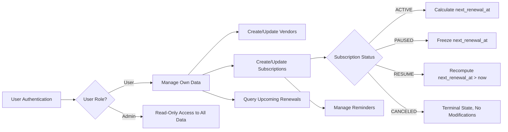

# Subscription & Renewal Guardian - Requirements Analysis Report

## 1. Introduction

The Subscription & Renewal Guardian service empowers users to efficiently track and manage their personal subscriptions and upcoming renewal dates, preventing unexpected charges and lapses in service. It offers capabilities to create, update, and maintain vendors and subscriptions, compute renewal schedules, and provide timely alerts through reminders.

## 2. Business Model

### 2.1 Why This Service Exists

In the modern digital economy, individuals maintain numerous subscriptions across various vendors. This proliferation leads to complexity and often causes users to lose track of renewals, resulting in unexpected costs and service interruptions. The Subscription & Renewal Guardian fills a vital market gap by providing centralized, reliable subscription tracking and renewal management.

### 2.2 Revenue Strategy

While the current system is primarily user-focused and may be offered as a free tool, potential monetization avenues include subscription-based premium features, advanced analytics, or partnerships with vendors for enhanced user offerings.

### 2.3 Growth Plan

User acquisition relies on delivering a seamless user experience with accurate and timely reminders, ensuring high retention rates. Organic growth and collaborations with subscription vendors are key strategies.

### 2.4 Success Metrics

- Monthly Active Users (MAU)
- Accuracy and reliability of renewal tracking
- User retention and engagement with reminders
- Reduction in missed subscription renewals

## 3. User Roles and Authentication

### 3.1 Roles
- **User:** Authenticated individuals managing their subscriptions and vendors with full CRUD capabilities on their data.
- **Admin:** Read-only access to all subscriptions and vendors globally for oversight, with no modification privileges.

### 3.2 Authentication
- Authentication is implemented using JWT tokens with email and password credentials.
- No refresh tokens are issued; tokens have fixed expirations.

### 3.3 Permissions
- Users may create, read, update, and delete their own subscriptions and vendors.
- Admins have read-only global access.

| Action                          | User | Admin |
|---------------------------------|:----:|:-----:|
| Create subscription/vendor      | ✅   | ❌    |
| Read own subscription/vendor    | ✅   | ❌    |
| Read all subscriptions/vendors  | ❌   | ✅    |
| Update own subscription/vendor  | ✅   | ❌    |
| Delete own subscription/vendor  | ✅   | ❌    |
| Modify subscription status      | ✅   | ❌    |

## 4. Functional Requirements

### 4.1 Vendor Management

- WHEN a user creates or updates a vendor, THE system SHALL trim the vendor name input and ensure uniqueness case-insensitively.
- IF the vendor name duplicates an existing vendor (case-insensitive), THEN THE system SHALL respond with HTTP 409 Conflict with an appropriate error message.
- THE system SHALL forbid deletion of vendors.

### 4.2 Subscription Management

- WHEN a user creates a subscription, THE system SHALL require vendor, plan name, billing cycle (DAILY, WEEKLY, MONTHLY, YEARLY), amount (decimal >= 0), currency (ISO-4217 3-letter uppercase), started_at, and status.
- WHEN a subscription is created or updated and billing_cycle or started_at changes, THE system SHALL compute and persist the next_renewal_at field based on the billing cycle and start date.
- WHILE a subscription is PAUSED, THE system SHALL freeze next_renewal_at and not recompute it.
- WHEN a subscription is resumed, THE system SHALL recompute next_renewal_at starting from the current UTC time until next_renewal_at is strictly greater than now.
- THE system SHALL prevent creating duplicate subscriptions for the same user with the same vendor and plan name and return HTTP 409 Conflict if attempted.
- THE system SHALL disallow any modifications on subscriptions marked as CANCELED; such attempts shall return HTTP 409 Conflict.

### 4.3 Reminder Management

- Users SHALL be able to create, list, and delete reminders linked to their subscriptions.

### 4.4 Upcoming Renewals

- THE system SHALL provide an endpoint to query upcoming renewals within a user-specifiable window (defaulting to 30 days, and constrained between 1 and 365 days).
- THE upcoming renewals list SHALL exclude PAUSED and CANCELED subscriptions.
- THE results SHALL be sorted ascendingly by next_renewal_at.

## 5. Business Rules and Constraints

- Vendor names MUST be unique globally, ignoring case, and trimmed of whitespace on input.
- Subscriptions MUST be unique per combination of user_id, vendor_id, and plan_name.
- Amounts in subscriptions MUST be decimal values with precision 12,2, and zero or greater.
- Currency codes MUST comply with ISO-4217 3-letter uppercase format.
- next_renewal_at MUST be stored in UTC and computed accurately according to billing cycle and start date.
- Subscription status enumerations are ACTIVE, PAUSED, and CANCELED, with CANCELED being a terminal state.
- All date-time fields are stored in UTC while business logic uses Asia/Seoul timezone.

## 6. Error Handling

- Duplicate vendor names cause HTTP 409 Conflict errors.
- Duplicate subscriptions for the same user, vendor, and plan name cause HTTP 409 Conflict errors.
- Attempts to modify CANCELED subscriptions cause HTTP 409 Conflict errors.
- Unauthorized or forbidden access causes HTTP 401 Unauthorized or HTTP 403 Forbidden errors respectively.
- Missing resources return HTTP 404 Not Found errors.
- Invalid inputs such as negative amounts or invalid currency codes cause HTTP 400 Bad Request errors.

## 7. Performance Expectations

- All user-facing API responses SHALL complete within 2 seconds under typical load.
- Pagination mechanisms SHALL be supported for listing vendors, subscriptions, and reminders.
- The upcoming renewals query SHALL execute efficiently with indexes supporting fast filtering and sorting.

## 8. Conclusion

This report fully defines the backend business requirements for the Subscription & Renewal Guardian service. It delivers unambiguous functional and business rules, role permissions, error handling processes, and performance standards. Developers have full autonomy regarding implementation details such as architecture and APIs. This document precisely sets WHAT the system shall do, enabling effective and reliable subscription management.

---

This document provides business requirements only. All technical decisions such as API design and database schema are at the discretion of the development team. Developers have full autonomy over how to implement these requirements.