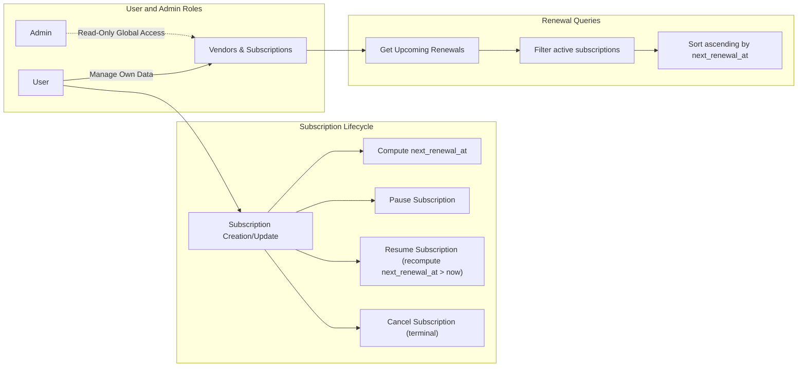

# Requirement Analysis Report for Subscription & Renewal Guardian

## 1. Executive Summary

The Subscription & Renewal Guardian service provides individuals with a tool to manage all their personal subscriptions and keep track of upcoming renewal dates efficiently. This system addresses the widespread problem where users lose track of multiple subscriptions, leading to unexpected charges, service interruptions, or missed savings opportunities.

This report consolidates and specifies the business requirements for backend developers who will implement the system. It clearly defines user roles, authentication mechanisms, functional needs, business rules, error handling, performance expectations, and system contexts crucial to delivering a reliable subscription and renewal tracking platform.

## 2. Business Model

### Why This Service Exists

Consumers increasingly subscribe to various digital and physical services with different renewal schedules. Due to fragmentation and lack of centralized tools, users struggle to keep track of renewal dates, often resulting in undesired auto-renewals or service lapses. This service addresses this gap by providing a centralized, user-centric subscription management platform that proactively informs users about upcoming renewals, helping them avoid unnecessary costs and maintain budget control.

### Revenue Strategy

While currently designed as a free, user-centric service, possible future monetization strategies include premium features such as enhanced analytics, cross-device sync, or vendor partnerships for referral bonuses. The primary focus remains on accurate tracking and reliable notifications to drive user acquisition and retention.

### Growth Plan

Growth will be organic, emphasizing ease of subscription entry, timely reminders, and seamless management. Partnerships with vendors and integration with payment systems might provide additional user acquisition channels.

### Success Metrics

- Monthly Active Users (MAU)
- Number of subscriptions managed per user
- Renewal notification accuracy and timeliness
- User retention and engagement rates

## 3. User Roles and Authentication

### Roles

- **User**: Authenticated individuals who can manage their own vendors and subscriptions. They have full CRUD rights on their data and receive renewal notifications.
- **Admin**: Read-only users with global access to all subscription and vendor data. They can audit data but have no modification rights.

### Authentication

- Utilizes JWT (JSON Web Tokens) for access control with email and password credentials.
- No refresh tokens; tokens have fixed expiration.
- JWT includes user ID, role, and permissions.

### Permissions Matrix

| Action                           | User | Admin |
|---------------------------------|:----:|:-----:|
| Create/Read/Update/Delete Vendors|  ✅  |   ❌  |
| Create/Read/Update/Delete Own Subscriptions | ✅  |   ❌  |
| Read All Vendors and Subscriptions Globally | ❌  |   ✅  |
| Modify Data of Others           |  ❌  |   ❌  |

## 4. Functional Requirements

### Vendor Management

- WHEN a user creates a vendor, THE system SHALL ensure vendor.name is unique case-insensitively and trimmed of whitespace.
- IF a duplicate vendor name exists (case-insensitive), THE system SHALL reject creation with HTTP 409 Conflict.
- Users can update vendor details but cannot delete vendors.

### Subscription Management

- WHEN a user creates a subscription, THE system SHALL require vendor, plan_name, amount (decimal>=0), currency (ISO 4217, uppercase), billing_cycle, started_at, status (ACTIVE, PAUSED, CANCELED), and next_renewal_at.
- THE system SHALL persist next_renewal_at computed on creation or whenever billing_cycle or started_at changes unless status is PAUSED.
- PAUSED subscriptions freeze the next_renewal_at date; RESUMED subscriptions recompute next_renewal_at to a date strictly greater than now in UTC.
- Cancellation marks subscription as CANCELED, a terminal state disallowing further modifications.
- Subscription uniqueness is enforced on (user_id, vendor_id, plan_name); duplicates raise 409 errors.

### Reminders

- Users can add, list, and delete reminders associated with their subscriptions.

### Upcoming Renewals

- The system SHALL provide an endpoint to query subscriptions renewing within a configurable window (default 30 days, min 1, max 365).
- The upcoming renewals SHALL exclude PAUSED and CANCELED subscriptions.
- Results SHALL be sorted ascending by next_renewal_at date.

## 5. Business Rules and Constraints

- Vendor names are unique case-insensitive and trimmed via PostgreSQL citext.
- Subscription uniqueness is enforced by the tuple (user_id, vendor_id, plan_name).
- Amounts must be decimal(12,2) and at least zero.
- Currency codes must follow ISO-4217 3-letter uppercase format.
- BillingCycle ENUM: DAILY, WEEKLY, MONTHLY, YEARLY.
- SubscriptionStatus ENUM: ACTIVE, PAUSED, CANCELED.
- next_renewal_at must be computed and persisted accurately per billing cycle rules.
- PAUSE freezes next_renewal_at; RESUME recomputes next_renewal_at from current UTC time strictly in the future.
- Attempting to modify a CANCELED subscription shall result in HTTP 409 Conflict.
- Access controls ensure users only modify own data; admins have read-only global visibility.

## 6. Error Handling Scenarios

- Requests creating duplicate vendors (case-insensitive by name) return HTTP 409 Conflict with descriptive messages.
- Duplicates in subscriptions by (user_id, vendor_id, plan_name) result in HTTP 409 Conflict.
- Modifications to canceled subscriptions result in HTTP 409 Conflict.
- Unauthorized access attempts respond with HTTP 401 Unauthorized or 403 Forbidden as applicable.
- Invalid inputs such as negative amount or incorrect currency codes result in HTTP 400 Bad Request.

## 7. Performance Expectations

- API responses shall complete within 2 seconds under standard load.
- Upcoming renewals queries shall complete within 1 second, supporting limit and offset pagination.
- Data consistency on creation and updates ensures transactional integrity.

## 8. System Diagrams

## 9. Technical Implementation Notes

This report strictly specifies business requirements only. Technical decisions concerning database schema design, API specifications, or deployment architecture must be formulated by developers.

------

This document provides business requirements only. All technical implementation decisions belong to developers. Developers have full autonomy over architecture, APIs, and database design. The document describes WHAT the system should do, not HOW to build it.