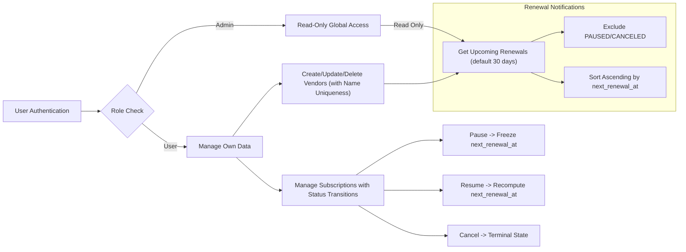

# Subscription & Renewal Guardian - Requirement Analysis Report

## 1. Introduction

The Subscription & Renewal Guardian service is designed to empower users to manage their personal subscriptions and to monitor upcoming renewals efficiently. It addresses the common pain points of losing track of recurring payments and unexpected charges by providing timely reminders and clear subscription statuses.

This document outlines the concise requirements for the backend system, translating the business goals, user roles, workflows, and constraints into a comprehensive analysis aimed at backend developers.

> This document provides business requirements only. All technical implementation decisions belong to developers. Developers have full autonomy over architecture, APIs, and database design. The document describes WHAT the system should do, not HOW to build it.

---

## 2. Business Model Overview

### Why This Service Exists

Modern consumers often subscribe to numerous services ranging from streaming platforms to SaaS tools but lack a unified system to track the multiple renewal cycles and costs. Subscription & Renewal Guardian fills this gap by providing a centralized subscription management service.

### Revenue Strategy

Though the initial focus is on user tooling, potential future monetization may involve premium features or partnerships with vendors; however, this document focuses on core subscription tracking capabilities.

### Success Metrics

- User retention measured by active subscription tracking
- Accuracy of upcoming renewals notifications
- Prevention of duplicate subscription entries
- Stable authentication and secure access

---

## 3. User Roles and Permissions

### Roles Defined

- **User**: Authenticated individuals who can create, read, update, and delete their own subscription and vendor data. Users manage their personal subscriptions, track renewal dates, and receive reminders.

- **Admin**: Read-only access to all subscriptions and vendors globally across users for administrative oversight. Cannot modify user data.

### Permission Matrix

| Action                    | User | Admin |
|---------------------------|:----:|:-----:|
| CRUD own subscriptions    | ✅   | ❌    |
| CRUD own vendors          | ✅   | ❌    |
| Read all subscriptions    | ❌   | ✅    |
| Read all vendors          | ❌   | ✅    |
| Modify others’ data       | ❌   | ❌    |

---

## 4. Functional Requirements

### Vendor Management

- WHEN a user creates a vendor, THE system SHALL require that the vendor name be unique, trimmed, and enforced case-insensitively.
- THE system SHALL reject vendor creation with duplicate names (case-insensitive), returning 409 Conflict.
- USERS can create, read, and update their vendors but cannot delete them.

### Subscription Management

- WHEN a user creates a subscription, THE system SHALL require vendor, plan name, billing cycle, amount (decimal >= 0), currency code (ISO-4217 uppercase), and start date.
- THE system SHALL compute and persist the `next_renewal_at` date on creation or when billing cycle or start date changes.
- THE system SHALL forbid creation of duplicate subscriptions per user for the same vendor and plan name, returning 409 Conflict.
- THE system SHALL allow users to pause subscriptions; when paused, `next_renewal_at` is frozen.
- WHEN the subscription is resumed, THE system SHALL recompute `next_renewal_at` from current UTC time strictly greater than now.
- THE system SHALL allow cancellation of subscriptions, marking them as terminal `CANCELED` status.
- THE system SHALL forbid modifications to subscriptions with `CANCELED` status, returning 409 Conflict.

### Reminders

- Users can create, read, and delete reminders nested under their subscriptions.

### Upcoming Renewals

- THE system SHALL expose an endpoint to list upcoming renewals within 1 to 365 days (default 30).
- THE list SHALL exclude subscriptions that are PAUSED or CANCELED.
- THE list SHALL be sorted ascending by `next_renewal_at`.

---

## 5. Business Rules and Validation

- Vendor names are unique case-insensitively, trimmed on input.
- Subscriptions are unique per (user_id, vendor_id, plan_name).
- subscription.amount MUST be Decimal(12,2) and >= 0; validated at service layer.
- Enums for billing_cycle and subscription_status are strictly enforced.
- `next_renewal_at` MUST be recalculated and persisted on create or when relevant fields change.
- PAUSED status freezes renewal computations; RESUME triggers recomputation from current UTC.
- CANCELED status is terminal; no modification allowed.

---

## 6. Error Handling and Edge Cases

- Duplicate vendor creation attempts SHALL respond with 409 Conflict.
- Duplicate subscription creation SHALL respond with 409 Conflict.
- Attempts to modify CANCELED subscriptions SHALL respond with 409 Conflict.
- Unauthorized access SHALL respond with 401 or 403 as appropriate.
- Invalid inputs such as negative amounts or invalid currencies SHALL respond with 400 Bad Request.

---

## 7. Performance Expectations

- THE system SHALL respond within 2 seconds under typical loads.
- Pagination SHALL be supported for listing endpoints.
- Upcoming renewals query SHALL return efficiently within 1 second.

---

## 8. Mermaid Diagrams

---

## 9. Conclusion

This report provides detailed, specific, and actionable business requirements for the Subscription & Renewal Guardian service aimed at backend implementation.

> This document provides business requirements only. All technical implementation decisions belong to developers. Developers have full autonomy over architecture, APIs, and database design. The document describes WHAT the system should do, not HOW to build it.
