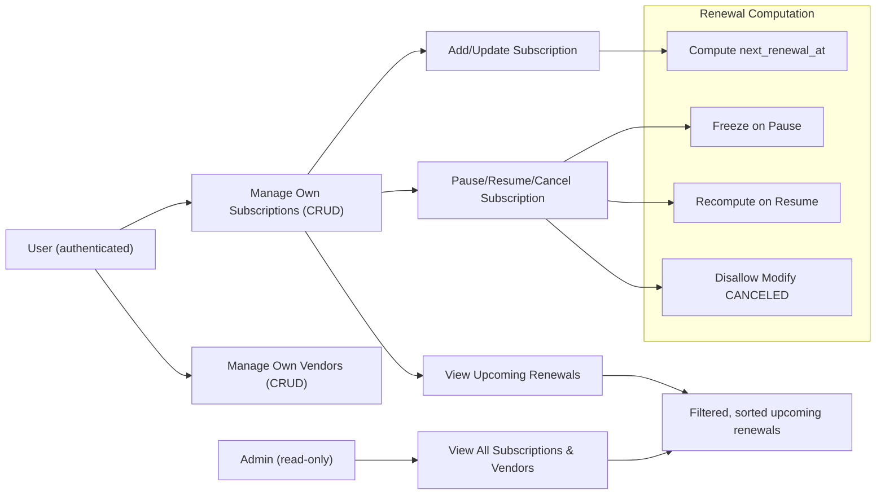

# Subscription & Renewal Guardian - Requirements Analysis Report

## 1. Introduction
This document provides a concise analysis report of the Subscription & Renewal Guardian service, designed to track personal subscriptions and upcoming renewals. It summarizes essential business requirements, roles, key functionalities, and operational constraints to inform backend development.

## 2. Business Objectives
### Why This Service Exists
The Subscription & Renewal Guardian addresses the common problem of individuals losing track of subscription services they use, leading to unexpected charges and poor budget management. This service fills the market gap by providing clear visibility into active subscriptions and imminent renewal dates.

### Core Goals
- Enable users to manage their subscriptions effectively.
- Notify users about upcoming subscription renewals within a configurable timeframe.
- Provide administrative oversight of all subscriptions without editing privileges.

## 3. User Roles & Permissions Overview
### User
- Can create, read, update, and delete their own subscription and vendor data.
- Manage personal subscriptions lifecycle (activate, pause, resume, cancel).
- Access upcoming renewal information for their own subscriptions.

### Admin
- Has read-only access to all subscriptions and vendors globally for monitoring and reporting.
- Cannot perform any modification operations.

## 4. Core Functional Requirements
### Subscription Management
- Users can add subscriptions specifying vendor, plan name, billing cycle, start date, amount, and currency.
- The system shall enforce that each vendor's name is unique ignoring case and trimmed of extra spaces.
- Users cannot create duplicate subscriptions with the same vendor and plan name.
- Amounts must be greater or equal to zero.
- Subscription states include ACTIVE, PAUSED, and CANCELED.

### Renewal Tracking
- The system computes and persists the next_renewal_at date in UTC upon subscription creation or when billing cycle or start date changes.
- When a subscription is paused, the next_renewal_at remains frozen until resumed.
- Upon resume, the system recalculates next_renewal_at to the nearest future date strictly greater than the current UTC time.
- CANCELED subscriptions disallow further modifications.

### Upcoming Renewals
- Users can retrieve upcoming renewals within a configurable window (default 30 days, valid range 1 to 365).
- Renewals exclude subscriptions that are PAUSED or CANCELED.
- Results sorted ascending by next_renewal_at.

## 5. Business Rules & Constraints
- Vendor names are case-insensitive unique, trimmed on input before validation.
- Subscription composite uniqueness enforced on (user_id, vendor_id, plan_name).
- Subscription amount validations enforce non-negative values at the service layer.
- Attempts to create duplicate vendors or subscriptions result in HTTP 409 Conflict errors.
- Modifications to subscriptions with status CANCELED are disallowed and return HTTP 409.
- Authentication uses JWT with email and password; no refresh tokens.
- All times are stored in UTC with business timezone Asia/Seoul considered for computations.

## 6. Error Handling Summary
- Return 409 Conflict for duplicates:
  - Duplicate vendor names (case-insensitive).
  - Duplicate subscription tuples (user_id, vendor_id, plan_name).
  - Modification attempts on CANCELED subscriptions.
- Return 401/403/404 as usual for unauthorized or forbidden access.
- Return 400 Bad Request for input validation errors such as negative amounts and invalid currency codes.

## 7. Performance Expectations
- System responses to queries and mutations shall be completed within 2 seconds under normal operation.
- Upcoming renewal queries must handle limits and offsets efficiently.
- Renewal date computations shall be instant upon subscription updates or state changes.

This report provides business requirements only. Detailed technical implementation decisions are to be made by developers. This document specifies WHAT the system should do, not HOW to implement it.