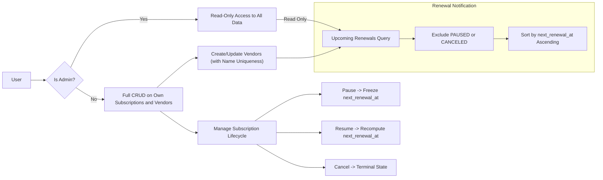

# Subscription & Renewal Guardian - Comprehensive Business Requirements

## 1. Introduction

The Subscription & Renewal Guardian service enables users to track their personal subscriptions and monitor upcoming renewal dates accurately. In a world where individuals subscribe to numerous services with varying billing cycles, this platform provides a centralized solution to avoid missed payments and unexpected charges.

### Why This Service Exists
Many users face challenges managing multiple subscriptions scattered across vendors, often losing track of renewal dates. This leads to unwanted automatic renewals or service interruptions. Subscription & Renewal Guardian fills this market gap by consolidating subscription data and notifying users proactively.

### Business Goals
- Provide a reliable subscription management tool.
- Enable timely notifications of upcoming renewals.
- Minimize user errors through strict validation and clear state management.

## 2. Business Model

### Market Need
Consumers increasingly rely on subscription-based services, yet lack unified management tools. This service offers a simple, user-focused platform to monitor all subscriptions.

### Revenue Strategy
Initial release targets user adoption with potential monetization via premium features, analytics, or vendor integrations.

### Growth Plans
Organic user growth through ease of use and reliable reminder mechanisms.

### Success Metrics
- Monthly active users (MAU)
- Renewal accuracy and reminder effectiveness
- Reduction in user-reported unexpected renewals

## 3. User Roles and Authentication

### Roles
- **User:** Individuals authenticated to create, read, update, and delete their own vendors and subscriptions.
- **Admin:** Read-only global view for system oversight, with no modification privileges.

### Authentication
Authentication uses JSON Web Tokens (JWT) issued upon successful login with email and password. No refresh tokens are implemented; users must re-authenticate when tokens expire.

### Access Permissions
| Action                               | User | Admin |
|------------------------------------|:----:|:-----:|
| Create vendors and subscriptions   |  ✅  |   ❌  |
| Read own data                      |  ✅  |   ❌  |
| Read all data                     |  ❌  |   ✅  |
| Update own data                   |  ✅  |   ❌  |
| Delete own data                   |  ✅  |   ❌  |
| Modify subscription status         |  ✅  |   ❌  |

## 4. Functional Requirements

### Vendor Management
- WHEN a user creates a vendor, THE system SHALL ensure the vendor name is unique disregarding case with trimming applied.
- THE system SHALL reject attempts to create duplicate vendor names with an HTTP 409 Conflict response.
- Users can update vendors but are prohibited from deleting vendors.

### Subscription Management
- WHEN creating or updating a subscription, THE system SHALL accept vendor_id, plan_name, amount (decimal >=0), currency (ISO-4217 uppercase), billing_cycle enum, started_at date, and status.
- THE system SHALL enforce uniqueness on (user_id, vendor_id, plan_name).
- THE system SHALL compute and persist next_renewal_at as UTC when billing_cycle or started_at change, unless the subscription is PAUSED.
- WHEN a subscription is paused, THE system SHALL freeze next_renewal_at, disallowing recomputations.
- WHEN resuming a paused subscription, THE system SHALL recompute next_renewal_at from current UTC time until strictly greater than now.
- THE system SHALL not allow modifications to subscriptions marked as CANCELED and respond with HTTP 409 Conflict if attempted.

### Reminders
- Users SHALL be able to add, fetch, and delete reminders linked to their subscriptions.

### Upcoming Renewals
- THE system SHALL provide an endpoint to fetch subscriptions renewing within a configurable number of days (default 30, minimum 1, maximum 365).
- THE result SHALL exclude subscriptions with status PAUSED or CANCELED.
- THE results SHALL be sorted ascending by next_renewal_at.

## 5. Business Rules and Constraints

- Vendor names are enforced unique in a case-insensitive manner using PostgreSQL citext and trimmed.
- Subscription uniqueness enforced for (user_id, vendor_id, plan_name).
- Amounts must be decimal with precision 12,2 and non-negative.
- Billing cycles are enum values: DAILY, WEEKLY, MONTHLY, YEARLY.
- Subscription statuses are enum values: ACTIVE, PAUSED, CANCELED.
- next_renewal_at is stored as UTC and computed according to billing cycle and subscription start date.
- Pausing a subscription freezes next_renewal_at; resuming recomputes the date from current UTC time.
- Canceling a subscription sets it to terminal state disallowing further updates.

## 6. Error Handling

- IF a user attempts to create a vendor with a duplicate name (case-insensitive), THEN THE system SHALL return HTTP 409 Conflict.
- IF a user attempts to create a subscription duplicate of (user_id, vendor_id, plan_name), THEN THE system SHALL return HTTP 409 Conflict.
- IF a user attempts to modify a subscription with status CANCELED, THEN THE system SHALL return HTTP 409 Conflict.
- IF a user makes unauthorized access attempts, THEN THE system SHALL return HTTP 401 Unauthorized or HTTP 403 Forbidden as appropriate.
- IF a user submits invalid data such as negative amounts or invalid currency codes, THEN THE system SHALL return HTTP 400 Bad Request with error details.

## 7. Performance Requirements

- THE system SHALL respond to API requests within 2 seconds under nominal load.
- THE upcoming renewals query SHALL support pagination and complete within 1 second.

## 8. Diagrams

## 9. Summary

THE system described in this document SHALL fulfill all business requirements outlined above to provide users with a reliable and efficient subscription tracking service. All technical decisions regarding implementation, APIs, and database designs are at developers' discretion.

THE document focuses exclusively on business requirements. Developers have full autonomy over the system architecture, technology choices, and implementation approaches.

---