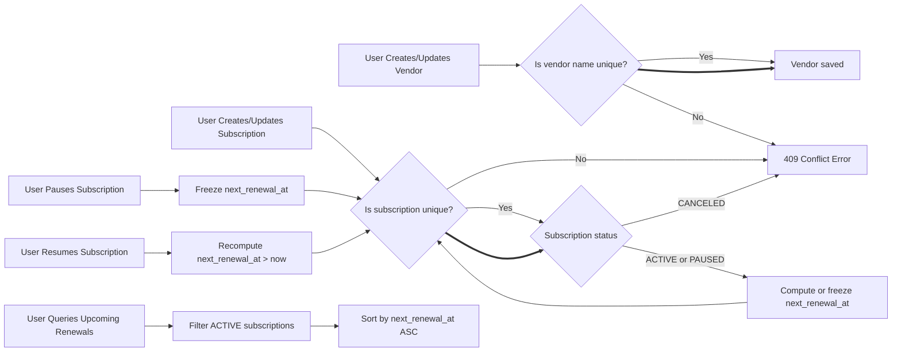

# Subscription & Renewal Guardian - Business Rules Specification

## 1. Introduction

### 1.1 Background and Purpose

This document defines the detailed business rules, constraints, and validation logic for the Subscription & Renewal Guardian service, which enables users to track personal subscriptions and upcoming renewals. It translates business needs and requirements into precise mandates that backend developers shall implement to ensure system correctness and reliability.

### 1.2 Scope

This document focuses exclusively on the business logic governing vendor management, subscription lifecycle, renewal scheduling, state transitions, validation and error handling relevant to the subscription tracking domain. It does not cover technical implementation details, database schemas, or API specifications, which are addressed in separate documents.

## 2. Business Model Overview

The Subscription & Renewal Guardian service fills a critical market need by helping users efficiently manage their recurring subscriptions and avoid accidental service lapses or unexpected charges. It differentiates itself by providing personalized subscription tracking with proactive renewal monitoring within a secure authenticated environment.

Revenue is derived primarily by monetizing premium features such as enhanced notification and reminder customizations, with user growth driven by simple onboarding and maximizing user retention through accurate renewal tracking.

Key success metrics include Monthly Active Users (MAU), renewal adherence rates, and subscription data completeness.

## 3. User Roles and Permissions

### Roles:
- **User:** Authenticated individuals who can create, read, update, and delete their own subscription and vendor data. They manage their personal subscription lifecycle, including adding reminders and viewing upcoming renewal notifications.
- **Admin:** System administrators with read-only access across all users’ subscription and vendor data, enabling global monitoring and oversight.

### Permissions:
- Users shall only modify their own data.
- Admins shall have no modification privileges.

## 4. Core Business Rules for Vendors

- Vendor names are stored as trimmed, case-insensitive unique values enforced by PostgreSQL `citext`.
- No two vendors can exist with names differing only in case or trailing/leading spaces.
- Users can create and update vendors with names complying with uniqueness constraints.
- Vendor deletion is not permitted.

## 5. Core Business Rules for Subscriptions

- Subscriptions belong exclusively to a single user and link to a specific vendor.
- Each subscription must define a plan name that, combined with user and vendor IDs, is unique.
- Valid billing cycles are enumerated as DAILY, WEEKLY, MONTHLY, or YEARLY.
- Amounts must be decimals with two decimal places and non-negative.
- Currency codes must conform to ISO-4217 three-letter uppercase format.
- Subscription statuses are enumerated as ACTIVE, PAUSED, or CANCELED; once CANCELED, further modifications are forbidden.

## 6. Subscription Renewal Logic

- The system shall persist `next_renewal_at` as a computed date-time stored in UTC.
- Upon subscription creation or update, if `billing_cycle` or `started_at` change and status is not PAUSED or CANCELED, the system SHALL recompute `next_renewal_at` according to the billing cycle starting from the subscription start date or the latest renewal date.
- WHEN a subscription is paused, THE system SHALL freeze `next_renewal_at`; no updates occur.
- WHEN a subscription is resumed from PAUSED, THE system SHALL recalculate `next_renewal_at` forward from the current UTC time to the next renewal date strictly greater than now.

## 7. Subscription State Management

- ACTIVE subscriptions represent normal recurring status.
- PAUSED subscriptions halt renewal date progression but retain all other subscription data; no recomputation of renewal occurs.
- CANCELED subscriptions are terminal; no further modifications (update, pause, resume) shall be allowed.

## 8. Data Validation and Uniqueness Constraints

- Vendor name uniqueness is enforced case-insensitively and trimmed.
- Subscription uniqueness combines user ID, vendor ID, and plan name.
- Subscription amount must be >= 0.
- Currency values must be valid ISO-4217 codes (3 uppercase letters).
- Billing cycle and subscription status accept only predefined enum values.
- Attempts at duplicates (vendor name or subscription tuple) must result in HTTP 409 Conflict errors at the API layer.

## 9. Error Handling Rules

- Duplicate vendor name submissions shall be rejected with a 409 Conflict and descriptive error.
- Duplicate subscription lifecycle attempts (same user, vendor, plan) shall also trigger 409 Conflict errors.
- Modifications to CANCELED subscriptions shall be blocked with 409 Conflict error.
- Unauthorized access triggers 401 or 403 errors as appropriate.
- Non-existent resources yield 404 Not Found error.

## 10. Performance Expectations

- Business rules executions should enable real-time response for subscription updates, renewals, and queries.
- Upcoming renewal queries filtered by date ranges shall perform efficiently with appropriate indexing.

## 11. Summary

This document comprehensively defines the binding business rules shaping vendor and subscription data handling within the Subscription & Renewal Guardian. It outlines precise validation, lifecycle management, and error conditions vital for the backend implementation to meet the service’s functional and operational standards.

---

This document provides business requirements only. All technical implementation decisions belong to developers. Developers have full autonomy over architecture, APIs, and database design. The document describes WHAT the system should do, not HOW to build it.