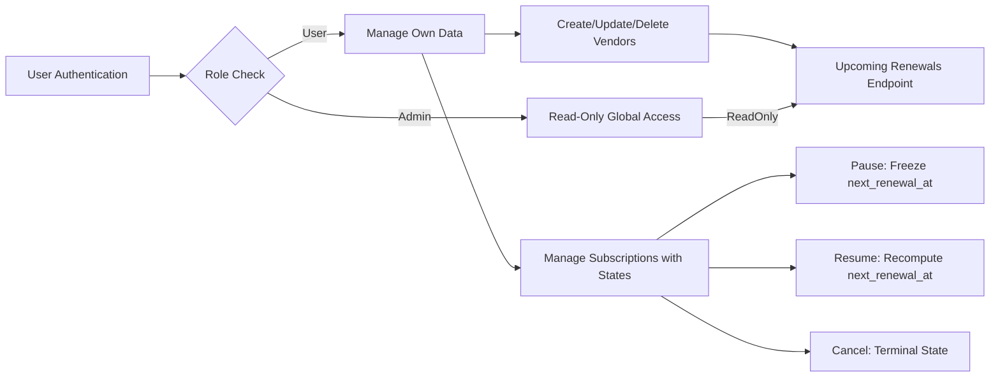

# Subscription & Renewal Guardian - Requirements Analysis Report

## 1. Introduction

The Subscription & Renewal Guardian service is designed to help users track their personal subscriptions and upcoming renewal dates efficiently and reliably. This service aims to fill the widespread problem of subscription fatigue by providing a single platform for subscription management and notifications.

## 2. Business Model

### Why This Service Exists

The service addresses the common issue of users losing track of multiple subscriptions, resulting in unexpected charges or failed renewals. By consolidating subscription information and providing timely renewal notifications, the service improves users' financial management and prevents service interruptions.

### Revenue Strategy

The system is initially free for users, with possible future monetization through premium features like enhanced notifications or analytics. User acquisition will focus on organic growth and partnerships.

### Growth Plan

The platform aims to grow through user-friendly onboarding, reliable notifications, and integration capabilities.

### Success Metrics

- Monthly active users
- User retention rate
- Accuracy of renewal notifications
- Reduction in subscription misses

## 3. User Roles and Authentication

### Roles
- **User**: The primary consumer who manages personal subscriptions and vendors, with full control over CRUD operations on their data.
- **Admin**: Has read-only access to all data globally for monitoring and analysis.

### Authentication
- JWT based authentication using email and password with no refresh tokens.
- Token expiration defined to balance security and usability.

### Permissions Matrix

| Action                 | User | Admin |
|------------------------|:----:|:-----:|
| Create Own Data        | ✅   | ❌    |
| Read Own Data          | ✅   | ❌    |
| Read All Users' Data   | ❌   | ✅    |
| Modify Own Data        | ✅   | ❌    |
| Modify Any Data        | ❌   | ❌    |

## 4. Functional Requirements

### Vendor Management
- Vendors must have unique, case-insensitive, trimmed names.
- Users can create and update vendors, but cannot delete them.
- Duplicate vendor attempts return HTTP 409 Conflict.

### Subscription Management
- Subscriptions are uniquely identified by user_id, vendor_id, and plan_name.
- Subscriptions store amount (Decimal(12,2), >=0), currency (ISO 4217 3-letter uppercase), billing cycle (enum), started_at, status, and next_renewal_at.
- next_renewal_at is computed on creation or when billing cycle or start date changes.
- PAUSED status freezes next_renewal_at; resuming recomputes next_renewal_at from current UTC time.
- CANCELED status is terminal; no modifications allowed.
- Duplicate subscriptions return HTTP 409 Conflict.

### Reminder Management
- Users can create, fetch, and delete reminders tied to subscriptions.

### Upcoming Renewals Endpoint
- Supports configurable window (1..365 days; default 30).
- Excludes PAUSED and CANCELED subscriptions.
- Results sorted ascending by next_renewal_at.

## 5. Business Rules and Constraints

- Vendor names unique case-insensitive and trimmed.
- Subscription uniqueness enforced on (user_id, vendor_id, plan_name).
- Valid billing cycle enums: DAILY, WEEKLY, MONTHLY, YEARLY.
- Valid subscription statuses: ACTIVE, PAUSED, CANCELED.
- Amount must be decimal(12,2) and >=0.
- next_renewal_at computed and stored in UTC.
- PAUSED freezes renewal date computation.
- RESUME recomputes renewal date from now to strictly future.
- CANCELED disallows any modifications.

## 6. Error Handling

- Duplicate vendor or subscription entries return 409 Conflict.
- Modifications to canceled subscriptions return 409 Conflict.
- Invalid input data returns 400 Bad Request.
- Unauthorized access returns 401 or 403.
- Not found resources return 404.

## 7. Performance Requirements

- API responses shall be within 2 seconds under normal load.
- Pagination and sorting support on list endpoints.
- Upcoming renewals query optimized with indexes.

## 8. Diagrams

## 9. Summary

The Subscription & Renewal Guardian service offers a comprehensive backend business logic for subscription tracking, renewal management, and user data permissions. This document expresses all requirements in clear business terms, using EARS format and validated Mermaid diagrams. It is suitable for immediate use by backend developers for implementation.

> This document provides business requirements only. All technical implementation decisions belong to developers. Developers have full autonomy over architecture, APIs, and database design. The document describes WHAT the system should do, not HOW to build it.