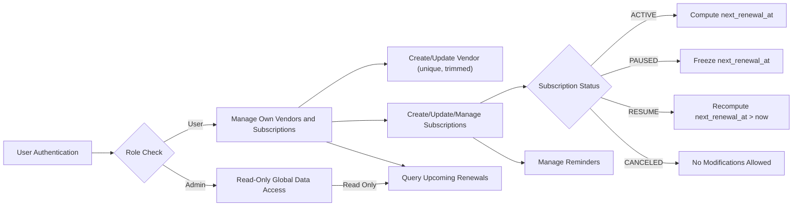

# Subscription & Renewal Guardian - Business Requirements Specification

## 1. Overview and Business Model

The Subscription & Renewal Guardian service addresses the growing need for individual users to manage diverse personal subscriptions effectively. By centralizing subscription information and providing accurate upcoming renewal dates and reminders, it helps prevent unexpected charges and service interruptions.

### Business Justification
Users often lose track of multiple subscriptions from various vendors due to differing billing cycles and poor notification systems. This service closes the gap by providing a unified platform to track and manage renewals.

### Revenue and Growth Strategy
Potential monetization includes premium features and vendor partnerships. Growth relies on delivering reliable subscription tracking and timely renewal notifications.

### Success Metrics
- Monthly Active Users (MAU)
- Renewal notification accuracy
- User retention rates
- Duplicate prevention success

## 2. User Roles and Authentication

### Roles
- **User:** Can create, read, update, and delete their own vendors and subscriptions. Manages personal renewal tracking and reminders.
- **Admin:** Has read-only global access to all vendors and subscriptions without modification rights.

### Authentication
- JWT tokens based on email and password authentication (no refresh tokens).
- Tokens contain userId, role, and permissions.
- Sessions expire as per token validity.

### Permissions Matrix
| Action                         | User | Admin |
|-------------------------------|:----:|:-----:|
| Create Vendor                 | ✅   | ❌    |
| Read Vendor                   | ✅   | ✅    |
| Update Vendor                 | ✅   | ❌    |
| Create Subscription            | ✅   | ❌    |
| Read Subscription              | ✅   | ✅    |
| Update Subscription            | ✅   | ❌    |
| Pause/Resume/Cancel Subscription | ✅   | ❌    |

## 3. Functional Requirements

### Vendor Management
- WHEN a user creates a vendor, THE system SHALL ensure the vendor name is trimmed and unique ignoring case.
- IF a duplicate vendor name (case-insensitive) exists, THEN THE system SHALL return HTTP 409 Conflict.

### Subscription Management
- WHEN a user creates or updates a subscription, THE system SHALL require vendor, plan name, billing cycle, amount (decimal >=0), currency (ISO-4217 3-letter uppercase), started_at, and status.
- WHEN creating or updating, THE system SHALL compute and persist next_renewal_at based on billing cycle and start date provided.
- IF billing cycle or start date changes, THE system SHALL recompute next_renewal_at.
- IF subscription status is PAUSED, THE system SHALL freeze next_renewal_at.
- WHEN resuming from PAUSED, THE system SHALL recompute next_renewal_at from current UTC time ensuring it is strictly > now.
- THE system SHALL prevent creation of duplicate subscriptions per user for same vendor and plan name, returning 409 Conflict.
- THE system SHALL prevent modifications on subscriptions in CANCELED state, returning 409 Conflict.

### Reminders Management
- Users can create, list, and delete reminders associated with their subscriptions.

### Upcoming Renewals
- WHEN a user requests upcoming subscriptions, THE system SHALL return subscriptions with next_renewal_at within a configurable window (default 30 days, min 1, max 365).
- PAUSED and CANCELED subscriptions SHALL be excluded.
- Results SHALL be sorted ascending by next_renewal_at.

## 4. Business Rules and Constraints

- Vendor names are unique across system, case-insensitive and trimmed before uniqueness check.
- Subscription uniqueness enforced on (user_id, vendor_id, plan_name).
- Subscription amount is decimal(12,2) and must be >= 0.
- BillingCycle enum: DAILY, WEEKLY, MONTHLY, YEARLY.
- SubscriptionStatus enum: ACTIVE, PAUSED, CANCELED.
- next_renewal_at stored in UTC; computations use Asia/Seoul timezone.
- Transition from CANCELED to any other status or modification is forbidden.
- PAUSED status freezes renewal dates; RESUMED must recompute next_renewal_at strictly after current datetime.

## 5. Error Handling Scenarios

- Duplicate vendor creation returns HTTP 409 Conflict with detailed error.
- Duplicate subscription per unique tuple returns HTTP 409 Conflict.
- Modification attempt on CANCELED subscription returns 409 Conflict.
- Invalid input values (negative amounts, invalid currency) return 400 Bad Request.
- Unauthorized access returns HTTP 401 Unauthorized.
- Forbidden access attempts return HTTP 403 Forbidden.
- Missing resources return HTTP 404 Not Found.

## 6. Performance Requirements

- API responses SHALL complete within 2 seconds under nominal conditions.
- Upcoming renewals queries SHALL be paginated and execute efficiently using indexes.

## 7. Summary

This specification fully defines the business and functional requirements for Subscription & Renewal Guardian with explicit roles, validation rules, lifecycle management, and error handling. Backend engineers can implement the system with full clarity on required behaviors.

---

This document provides business requirements only. All technical implementation decisions such as architecture, APIs, and database schema design are at developers' discretion. The document specifies WHAT the system should do, not HOW it should be implemented.