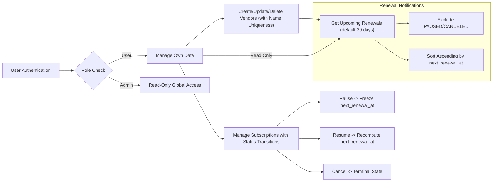

# Subscription & Renewal Guardian - Requirements Analysis Report

## 1. Introduction

The Subscription & Renewal Guardian service is designed to empower users to manage their personal subscriptions and to monitor upcoming renewals efficiently. It addresses the common pain points of losing track of recurring payments and unexpected charges by providing timely reminders and clear subscription statuses.

This document outlines the concise requirements for the backend system, translating the business goals, user roles, workflows, and constraints into a comprehensive analysis aimed at backend developers.

---

## 2. Business Model Overview

### Why This Service Exists

Modern consumers often subscribe to numerous services ranging from streaming platforms to SaaS tools but lack a unified system to track the multiple renewal cycles and costs. Subscription & Renewal Guardian fills this gap by providing a centralized subscription management service.

### Revenue Strategy

Though the initial focus is on user tooling, potential future monetization may involve premium features or partnerships with vendors; however, this document focuses on core subscription tracking capabilities.

### Success Metrics

- User retention measured by active subscription tracking
- Accuracy of upcoming renewals notifications
- Prevention of duplicate subscription entries
- Stable authentication and secure access

---

## 3. User Roles and Permissions

### Roles Defined

- **User**: Authenticated individuals who can create, read, update, and delete their own subscription and vendor data. Users manage their personal subscriptions, track renewal dates, and receive reminders.

- **Admin**: Read-only access to all subscriptions and vendors globally across users for administrative oversight. Cannot modify user data.

### Permission Matrix

| Action                    | User | Admin |
|---------------------------|:----:|:-----:|
| CRUD own subscriptions    | ✅   | ❌    |
| CRUD own vendors          | ✅   | ❌    |
| Read all subscriptions    | ❌   | ✅    |
| Read all vendors          | ❌   | ✅    |
| Modify others’ data       | ❌   | ❌    |

---

## 4. Functional Requirements Summary

- Users authenticate using JWT (email+password), with no refresh tokens.
- Users can create vendors with unique, trimmed, case-insensitive names.
- Users can add subscriptions tied uniquely by user_id, vendor_id, and plan_name.
- Subscription fields include amount (validated >=0), billing cycle (DAILY, WEEKLY, MONTHLY, YEARLY), status (ACTIVE, PAUSED, CANCELED), next_renewal_at (UTC), and started_at.
- next_renewal_at is recalculated on create/update when relevant fields change.
- PAUSED subscriptions freeze next_renewal_at; RESUMED subscriptions recompute next_renewal_at to strictly after current UTC time.
- The system returns upcoming subscriptions renewing within a configurable window (default 30 days), excluding PAUSED and CANCELED, ordered ascending by next_renewal_at.
- Attempts to create duplicate vendors or subscriptions yield HTTP 409 Conflict.
- Canceling a subscription makes it terminal; further modifications yield HTTP 409.
- Standard HTTP 401/403/404 errors apply for unauthorized access or missing resources.
- Vendors cannot be deleted.
- Reminders nested under subscriptions support basic CRUD operations for user convenience.

---

## 5. Business Rules and Constraints

- Vendor names are unique globally via case-insensitive comparison (citext) and trimmed on input.
- Subscription uniqueness enforced by a tuple of user_id, vendor_id, and plan_name.
- Amount field must always be decimal with scale 2 and non-negative.
- Currency codes must conform to ISO-4217 three-letter uppercase format.
- Subscription statuses are enumerated as ACTIVE, PAUSED, or CANCELED; once CANCELED, further modifications are forbidden.

---

## 6. Subscription Renewal Logic

- The system shall persist `next_renewal_at` as a computed date-time stored in UTC.
- Upon subscription creation or update, if `billing_cycle` or `started_at` change and status is not PAUSED or CANCELED, the system SHALL recompute `next_renewal_at` according to the billing cycle starting from the subscription start date or the latest renewal date.
- WHEN a subscription is paused, THE system SHALL freeze `next_renewal_at`; no updates occur.
- WHEN a subscription is resumed from PAUSED, THE system SHALL recalculate `next_renewal_at` forward from the current UTC time to the next renewal date strictly greater than now.

---

## 7. Error Handling

- Duplicate vendor name submissions shall be rejected with a 409 Conflict and descriptive error.
- Duplicate subscription lifecycle attempts (same user, vendor, plan) shall also trigger 409 Conflict errors.
- Modifications to CANCELED subscriptions shall be blocked with 409 Conflict error.
- Unauthorized or forbidden access attempts shall respond with 401 Unauthorized or 403 Forbidden as applicable.
- Requests for non-existent resources return 404 Not Found.
- Invalid input for amounts (e.g., negative decimals) or bad currency codes return 400 Bad Request.

---

## 8. Performance Expectations

The system SHALL respond to all user interactions within 2 seconds in typical scenarios, ensuring a smooth user experience.

Endpoints returning paginated listings SHALL support offset and limit parameters to maintain performance.

Queries for upcoming renewals SHALL execute efficiently with proper indexing on user_id and next_renewal_at.

---

## 9. Diagrams

---

## 10. Summary

The Subscription & Renewal Guardian backend service requires strict enforcement of business rules for subscription lifecycle management, uniqueness constraints, renewal computations, and access control by defined roles. The system shall provide clear error responses to guide users and maintain data integrity.

Authentication shall use JWT tokens and enforce role-based permissions strictly. Renewals computations must be consistent with the configured billing cycle and respect PAUSED and CANCELED statuses.

This document provides business requirements only. Developers have full autonomy over technical implementation, architecture, and API design. It defines WHAT the system shall do, not HOW.