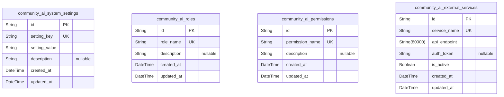
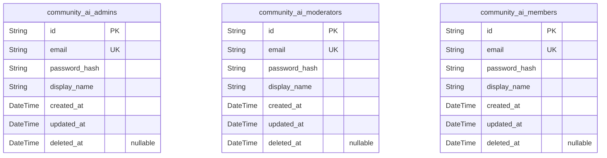
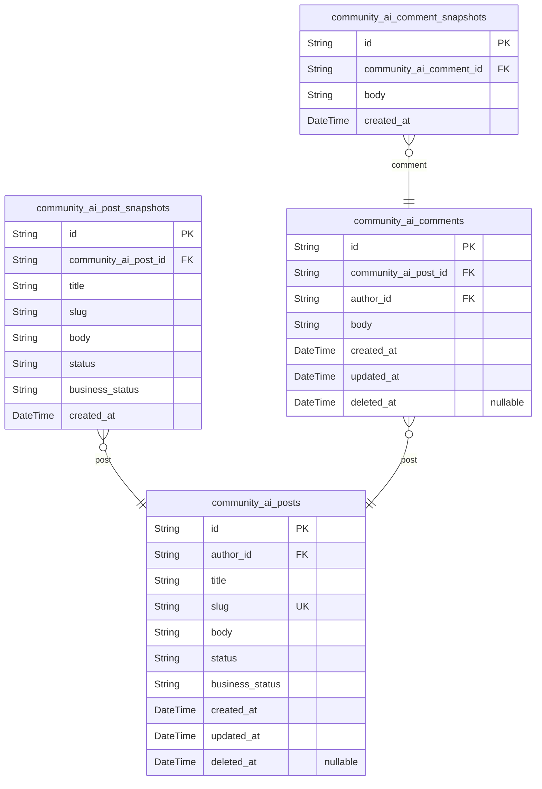
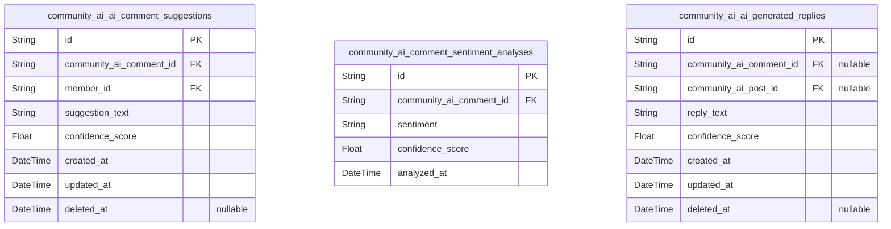
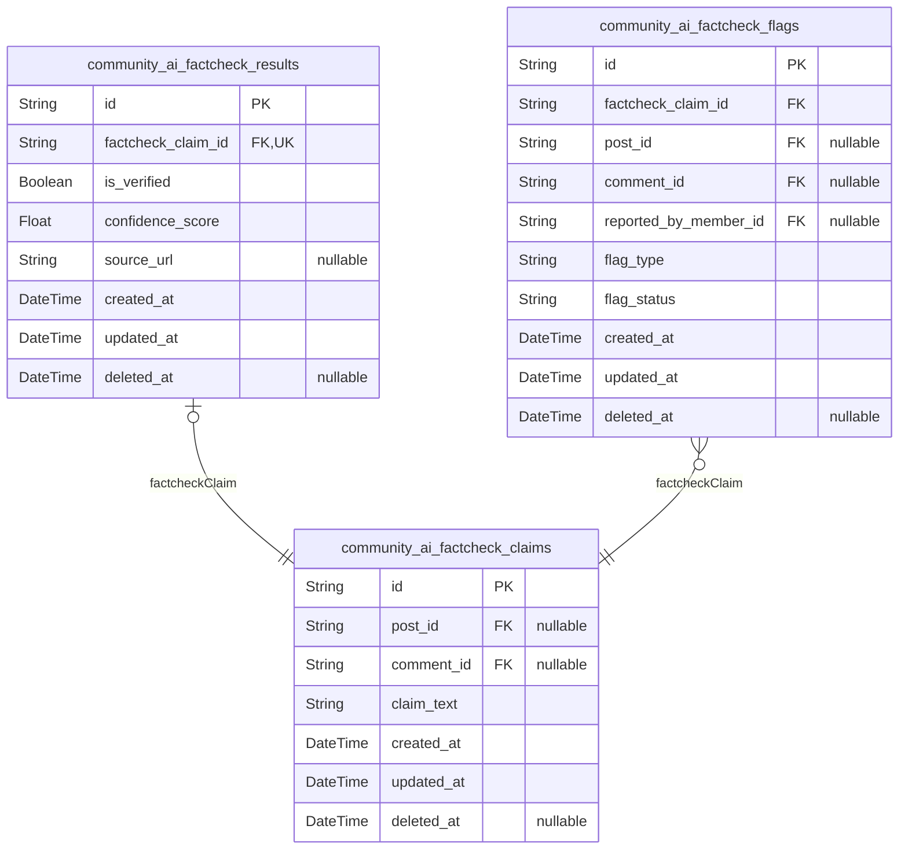
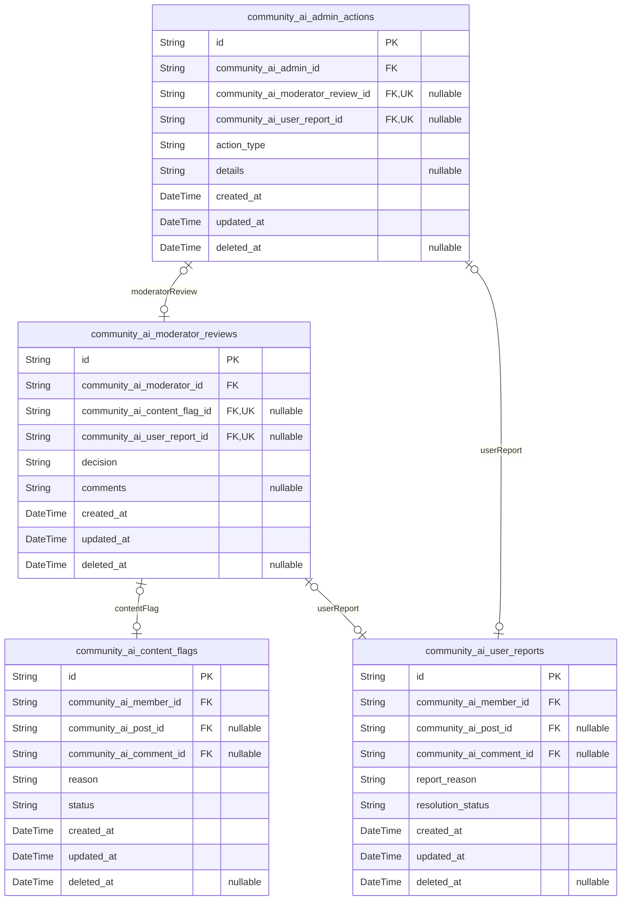
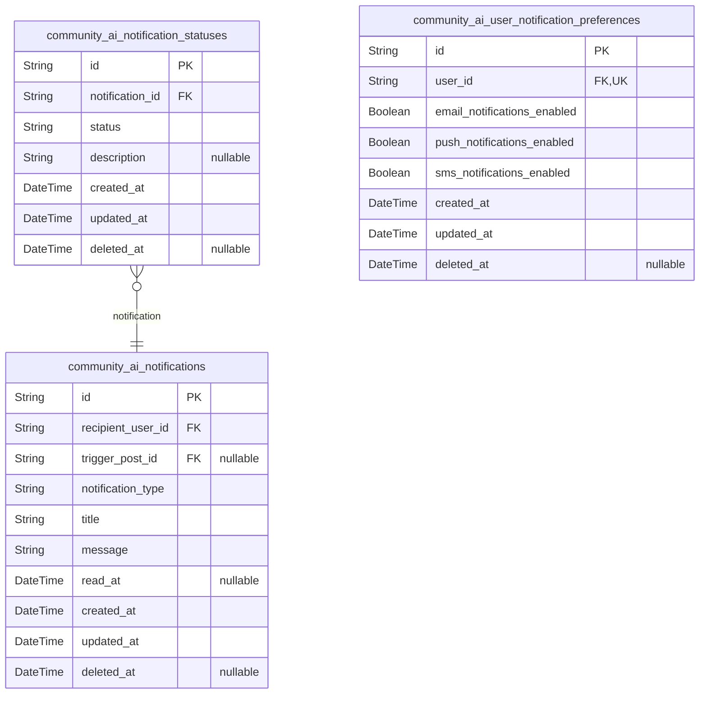
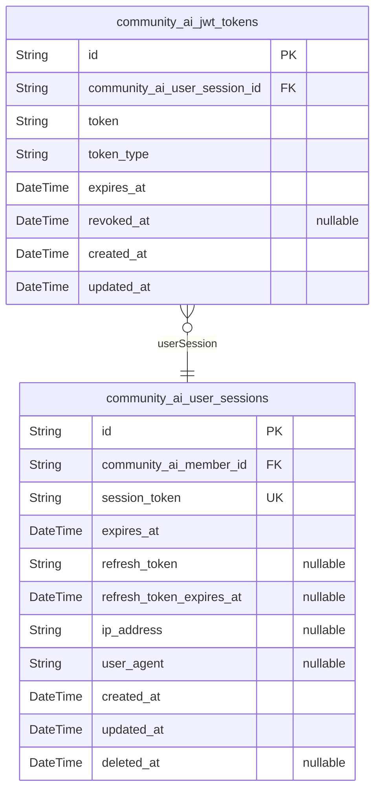
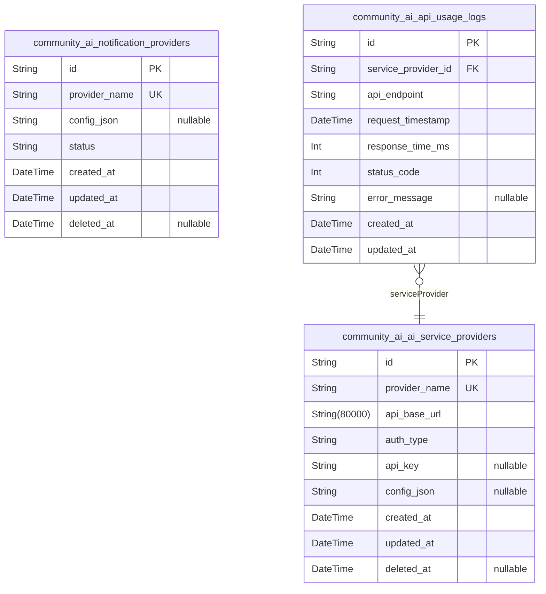
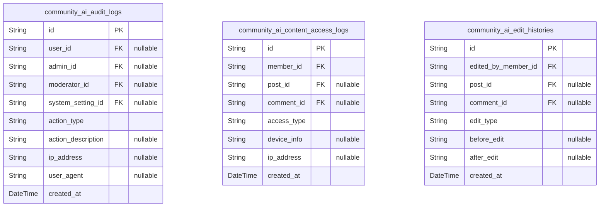

# Prisma Markdown

> Generated by [`prisma-markdown`](https://github.com/samchon/prisma-markdown)

- [Systematic](#systematic)
- [Identity](#identity)
- [Content](#content)
- [AICommenting](#aicommenting)
- [AIFactcheck](#aifactcheck)
- [Moderation](#moderation)
- [Notifications](#notifications)
- [UserSessions](#usersessions)
- [ExternalIntegrations](#externalintegrations)
- [Audit](#audit)

## Systematic

### `community_ai_system_settings`

System-wide configuration settings for community AI platform. Stores
key-value based settings for general platform behavior and feature
toggles. This table holds critical system parameters that control
site-wide operational modes. Uniqueness is enforced on setting keys.

Properties as follows:

- `id`: Primary Key.
- `setting_key`: Unique key identifying the system setting.
- `setting_value`: Value of the system setting as string.
- `description`: Optional human-readable description of the setting purpose and usage.
- `created_at`: Record creation timestamp.
- `updated_at`: Record last update timestamp.

### `community_ai_roles`

Defines user roles within the community AI platform. Represents role
names and their descriptions for access control and permission
assignment. Roles govern authorization scopes and are referenced
throughout the system.

Properties as follows:

- `id`: Primary Key.
- `role_name`: Unique name of the user role.
- `description`: Detailed description of the role and its purpose in the system.
- `created_at`: Record creation timestamp.
- `updated_at`: Record last update timestamp.

### `community_ai_permissions`

Permission definitions that govern access rights within the community AI
platform. Permissions link to roles and specify authorization actions.
This table contains discrete permission entries which can be assigned to
roles.

Properties as follows:

- `id`: Primary Key.
- `permission_name`: Unique identifier name for the permission.
- `description`: Detailed explanation of what actions the permission allows.
- `created_at`: Record creation timestamp.
- `updated_at`: Record last update timestamp.

### `community_ai_external_services`

Configuration and metadata for external AI and system integration
services used by Community AI platform. Includes service names, API
endpoints, authentication credentials, and operational status. Supports
multiple external service types for extensibility.

Properties as follows:

- `id`: Primary Key.
- `service_name`: Unique name of the external service.
- `api_endpoint`: URI endpoint for API access to the external service.
- `auth_token`
  > Authentication token or key for service API calls, may be null if not
  > needed.
- `is_active`: Flag indicating if the service is currently active and enabled.
- `created_at`: Record creation timestamp.
- `updated_at`: Record last update timestamp.

## Identity

### `community_ai_admins`

Table representing admin users with full system control including user
management, content moderation, and AI feature configuration. Each admin
has unique identity attributes and audit timestamps. Part of the Identity
component enabling role-specific user management and access control.

Properties as follows:

- `id`: Primary Key.
- `email`: Unique email address of the admin user for login and contact.
- `password_hash`: Hash of the admin's password for authentication purposes.
- `display_name`: Admin user's display name or nickname.
- `created_at`: Timestamp when the admin user was created.
- `updated_at`: Timestamp when the admin user was last updated.
- `deleted_at`: Timestamp when the admin user was soft deleted, if applicable.

### `community_ai_moderators`

Table representing moderator users with permissions to review and flag
content, manage user-generated posts and comments. Supports role-based
access control distinct from admins and members with separate identity
fields and audit trails.

Properties as follows:

- `id`: Primary Key.
- `email`: Unique email address of the moderator user for login and contact.
- `password_hash`: Hash of the moderator's password for authentication purposes.
- `display_name`: Moderator user's display name or nickname.
- `created_at`: Timestamp when the moderator user was created.
- `updated_at`: Timestamp when the moderator user was last updated.
- `deleted_at`: Timestamp when the moderator user was soft deleted, if applicable.

### `community_ai_members`

Table representing member users, the main community participants who can
create posts, comments, and use AI-assisted features. Holds identity
data, credentials, and audit timestamps. Supports separation of normal
users from admins and moderators.

Properties as follows:

- `id`: Primary Key.
- `email`: Unique email address of the member user for login and contact.
- `password_hash`: Hash of the member's password for authentication purposes.
- `display_name`: Member user's display name or nickname.
- `created_at`: Timestamp when the member user was created.
- `updated_at`: Timestamp when the member user was last updated.
- `deleted_at`: Timestamp when the member user was soft deleted, if applicable.

## Content

### `community_ai_posts`

Primary content entity representing posts created by community members.
Houses main post data including title, content, status, author
association, and timestamps. Supports content lifecycle with soft
deletion and workflow status. Related snapshots capture historical
states.

Properties as follows:

- `id`: Primary Key.
- `author_id`: Belonged author's community_ai_members.id.
- `title`: Post title, up to 100 characters, non-empty.
- `slug`: Unique slug for post URL identification.
- `body`: Main content body of the post.
- `status`: Current workflow status of the post (e.g., draft, published, archived).
- `business_status`: Business specific state for the post workflow.
- `created_at`: Timestamp when the post was created.
- `updated_at`: Timestamp when the post was last updated.
- `deleted_at`: Soft delete timestamp; null if not deleted.

### `community_ai_post_snapshots`

Snapshot entity capturing historical states of posts for audit trails and
version control. Stores denormalized data of the post at the moment of
snapshot creation for historical reference.

Properties as follows:

- `id`: Primary Key.
- `community_ai_post_id`: Belonged post's community_ai_posts.id.
- `title`: Snapshot of post title.
- `slug`: Snapshot of post slug.
- `body`: Snapshot of post body content.
- `status`: Snapshot of current post status.
- `business_status`: Snapshot of business workflow status.
- `created_at`: Timestamp when the snapshot was created.

### `community_ai_comments`

Primary entity representing comments made by community members on posts.
Contains comment content, author association, linked post, timestamps,
and soft deletion support. Comments support independent management and AI
moderation features.

Properties as follows:

- `id`: Primary Key.
- `community_ai_post_id`: Belonged post's community_ai_posts.id.
- `author_id`: Belonged author's community_ai_members.id.
- `body`: Comment content, non-empty and up to 1000 characters.
- `created_at`: Timestamp when the comment was created.
- `updated_at`: Timestamp when the comment was last updated.
- `deleted_at`: Soft delete timestamp; null if not deleted.

### `community_ai_comment_snapshots`

Snapshot entity capturing historical states of comments for audit trails
and version control. Stores comment data corresponding to a specific
previous state for history analysis and moderation tracking.

Properties as follows:

- `id`: Primary Key.
- `community_ai_comment_id`: Belonged comment's community_ai_comments.id.
- `body`: Snapshot of comment content.
- `created_at`: Timestamp when the snapshot was created.

## AICommenting

### `community_ai_ai_comment_suggestions`

Stores AI-generated suggestions for improving user comments. Each
suggestion links to a specific comment and the user who made the comment.
It captures the suggested text, confidence score, and timestamps for
creation and updates. Supports user interaction with AI comment
improvement features.

Properties as follows:

- `id`: Primary Key.
- `community_ai_comment_id`: Referenced comment's [community_ai_comments.id](#community_ai_comments).
- `member_id`: Member who owns the original comment [community_ai_members.id](#community_ai_members).
- `suggestion_text`: AI-generated comment improvement suggestion text.
- `confidence_score`: Confidence score for the AI suggestion ranging from 0.0 to 1.0.
- `created_at`: Timestamp when the AI suggestion was created.
- `updated_at`: Timestamp when the AI suggestion was last updated.
- `deleted_at`: Timestamp for soft deletion, if applicable.

### `community_ai_comment_sentiment_analyses`

Historical sentiment analysis results for comments. Each record links to
one comment and captures sentiment classification such as positive,
neutral, or negative, along with AI confidence scores and timestamps for
auditing purposes.

Properties as follows:

- `id`: Primary Key.
- `community_ai_comment_id`: Referenced comment's [community_ai_comments.id](#community_ai_comments).
- `sentiment`: Sentiment classification: positive, neutral, or negative.
- `confidence_score`: Confidence score for sentiment analysis from AI, range 0.0 to 1.0.
- `analyzed_at`: Timestamp when the sentiment analysis was performed.

### `community_ai_ai_generated_replies`

AI-generated replies to user posts or comments. Each reply links to the
original user comment or post and stores the generated reply text with
confidence score and timestamps. Facilitates AI-assisted conversation
enhancement.

Properties as follows:

- `id`: Primary Key.
- `community_ai_comment_id`: Referenced comment's [community_ai_comments.id](#community_ai_comments).
- `community_ai_post_id`: Referenced post's [community_ai_posts.id](#community_ai_posts).
- `reply_text`: Generated reply text provided by the AI model.
- `confidence_score`: Confidence score for the generated reply ranging from 0.0 to 1.0.
- `created_at`: Timestamp when the reply was generated.
- `updated_at`: Timestamp when the reply was last updated.
- `deleted_at`: Timestamp for soft deletion, if applicable.

## AIFactcheck

### `community_ai_factcheck_claims`

Factual claims extracted from posts or comments for AI fact-checking.
Each claim is linked to its source content, supporting accurate
verification workflows and auditability.

Properties as follows:

- `id`: Primary Key.
- `post_id`: Source post's [community_ai_posts.id](#community_ai_posts).
- `comment_id`: Source comment's [community_ai_comments.id](#community_ai_comments).
- `claim_text`: Extracted factual claim text to be verified.
- `created_at`: Timestamp when the claim was created.
- `updated_at`: Timestamp when the claim was last updated.
- `deleted_at`: Soft delete timestamp for claim.

### `community_ai_factcheck_results`

Verification results from AI fact-check services linked to extracted
claims. Includes verification status, confidence score, source
references, and audit timestamps.

Properties as follows:

- `id`: Primary Key.
- `factcheck_claim_id`: Linked factual claim's [community_ai_factcheck_claims.id](#community_ai_factcheck_claims).
- `is_verified`: Indicates if the claim was verified as true or false.
- `confidence_score`: Confidence level of the verification result provided by the AI.
- `source_url`: Reference URL to source data backing the verification.
- `created_at`: Timestamp when the verification result was created.
- `updated_at`: Timestamp when the verification result was last updated.
- `deleted_at`: Soft delete timestamp for verification result.

### `community_ai_factcheck_flags`

Flags raised by AI fact-checking on content indicating potential
misinformation or issues. Includes references to source claims, content
IDs, flag type, status, and reporting member details for moderation and
traceability.

Properties as follows:

- `id`: Primary Key.
- `factcheck_claim_id`: Linked factual claim's [community_ai_factcheck_claims.id](#community_ai_factcheck_claims).
- `post_id`: Offending post's [community_ai_posts.id](#community_ai_posts).
- `comment_id`: Offending comment's [community_ai_comments.id](#community_ai_comments).
- `reported_by_member_id`: Member who reported the flag's [community_ai_members.id](#community_ai_members).
- `flag_type`: Type of flag raised, e.g., misinformation, spam, inappropriate content.
- `flag_status`: Current status of the flag, e.g., pending, reviewed, dismissed.
- `created_at`: Timestamp when the flag was created.
- `updated_at`: Timestamp of the last flag update.
- `deleted_at`: Soft delete timestamp for the flag record.

## Moderation

### `community_ai_content_flags`

Flags raised by members regarding community content such as posts or
comments. Each flag indicates the member who raised it, the content
targeted, reason, status, and timestamps. Serves as primary data for
moderation workflows and triggers.

Properties as follows:

- `id`: Primary Key.
- `community_ai_member_id`: Member who raised the flag. [community_ai_members.id](#community_ai_members)
- `community_ai_post_id`
  > Targeted post flagged (nullable if the flag is for a comment). {@link
  > community_ai_posts.id}
- `community_ai_comment_id`
  > Targeted comment flagged (nullable if the flag is for a post). {@link
  > community_ai_comments.id}
- `reason`: Reason given by member for flagging the content.
- `status`: Current status of the flag such as 'pending', 'reviewed', or 'dismissed'.
- `created_at`: Timestamp when the flag was created.
- `updated_at`: Timestamp when the flag was last updated.
- `deleted_at`
  > Nullable soft delete timestamp to mark if the flag is deleted and hidden
  > from public.

### `community_ai_user_reports`

Reports submitted independently by members regarding inappropriate
content or user behavior. Tracks the reporting member, referenced
content, report reason, resolution status, and timestamps. Supports
moderation escalation workflows.

Properties as follows:

- `id`: Primary Key.
- `community_ai_member_id`: Member who submitted the report. [community_ai_members.id](#community_ai_members)
- `community_ai_post_id`
  > Post reported (nullable if the report targets a comment). {@link
  > community_ai_posts.id}
- `community_ai_comment_id`
  > Comment reported (nullable if the report targets a post). {@link
  > community_ai_comments.id}
- `report_reason`: Reason for reporting the content or user behavior.
- `resolution_status`: Current resolution status such as 'open', 'investigating', or 'closed'.
- `created_at`: Timestamp when the report was created.
- `updated_at`: Timestamp when the report was last updated.
- `deleted_at`
  > Nullable soft delete timestamp to mark if the report is deleted and
  > hidden from public.

### `community_ai_moderator_reviews`

Reviews and decisions made by moderators regarding flagged or reported
content. Includes reference to the moderator, related flag or report,
decision details, and audit timestamps. Facilitates moderation workflow
tracking and accountability.

Properties as follows:

- `id`: Primary Key.
- `community_ai_moderator_id`: Moderator performing the review. [community_ai_moderators.id](#community_ai_moderators)
- `community_ai_content_flag_id`
  > Referenced content flag under review. {@link
  > community_ai_content_flags.id}
- `community_ai_user_report_id`: Referenced user report under review. [community_ai_user_reports.id](#community_ai_user_reports)
- `decision`: Decision outcome such as 'approved', 'rejected', or 'needs more info'.
- `comments`: Additional comments or reasons by the moderator.
- `created_at`: Timestamp when the review was created.
- `updated_at`: Timestamp when the review was last updated.
- `deleted_at`
  > Nullable soft delete timestamp to mark if the review is deleted and
  > hidden.

### `community_ai_admin_actions`

Administrative actions performed by admins on moderation cases or user
accounts. Captures the admin performing the action, targeted review or
report, action details, and time tracking. Supports audit and governance
of administration.

Properties as follows:

- `id`: Primary Key.
- `community_ai_admin_id`: Admin performing the action. [community_ai_admins.id](#community_ai_admins)
- `community_ai_moderator_review_id`
  > Moderator review on which this action is based (nullable if action is
  > based on a user report). [community_ai_moderator_reviews.id](#community_ai_moderator_reviews)
- `community_ai_user_report_id`
  > User report on which this action is based (nullable if action is based on
  > a moderator review). [community_ai_user_reports.id](#community_ai_user_reports)
- `action_type`
  > Type of administrative action such as 'ban user', 'unban user', 'warn
  > user', or 'delete content'.
- `details`: Additional details or reasons regarding the action by the admin.
- `created_at`: Timestamp of when the action was performed.
- `updated_at`: Timestamp of the last update on the action.
- `deleted_at`
  > Nullable soft delete timestamp to mark if the action is deleted and
  > hidden.

## Notifications

### `community_ai_notifications`

Table storing user notifications generated by the community AI system,
representing the notification content, type, target user, delivery
status, and processing lifecycle. This table holds the main user
notification records and links to status history via
community_ai_notification_statuses. Notifications reference the recipient
user and possibly the source entity triggering the notification.

Properties as follows:

- `id`: Primary Key.
- `recipient_user_id`: Recipient user for the notification, referencing community_ai_members.id.
- `trigger_post_id`
  > Optional post that triggered this notification, referencing
  > community_ai_posts.id.
- `notification_type`
  > Type of notification such as 'comment_reply', 'factcheck_flagged', or
  > 'moderator_alert'.
- `title`: Notification title to be displayed to the user.
- `message`: Detailed notification message content.
- `read_at`: Timestamp when the notification was read by the user.
- `created_at`: Timestamp when the notification was created.
- `updated_at`: Timestamp when the notification was last updated.
- `deleted_at`: Soft delete timestamp, if the notification was deleted.

### `community_ai_notification_statuses`

Historical status records for user notifications, capturing changes in
delivery or processing states. Each status record refers to a single
notification and contains timestamps, status codes, and optional
descriptive context. This table supports audit trails and lifecycle
management for notifications.

Properties as follows:

- `id`: Primary Key.
- `notification_id`: Referenced notification's community_ai_notifications.id.
- `status`
  > Status code representing notification processing state such as 'pending',
  > 'delivered', or 'failed'.
- `description`: Optional detailed description or reason for the status.
- `created_at`: Timestamp when this status entry was recorded.
- `updated_at`: Timestamp when this status entry was last updated.
- `deleted_at`: Soft delete timestamp for this status entry.

### `community_ai_user_notification_preferences`

User-specific notification preferences that store per-user settings for
notification delivery channels, opt-ins, and categories. Preferences are
linked to the associated user account and provide customization options
for notification management.

Properties as follows:

- `id`: Primary Key.
- `user_id`: User this preference belongs to, referencing community_ai_members.id.
- `email_notifications_enabled`: Flag indicating whether the user has enabled email notifications.
- `push_notifications_enabled`: Flag indicating whether the user has enabled push notifications.
- `sms_notifications_enabled`: Flag indicating whether the user has enabled SMS notifications.
- `created_at`: Timestamp when the preferences were created.
- `updated_at`: Timestamp when the preferences were last updated.
- `deleted_at`: Soft delete timestamp for the preferences record.

## UserSessions

### `community_ai_user_sessions`

Stores authentication sessions for community AI members, including
session tokens, expiration info, IP address, and user agent data. This
model facilitates session lifecycle management, revocation, and auditing.
It references community AI members for user association.

Properties as follows:

- `id`: Primary Key.
- `community_ai_member_id`: Associated community AI member's [community_ai_members.id](#community_ai_members).
- `session_token`: Unique token used for session authentication.
- `expires_at`: Timestamp when the session expires.
- `refresh_token`: Optional token used to refresh the session.
- `refresh_token_expires_at`: Expiration timestamp for the refresh token.
- `ip_address`: IP address from which the session was initiated.
- `user_agent`: User agent string of the client device.
- `created_at`: Timestamp of session creation.
- `updated_at`: Timestamp of last update to the session record.
- `deleted_at`: Timestamp when the session was soft deleted or invalidated.

### `community_ai_jwt_tokens`

JWT tokens issued in relation to community AI user sessions, recording
token strings, their types (access or refresh), expiration timestamps,
and revocation status. Supports token lifecycle management and security
enforcement.

Properties as follows:

- `id`: Primary Key.
- `community_ai_user_session_id`
  > Associated community AI user session's {@link
  > community_ai_user_sessions.id}.
- `token`: JWT token string used for authentication or refresh processes.
- `token_type`: Type of JWT token, such as 'access' or 'refresh'.
- `expires_at`: Expiration timestamp of the JWT token.
- `revoked_at`: Timestamp at which the token was revoked, if applicable.
- `created_at`: Timestamp of token creation.
- `updated_at`: Timestamp of last token update.

## ExternalIntegrations

### `community_ai_ai_service_providers`

Metadata for external AI service providers integrated into communityAi,
including provider name, API endpoints, authentication methods, and
configuration parameters. This table stores operational information
required to connect and authenticate with AI services used for comment
analysis, fact-checking, and content generation.

Properties as follows:

- `id`: Primary Key.
- `provider_name`: The official name of the AI service provider.
- `api_base_url`: The base URI for the provider's API endpoints.
- `auth_type`: Authentication mechanism used by the provider (e.g., OAuth2, API Key).
- `api_key`: API key or token for accessing the AI service, if applicable.
- `config_json`: JSON string storing dynamic configuration parameters for the AI provider.
- `created_at`: Record creation timestamp.
- `updated_at`: Record last update timestamp.
- `deleted_at`
  > Logical deletion timestamp, if the provider entry is deactivated or
  > removed.

### `community_ai_notification_providers`

Metadata for notification service providers integrated into communityAi.
Includes provider name, configuration data, status, and API details for
sending notifications via different channels like email or push
notifications.

Properties as follows:

- `id`: Primary Key.
- `provider_name`: Name of the notification service provider.
- `config_json`: JSON string storing dynamic configuration for the notification provider.
- `status`
  > Current operational status of the notification provider (e.g., active,
  > inactive, error).
- `created_at`: Record creation timestamp.
- `updated_at`: Record last update timestamp.
- `deleted_at`: Logical deletion timestamp for soft deletes.

### `community_ai_api_usage_logs`

Operational log of API usage for tracking requests to external AI and
notification services, including request timestamps, provider references,
endpoints called, request duration, and error details if any. This table
supports monitoring and quota management for external integrations.

Properties as follows:

- `id`: Primary Key.
- `service_provider_id`
  > Referenced AI service provider. {@link
  > community_ai_ai_service_providers.id}
- `api_endpoint`: The API endpoint path called on the external service.
- `request_timestamp`: Timestamp when the API request was made.
- `response_time_ms`: Duration of the API request response in milliseconds.
- `status_code`: HTTP status code returned by the external service.
- `error_message`: Error message returned by the server if any.
- `created_at`: Record creation timestamp.
- `updated_at`: Record last update timestamp.

## Audit

### `community_ai_audit_logs`

Audit logs capturing detailed records of system actions including user,
admin, moderator, and system events for compliance and forensic analysis.
Each log entry is immutable and includes metadata such as IP address and
user agent for traceability.

Properties as follows:

- `id`: Primary Key.
- `user_id`: Acting member user [community_ai_members.id](#community_ai_members).
- `admin_id`: Admin user [community_ai_admins.id](#community_ai_admins).
- `moderator_id`: Moderator user [community_ai_moderators.id](#community_ai_moderators).
- `system_setting_id`: Related system setting [community_ai_system_settings.id](#community_ai_system_settings).
- `action_type`: Type of action performed, e.g., 'login', 'post_create', 'comment_delete'.
- `action_description`: Detailed description of the action performed.
- `ip_address`: IP address from which the action originated.
- `user_agent`: User agent string of the client performing the action.
- `created_at`: Timestamp when the audit log entry was created.

### `community_ai_content_access_logs`

Logs recording access events where members view or interact with posts
and comments. Captures member identity, accessed content references,
access type, device info, IP address, and access timestamp for compliance
monitoring.

Properties as follows:

- `id`: Primary Key.
- `member_id`: Accessing member [community_ai_members.id](#community_ai_members).
- `post_id`: Accessed post [community_ai_posts.id](#community_ai_posts).
- `comment_id`: Accessed comment [community_ai_comments.id](#community_ai_comments).
- `access_type`: Type of access event, e.g., 'view', 'edit', 'share'.
- `device_info`: Device information from which access was made.
- `ip_address`: IP address from which access was made.
- `created_at`: Timestamp when the access event occurred.

### `community_ai_edit_histories`

Records of edit history for posts and comments, capturing editor
identity, referenced post or comment, edit type, before and after content
snapshots, and timestamps for auditing changes and supporting content
traceability.

Properties as follows:

- `id`: Primary Key.
- `edited_by_member_id`: Member who performed the edit [community_ai_members.id](#community_ai_members).
- `post_id`: Edited post [community_ai_posts.id](#community_ai_posts).
- `comment_id`: Edited comment [community_ai_comments.id](#community_ai_comments).
- `edit_type`: Type of edit performed, e.g., 'content_update', 'title_change'.
- `before_edit`: Content before the edit.
- `after_edit`: Content after the edit.
- `created_at`: Timestamp when the edit record was created.
