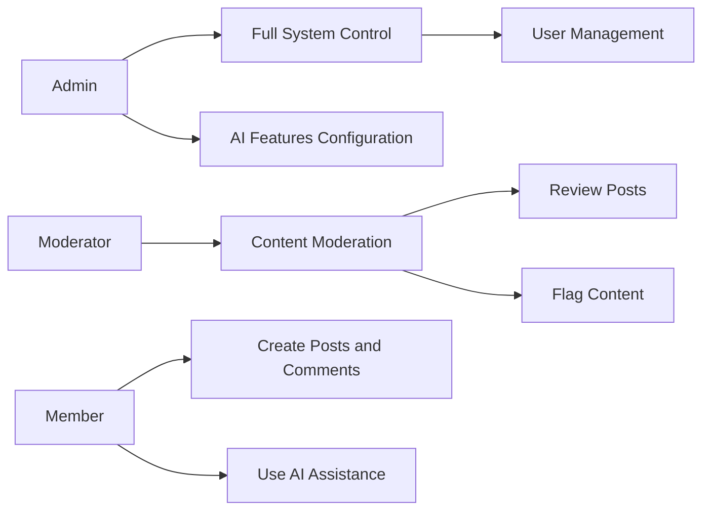
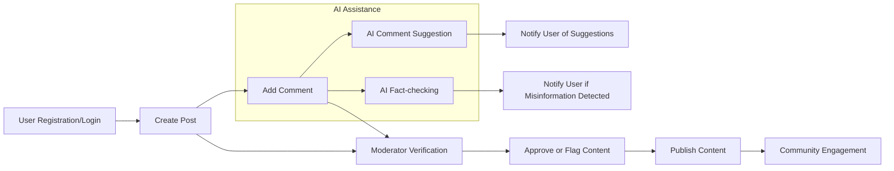

# Community AI Website Service Overview

## 1. Business Model

### 1.1 Why This Service Exists
The Community AI Website exists to facilitate collaborative discussions among users while improving content quality and trustworthiness through AI interventions. It addresses the challenge of misinformation and enhances user engagement by providing AI-backed comment assistance and fact verification.

### 1.2 Revenue Strategy
The platform may generate revenue through advertising, premium membership subscriptions providing enhanced AI features, and partnerships with AI service providers.

### 1.3 Growth Plan
User acquisition efforts focus on creating a dependable and engaging community with AI tools that aid quality discussions. Retention is driven by meaningful interactions bolstered by AI's moderation and assistance.

### 1.4 Success Metrics
- Monthly Active Users (MAU) exceeding target thresholds.
- High engagement rates demonstrated by volume and quality of posts and comments.
- Accuracy rates of AI Commenting and AI Factcheck features above 85%.
- Moderation effectiveness as assessed by reduced harmful content incidents.

## 2. User Roles and Authentication

### 2.1 User Role Definitions
- **Admin**: Full control over user management, AI feature configuration, and content moderation.
- **Moderator**: Responsible for reviewing and managing user content flagged by AI or reported by users.
- **Member**: Authenticated users able to create posts, comment, and utilize AI-assisted features.

### 2.2 Authentication Requirements
WHEN a user registers, THE system SHALL validate the email and securely create an account.
WHEN a user submits login credentials, THE system SHALL authenticate and maintain a secure session.
THE system SHALL expire sessions after 30 days of inactivity.

### 2.3 Authorization
THE system SHALL enforce role-based access controls for actions such as content moderation and AI feature management.

## 3. Functional Requirements

### 3.1 Post Management
WHEN a member creates a post, THE system SHALL validate and save the post.
WHEN a member edits their post within 24 hours, THE system SHALL allow modification.
THE system SHALL permit deletion of posts by the original author or a moderator.

### 3.2 Commenting System
WHEN a member comments on a post, THE system SHALL validate and store the comment.
THE system SHALL enforce a maximum comment length of 500 characters.
WHEN a member edits a comment within 15 minutes of posting, THE system SHALL update the comment.

### 3.3 AI Commenting Features
WHEN a member initiates a comment, THE system SHALL provide AI-generated suggestions to improve clarity or tone.
WHEN requested, THE system SHALL auto-generate draft comments based on post context.
WHEN a comment is posted, THE system SHALL analyze sentiment and flag comments with negative or abusive tones for moderator review.

### 3.4 AI Factcheck Features
WHEN a post or comment is submitted, THE system SHALL extract factual claims and verify them using AI fact-checking services.
WHERE misinformation or unverifiable claims are detected, THE system SHALL flag content and notify authors with source information.
THE system SHALL display fact-check results alongside the content to users.

### 3.5 Notification System
WHEN user content is replied to or liked, THE system SHALL notify relevant users within 5 seconds.
WHEN AI flags content for moderation or misinformation, THE system SHALL promptly notify moderators.

## 4. Business Rules
- THE system SHALL perform AI analyses asynchronously to avoid blocking user interactions.
- AI-flagged content SHALL require manual review before sanctions.
- Only users with verified email addresses SHALL be allowed to create posts or comments.

## 5. Error Handling
IF authentication fails, THEN THE system SHALL return appropriate error codes and messages, prompting retries.
IF AI services are unavailable, THEN THE system SHALL log incidents and inform users that AI features are temporarily disabled.
IF content validation fails (e.g., empty post, comment too long), THEN THE system SHALL reject submissions with clear feedback.

## 6. Performance Requirements
THE system SHALL respond to key user actions (login, post/comment creation) within 2 seconds under normal load.
AI features SHALL provide suggestions and fact-check results within 3 seconds.

## 7. Security and Privacy Considerations
THE system SHALL encrypt user data in transit and at rest.
THE system SHALL comply with GDPR and similar privacy regulations.
AI data processing SHALL respect user privacy and avoid exposure of personal data.

## 8. Success Criteria
- Complete and accurate processing of user workflows without unhandled errors.
- AI features operate with an accuracy exceeding 85%.
- Effective moderation maintains community standards.
- Performance targets for responsiveness and AI interaction times are consistently met.

---

## Mermaid Diagram: User Role Overview

## Mermaid Diagram: High-Level Business Process Flow

This document provides business requirements only. All technical implementation decisions belong to developers. Developers have full autonomy over architecture, APIs, and database design. The document describes WHAT the system should do, not HOW to build it.
