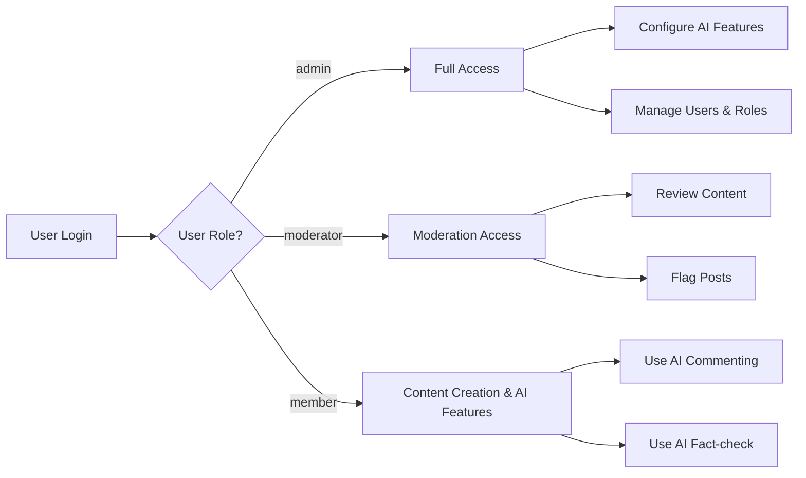

# User Roles and Authentication Requirements for Community AI Website

## 1. Introduction
This document defines the business requirements for user roles, authentication flows, authorization, and permission management within the Community AI website. It provides backend developers with clear, unambiguous, and measurable requirements to implement secure, role-aware access control that supports AI features such as AI Commenting and AI Fact-check.

This document covers:
- Definitions of user roles and permissions
- Authentication flows including registration, login, password management, and email verification
- Authorization policies and role-based access control
- Session and token management details
- Error handling and performance expectations

## 2. User Role Definitions

### 2.1 Role Descriptions

- **Admin**: System administrators with full control over user management, AI feature configuration, and content moderation. Admins can manage all areas of the system including user roles, AI settings, and override content moderation decisions.

- **Moderator**: Moderators are responsible for reviewing user-generated content, flagging inappropriate posts or comments, and managing user reports. They have elevated permissions to moderate content but cannot change system-wide settings.

- **Member**: Authenticated regular users who can create posts, comment on posts, and utilize AI-assisted features such as AI Commenting and AI Fact-check. Members have limited permissions focused on content creation and interaction.

### 2.2 Role Responsibilities and Restrictions

- Admins CAN manage all users and have exclusive rights to configure AI features.
- Moderators CAN review and flag content, manage reports, and moderate comments and posts.
- Members CAN create, edit (within constraints), and delete their own posts and comments.
- Members CANNOT access administrative settings or override moderation.
- Moderators CANNOT modify AI settings or user roles.

## 3. Authentication Requirements

### 3.1 User Registration

WHEN a new user attempts to register, THE Community AI system SHALL collect email and password, validate inputs, and create a user account in a non-active state until email verification is completed.

### 3.2 User Login

WHEN a user submits login credentials (email and password), THE system SHALL validate the credentials, authenticate the user, and establish a user session with a JWT access token.

### 3.3 Email Verification

WHEN a user registers, THE system SHALL send a verification email containing a unique link.
WHEN a user clicks the verification link, THE system SHALL activate the user account allowing full access.

### 3.4 Password Management

- Users SHALL be able to reset forgotten passwords by requesting a reset link via email.
- Users SHALL be able to change their password after providing current password credentials.

### 3.5 Session Management

- The system SHALL maintain secure user sessions using JWT access and refresh tokens.
- Sessions SHALL expire after defined inactivity periods.

## 4. Authorization and Permissions

### 4.1 General Authorization Principles

- THE Community AI system SHALL enforce role-based access control for all protected resources.
- Access to modifying AI settings SHALL be restricted to Admin role.
- Moderation actions SHALL be permitted to Admin and Moderator roles only.
- Content creation and AI feature use SHALL be permitted to Members, Moderators, and Admins as applicable.

### 4.2 Permission Matrix

| Action                               | Admin | Moderator | Member |
|------------------------------------|-------|-----------|--------|
| Register                          | N/A   | N/A       | ✅      |
| Login                             | N/A   | N/A       | ✅      |
| Create post                      | ✅    | ✅        | ✅      |
| Edit own post                    | ✅    | ✅        | ✅      |
| Delete own post                  | ✅    | ✅        | ✅      |
| Moderate content                | ✅    | ✅        | ❌      |
| Manage user roles               | ✅    | ❌        | ❌      |
| Configure AI features           | ✅    | ❌        | ❌      |
| Use AI Commenting               | ✅    | ✅        | ✅      |
| Use AI Fact-check               | ✅    | ✅        | ✅      |

## 5. Role-Based Access Controls

### 5.1 Access Rules by Role

- Admins SHALL have unrestricted access to all system functionalities.
- Moderators SHALL have access to moderation functions and content management.
- Members SHALL have access limited to their own content creation, viewing, and AI feature usage.

### 5.2 AI Feature Access Controls

- THE system SHALL enable AI Commenting and AI Fact-check features for all authenticated members.
- THE system SHALL allow Admins to configure AI parameters.
- Moderators SHALL have permission to review AI-generated flags and override or escalate as needed.

## 6. Session and Token Management

### 6.1 Token Types and Lifecycle

- THE system SHALL use JWT access tokens for authentication, with expiration time set to 15 minutes.
- THE system SHALL use JWT refresh tokens for session renewal, with expiration time set to 30 days.

### 6.2 JWT Payload Structure

THE JWT payload SHALL contain the following claims:
- `userId`: Unique identifier of the user
- `role`: User's role as one of `admin`, `moderator`, or `member`
- `permissions`: Array of specific granted actions or permissions

### 6.3 Token Expiration and Revocation

- THE system SHALL expire access tokens after 15 minutes of issuance.
- THE system SHALL expire refresh tokens after 30 days of issuance or after user logout.
- THE system SHALL support revocation of refresh tokens on logout or administrative action.

## 7. Error Handling

- IF user login credentials are invalid, THEN the system SHALL respond with an authentication failure message and deny access.
- IF a user attempts an unauthorized action, THEN the system SHALL return an authorization error.
- IF registration email is already in use, THEN the system SHALL notify the user of the conflict.
- IF token expiration occurs, THEN the system SHALL prompt for re-authentication or token refresh as appropriate.

## 8. Performance Requirements

- THE system SHALL respond to login requests within 2 seconds under normal load.
- THE system SHALL validate tokens and permissions within 100 milliseconds per request.
- THE system SHALL send email for verification and password reset within 1 minute.

## 9. Summary and Developer Guidance

This document provides business requirements only for the user roles and authentication system of the Community AI website. All technical implementation decisions, including architecture, API design, database schema, and security mechanisms, are at the discretion of the development team. Developers have full autonomy to design and implement according to these business requirements.

---

## Mermaid Diagram: Role-Based Access Control Flow

This diagram illustrates the access control decisions based on user roles after successful authentication.