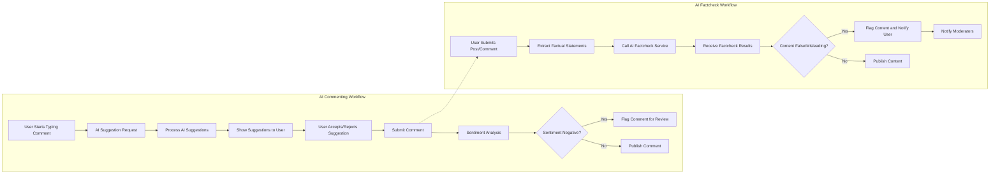

# AI-Powered Features Requirement Analysis for Community AI Website

This document provides detailed business requirements and functional specifications for the AI-powered features of the community website, specifically AI Commenting and AI Factcheck. It defines the expected system behaviors, user interactions, workflows, business rules, and quality criteria that backend developers must implement. This document focuses on the WHAT of the system behavior and excludes technical implementation details.

---

## 1. AI Commenting Overview

### 1.1 Purpose
The AI Commenting feature aims to enhance user engagement by leveraging AI to assist users in writing comments. It provides suggestions to improve comment content, generates auto-replies, and analyzes comment sentiment to maintain a positive and constructive community atmosphere.

### 1.2 Scope
- Suggest improvements on user-written comments before submission.
- Auto-generate relevant comment replies based on post and comment context.
- Analyze sentiment in comments to flag potentially harmful or abusive content.

---

## 2. AI Comment Suggestion Logic

### 2.1 Functional Requirements

- WHEN a user initiates typing or editing a comment, THE system SHALL offer real-time suggestions to improve clarity, grammar, or tone.
- WHEN a user requests an auto-generated reply on a comment or post, THE system SHALL generate a relevant, context-aware comment using AI.
- WHEN the AI estimates comment sentiment, THE system SHALL classify the sentiment as positive, neutral, or negative.
- WHERE a comment sentiment is classified as negative or abusive, THE system SHALL flag the comment for moderator review.

### 2.2 Input Validation
- Comments SHALL be limited to 1000 characters.
- Inputs to AI services SHALL be sanitized to prevent injection or malicious content.

### 2.3 Processing
- AI models SHALL use the post content, existing comments, and user profile context to tailor suggestions.

### 2.4 Output
- Suggestions SHALL be presented as textual options with confidence scores.
- Auto-generated comments SHALL be coherent, relevant, and comply with community guidelines.

### 2.5 Error Handling
- IF the AI service is unavailable, THEN the system SHALL notify the user that AI features are temporarily disabled but still allow manual commenting.
- IF generated comments violate community guidelines, THEN they SHALL be discarded and NOT presented to the user.

### 2.6 Performance
- AI comment suggestions SHALL be delivered within 1 second of user input.
- Auto-generated replies SHALL be produced within 3 seconds of request.

---

## 3. AI Factcheck Workflow

### 3.1 Purpose
The AI Factcheck feature automatically verifies factual statements in posts and comments to reduce misinformation.

### 3.2 Functional Requirements

- WHEN a user submits a post or comment, THE system SHALL extract statements that appear factual.
- WHEN statements are extracted, THE system SHALL call AI fact-check services to verify accuracy.
- IF verified facts are found to be false or misleading, THEN THE system SHALL flag the content and notify the user.
- WHERE content is flagged, THE system SHALL display factcheck results including sources and confidence scores.
- Moderators SHALL be notified of flagged content for further action.

### 3.3 Input Validation
- Posts and comments SHALL have a minimum of 20 characters to trigger fact-check.

### 3.4 Processing
- THE system SHALL utilize external verified data sources and AI models for fact verification.

### 3.5 Output
- Flags SHALL include detailed information about the questionable fact, source URLs, and confidence levels.

### 3.6 Error Handling
- IF the AI factcheck service is down or timeout occurs, THEN the system SHALL defer fact-check and flag content for manual review.

### 3.7 Performance
- Fact-check results SHALL be returned within 5 seconds of submission.

---

## 4. User Interface Interaction with AI Features

- THE system SHALL provide clear UI feedback showing when AI suggestions or fact-checks are available, processing, or failed.
- THE system SHALL allow users to accept, reject, or edit AI comment suggestions before submitting.
- FOR flagged content, THE system SHALL present clear notifications with options to appeal or edit the content.

---

## 5. Quality Metrics

- AI Commenting accuracy SHALL have a precision of at least 90% for suggestion relevance.
- AI Factcheck SHALL maintain a false positive rate below 5%.
- System availability for AI features SHALL be 99.9% uptime.
- User feedback on AI features SHALL be collected to monitor satisfaction and improve models.

---

## 6. Privacy Considerations

- User content processed by AI SHALL comply with privacy regulations including data anonymization.
- THE system SHALL not store AI inputs longer than necessary for processing.
- User consent SHALL be obtained where legally required before processing posts with AI.

---

## 7. Appendix: Mermaid Diagrams of AI Feature Workflows

---

This document provides business requirements only. All technical implementation details, including architecture, APIs, and database design, are under the full autonomy of backend developers.

The system described herein defines WHAT the system must do to meet user and business needs, NOT HOW to implement these features.
